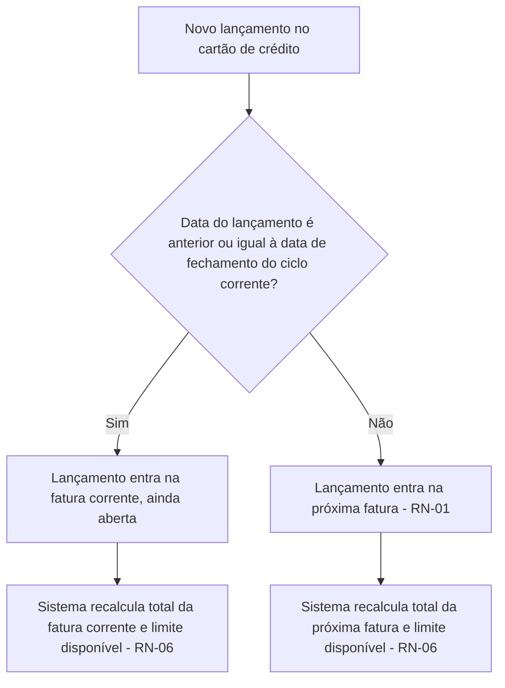
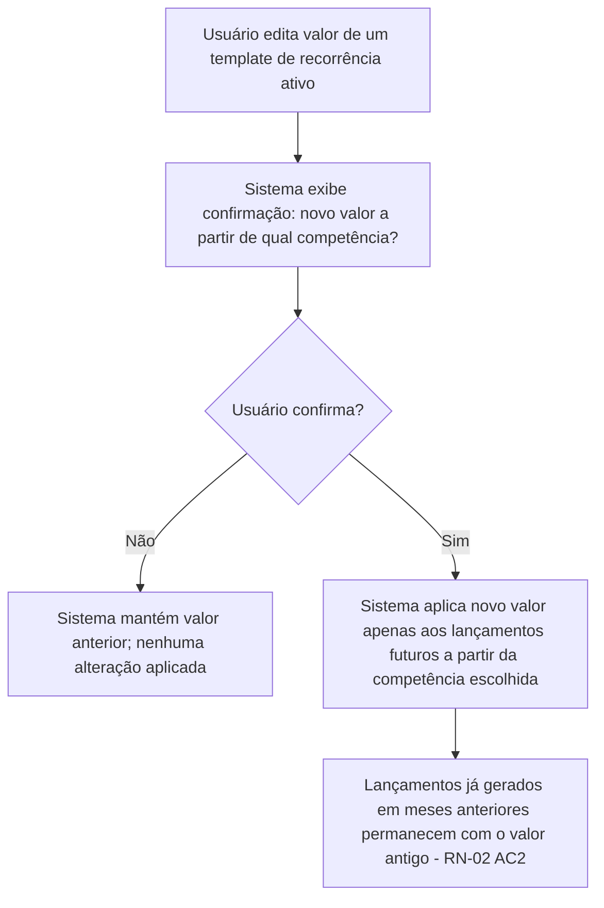
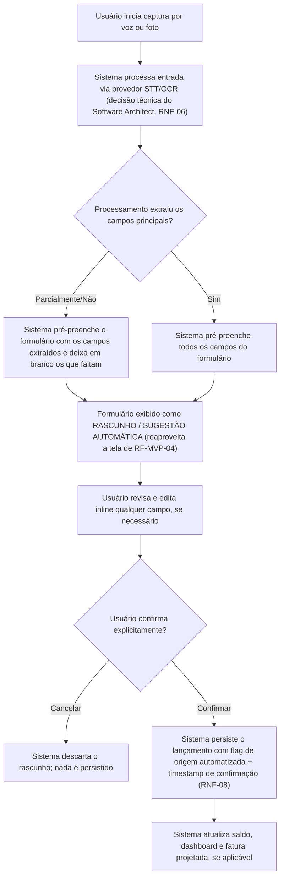
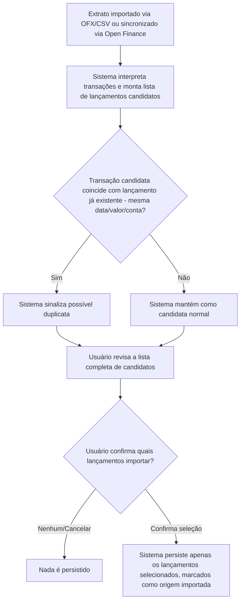
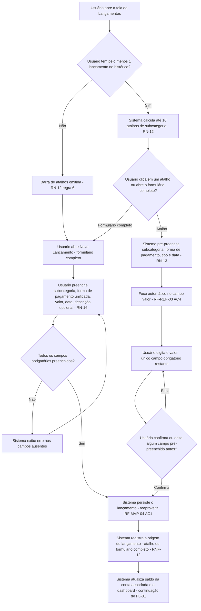
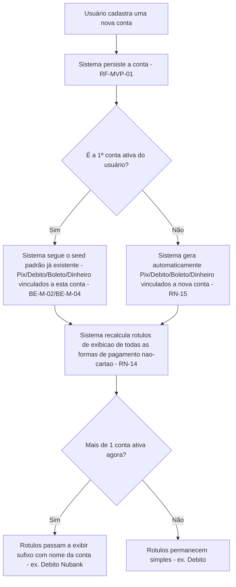
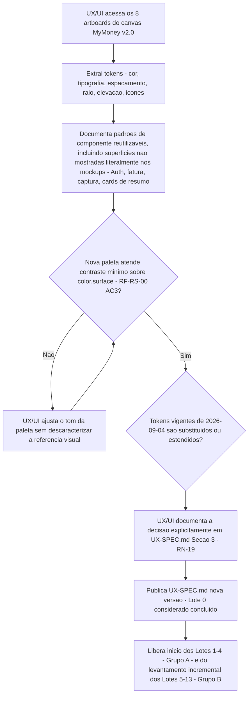
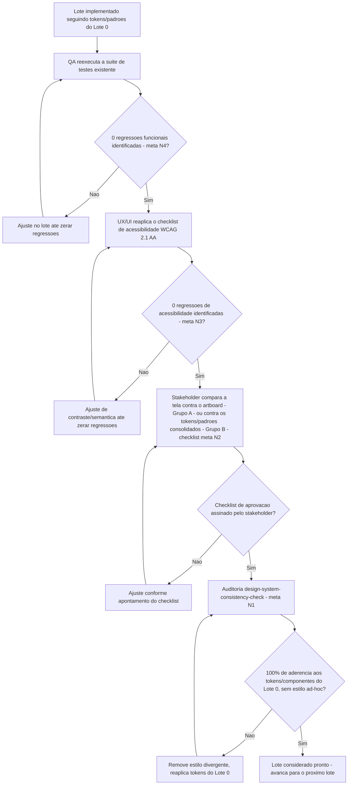
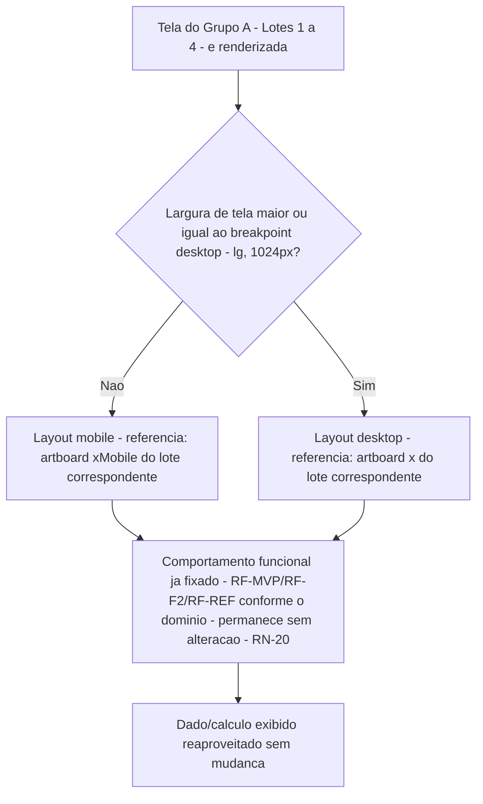

# PRD-TECNICO.md

**Dono**: Business Analyst
**Data**: 2026-09-02
**Gate de entrada**: `PRD.md` liberado pelo PM em 2026-09-02, `stakeholder-alignment-check`
sem divergência em relação ao `CTO-REVIEW.md` Gate 1.
**Fonte**: `PRD.md` (Seções 1-7) + `CTO-REVIEW.md` Gate 1 (contexto).
**Consumidor imediato**: `software-architect` (base de arquitetura para o `SDD.md`);
contexto para `tech-lead` e `cto` (Gate 2).

**Nota de escopo herdado**: o faseamento MVP / Fase 2 / Fase 3 do `PRD.md` é preservado
integralmente — nenhuma funcionalidade foi antecipada ou adiada entre fases neste
documento. Este documento também **não decide** os três pontos que o `PRD.md`
explicitamente delegou ao Software Architect/CTO no Gate 2: (a) build vs. buy de
voz/OCR/Open Finance, (b) web/PWA vs. app nativo, (c) meta técnica formal de
confiabilidade (SLA, backup, RPO/RTO). Onde esses pontos aparecem abaixo, estão
marcados explicitamente como **"não decidido aqui"**, apenas sinalizados como
necessidade funcional/não-funcional.

**Convenção de IDs**: `RF-MVP-NN` / `RF-F2-NN` / `RF-F3-NN` (requisitos funcionais por
fase), `RNF-NN` (não-funcionais), `RN-NN` (regras de negócio), `FL-NN` (fluxos),
`DEP-NN` / `EXT-NN` (dependências internas / integrações externas), `AMB-NN`
(interpretações registradas, Seção 7).

**Formato de critério de aceite**: EARS (Easy Approach to Requirements Syntax) —
"Quando `<evento>`, o sistema deve `<resposta>`" (event-driven), "Se `<condição
indesejada>`, então o sistema deve `<resposta>`" (unwanted behavior), "Enquanto
`<estado>`, o sistema deve `<resposta>`" (state-driven), "O sistema deve `<sempre
fazer X>`" (ubiquitous).

---

## 1. Requisitos Funcionais

### MVP (Fase 1)

#### RF-MVP-01 — Cadastro de Contas
CRUD de contas financeiras, tipos: corrente, poupança, carteira (dinheiro físico),
investimentos (tratado só como conta com saldo, conforme corte de escopo do `PRD.md`
Seção 4).

- **AC1**: Quando o usuário submete o cadastro de uma nova conta com nome, tipo e
  saldo inicial válidos, o sistema deve criar a conta e exibi-la na lista de contas.
- **AC2**: Se o usuário tentar cadastrar uma conta sem informar o tipo, então o
  sistema deve rejeitar o cadastro e indicar o campo obrigatório ausente.
- **AC3**: Quando o usuário edita o saldo inicial ou nome de uma conta existente, o
  sistema deve recalcular o saldo consolidado exibido no dashboard (RF-MVP-05).
- **AC4**: Se o usuário tentar excluir uma conta que possui lançamentos vinculados,
  então o sistema deve impedir a exclusão definitiva e oferecer inativação (RN-08) —
  a conta some da lista de contas ativas para novos lançamentos, mas o histórico
  permanece íntegro.

#### RF-MVP-02 — Cadastro de Formas de Pagamento
Pré-cadastradas: Pix, débito, crédito, boleto, dinheiro; customização adicional
permitida.

- **AC1**: O sistema deve disponibilizar, desde o primeiro acesso, as 5 formas de
  pagamento citadas no `PRD.md` (Pix, débito, crédito, boleto, dinheiro) já
  pré-cadastradas.
- **AC2**: Quando o usuário registra um lançamento (RF-MVP-04), o sistema deve exigir
  a seleção de uma forma de pagamento entre as cadastradas.
- **AC3**: Onde o usuário quiser adicionar uma forma de pagamento além das 5 padrão
  (ex.: TED), o sistema deve permitir cadastro customizado adicional.

#### RF-MVP-03 — Categorização com Subcategorias
Taxonomia hierárquica (categoria > subcategoria), com conjunto padrão sugerido no
primeiro acesso (ver RN-09, AMB-02) e 100% editável.

- **AC1**: O sistema deve apresentar, no primeiro acesso, uma taxonomia padrão de
  categorias e subcategorias pré-cadastrada.
- **AC2**: Quando o usuário cria, edita ou exclui uma categoria/subcategoria, o
  sistema deve refletir a mudança em todos os pontos de seleção de categoria
  (lançamento manual, orçamento, dashboard).
- **AC3**: Se o usuário tentar excluir uma categoria com lançamentos vinculados,
  então o sistema deve bloquear a exclusão e sugerir reclassificar os lançamentos
  existentes antes.

#### RF-MVP-04 — Lançamento Manual de Transação
CRUD completo de lançamentos (entrada/saída). Campos: data, conta, forma de
pagamento, categoria/subcategoria, valor, tipo, descrição.

- **AC1**: Quando o usuário submete um lançamento manual com todos os campos
  obrigatórios preenchidos, o sistema deve persistir o lançamento e atualizar o
  saldo da conta associada imediatamente.
- **AC2**: Se algum campo obrigatório estiver ausente, então o sistema deve rejeitar
  o envio e indicar o(s) campo(s) faltante(s), sem persistir lançamento parcial.
- **AC3**: Quando o usuário edita um lançamento existente, o sistema deve recalcular
  o saldo da(s) conta(s) afetada(s) refletindo a edição.
- **AC4**: Quando o usuário exclui um lançamento, o sistema deve reverter seu efeito
  no saldo da conta associada.
- **AC5**: O sistema deve listar os lançamentos do mês corrente por padrão, com
  filtro por conta, forma de pagamento, categoria e período.

#### RF-MVP-05 — Dashboard: Saldo Consolidado
- **AC1**: O sistema deve exibir, na tela inicial, o saldo total consolidado somando
  o saldo de todas as contas ativas.
- **AC2**: Quando um lançamento é criado, editado ou excluído, o sistema deve
  refletir corretamente o saldo consolidado atualizado (mecanismo de atualização —
  tempo real vs. próxima renderização — é decisão do Software Architect).

#### RF-MVP-06 — Dashboard: Entradas/Saídas do Mês e Distribuição por Categoria
- **AC1**: O sistema deve exibir o total de entradas e o total de saídas do mês
  corrente.
- **AC2**: O sistema deve exibir, em formato gráfico (não apenas tabela numérica), a
  distribuição de saídas do mês por categoria — exigência explícita do `PRD.md`
  Seção 1 ("para onde o dinheiro está indo").
- **AC3**: O sistema deve exibir a quantidade total de lançamentos registrados no mês
  corrente — instrumentação necessária para apurar, ao longo do tempo, o baseline
  real de volume mensal usado por M2 (ver AMB-01, RN-11).

#### RF-MVP-07 — Orçamento por Categoria por Mês
- **AC1**: Quando o usuário define um teto de orçamento para uma categoria em um mês,
  o sistema deve armazenar esse teto e associá-lo aos lançamentos daquela categoria
  naquele mês.
- **AC2**: Enquanto o total de saídas de uma categoria no mês estiver abaixo do
  limiar de alerta (RN-04, 80% do teto), o sistema não deve exibir alerta.
- **AC3**: Quando o total de saídas de uma categoria atingir o limiar de alerta
  (RN-04), o sistema deve exibir um alerta visual.
- **AC4**: Se o total de saídas de uma categoria ultrapassar 100% do teto, então o
  sistema deve exibir um alerta de estouro, com severidade maior que o alerta de
  aproximação.

#### RF-MVP-08 — Login Seguro (Biometria/PIN)
- **AC1**: O sistema deve exigir autenticação (PIN ou biometria, conforme mecanismo
  disponível na plataforma escolhida pelo Software Architect) antes de exibir
  qualquer dado financeiro.
- **AC2**: Se o usuário exceder um número de tentativas de autenticação malsucedidas
  (número exato a definir pelo Software Architect/DevSecOps), então o sistema deve
  bloquear temporariamente novas tentativas.
- **AC3**: O sistema deve permitir logout explícito, encerrando a sessão ativa.

### Fase 2

#### RF-F2-01 — Cadastro de Cartão de Crédito
Pré-requisito de RF-F2-05 (fatura projetada), conforme dependência já nomeada no
`PRD.md` Seção 5.

- **AC1**: Quando o usuário cadastra um cartão com limite, dia de fechamento e dia de
  vencimento, o sistema deve armazenar esses dados e disponibilizar o cartão como
  forma de pagamento "crédito" vinculada.
- **AC2**: O sistema deve calcular e exibir o limite disponível do cartão como
  (limite total) − (soma de compras/parcelas futuras já lançadas e não pagas),
  conforme RN-06.

#### RF-F2-02 — Gastos Recorrentes: Cadastro de Template
- **AC1**: Quando o usuário cadastra um gasto recorrente (descrição, valor,
  categoria, forma de pagamento, dia do mês, data de início), o sistema deve
  armazenar o template e gerar automaticamente um lançamento correspondente em cada
  mês subsequente, sem exigir ação manual mensal.
- **AC2**: O sistema deve permitir encerrar um template de recorrência a partir de um
  mês específico, preservando os lançamentos já gerados nos meses anteriores (RN-07).

#### RF-F2-03 — Atualização de Valor de Recorrência (Reajuste)
Resolve a pergunta 4 do `PRD.md` Seção 7 — ver AMB-04.

- **AC1**: Quando o usuário edita o valor de um template de recorrência ativo, o
  sistema deve exibir uma confirmação explícita informando a partir de qual
  competência o novo valor passará a valer, antes de aplicar a mudança.
- **AC2**: Se o usuário confirmar, então o sistema deve aplicar o novo valor apenas
  aos lançamentos futuros gerados a partir da competência escolhida, nunca
  retroativamente aos já lançados (RN-02).
- **AC3**: Se o usuário cancelar a confirmação, então o sistema deve manter o valor
  anterior do template inalterado.

#### RF-F2-04 — Gastos Parcelados no Cartão: Cadastro
- **AC1**: Quando o usuário cadastra uma compra parcelada (valor total ou por
  parcela, número de parcelas, categoria, cartão), o sistema deve gerar
  automaticamente uma parcela lançada em cada fatura subsequente até a quitação.
- **AC2**: O sistema deve exibir, a qualquer momento, quantas parcelas já foram
  pagas e quantas restam para uma compra parcelada específica.

#### RF-F2-05 — Fatura de Cartão Projetada
Depende de RF-F2-01 + RF-F2-04 + RF-F2-03 (mesma dependência nomeada no `PRD.md`
Seção 5).

- **AC1**: O sistema deve exibir, para cada cartão, a projeção da fatura corrente e
  das próximas faturas (número de meses a definir pelo Software Architect conforme
  volume de dados), somando parcelas e recorrências que caem em cada competência.
- **AC2**: Quando um lançamento no cartão ocorre após a data de fechamento do ciclo
  corrente, o sistema deve atribuí-lo automaticamente à próxima fatura, nunca à
  fatura já fechada (RN-01, resolve pergunta 3 do `PRD.md` Seção 7).
- **AC3**: O sistema deve indicar visualmente, para cada fatura projetada, se ela já
  está fechada (não recebe mais lançamentos) ou ainda aberta.

#### RF-F2-06 — Contas Fixas com Vencimento
- **AC1**: Quando o usuário cadastra uma conta fixa (descrição, valor, categoria, dia
  de vencimento), o sistema deve gerar um lançamento previsto (pendente) para cada
  competência mensal.
- **AC2**: O sistema deve permitir marcar uma conta fixa do mês como paga,
  convertendo o lançamento previsto em lançamento efetivado, refletido no saldo.

#### RF-F2-07 — Aviso de Conta Fixa a Vencer
- **AC1**: Quando faltarem 3 dias corridos (padrão, configurável — RN-05) para o
  vencimento de uma conta fixa ainda não paga, o sistema deve emitir uma notificação
  de aviso.
- **AC2**: Se a conta fixa não for marcada como paga até a data de vencimento, então
  o sistema deve sinalizá-la visualmente como vencida/em atraso.

#### RF-F2-08 — Metas com Acompanhamento de Progresso
- **AC1**: Quando o usuário cadastra uma meta (nome, valor-alvo, prazo opcional), o
  sistema deve permitir vincular aportes e calcular o percentual de progresso em
  relação ao valor-alvo.
- **AC2**: O sistema deve exibir visualmente o progresso de cada meta ativa.

#### RF-F2-09 — Notificações (infraestrutura compartilhada)
- **AC1**: O sistema deve centralizar em um único mecanismo os avisos de orçamento
  próximo do teto (RF-MVP-07) e de conta fixa a vencer (RF-F2-07), sem duplicar
  lógica de disparo — dependência de infraestrutura compartilhada já nomeada no
  `PRD.md` Seção 4.
- **AC2**: O usuário deve poder visualizar um histórico de notificações recentes
  dentro do próprio app (não depende exclusivamente de push do dispositivo, cujo
  mecanismo exato depende da decisão web/PWA vs. nativo — RNF-05, não decidido aqui).

#### RF-F2-10 — Relatório Comparativo Entradas vs. Saídas Mês a Mês
- **AC1**: O sistema deve exibir um gráfico comparando entradas e saídas ao longo
  dos últimos 6 meses com dados disponíveis.
- **AC2**: Se houver menos de 6 meses de dados (ex.: logo após o MVP), então o
  sistema deve exibir o comparativo apenas para os meses efetivamente disponíveis,
  deixando claro que não há dado (não preencher com zero enganoso).

### Fase 3

#### RF-F3-01 — Captura de Lançamento por Voz (NLP)
NFR obrigatório e não-negociável associado: RNF-01 (confirmação humana). Ver FL-04.

- **AC1**: Quando o usuário finaliza uma gravação de captura por voz, o sistema deve
  interpretar a fala e pré-preencher o formulário de lançamento (reaproveita campos
  de RF-MVP-04) com os valores extraídos, marcados como "sugestão automática, não
  confirmada".
- **AC2**: O sistema não deve, em nenhuma hipótese, persistir o lançamento sem ação
  explícita de confirmação do usuário sobre o formulário pré-preenchido (RNF-01).
- **AC3**: Quando o usuário edita qualquer campo pré-preenchido antes de confirmar,
  o sistema deve considerar o valor editado (não o originalmente interpretado) ao
  salvar.
- **AC4**: Se o usuário cancelar a captura antes de confirmar, então o sistema não
  deve persistir nenhum lançamento, e deve descartar o rascunho interpretado.

#### RF-F3-02 — Captura de Lançamento por Foto/OCR
Mesmo padrão de confirmação de RF-F3-01, adaptado a imagem de recibo/nota fiscal.

- **AC1**: Quando o usuário fotografa um recibo/nota fiscal, o sistema deve extrair
  via OCR os campos possíveis (valor, data, estabelecimento/categoria sugerida) e
  pré-preencher o mesmo formulário de confirmação de RF-F3-01.
- **AC2**: O sistema não deve persistir o lançamento sem confirmação explícita do
  usuário (RNF-01).
- **AC3**: Se o OCR não conseguir extrair um campo obrigatório (ex.: valor
  ilegível), então o sistema deve apresentar o campo em branco para preenchimento
  manual, sem bloquear o restante do formulário pré-preenchido.

#### RF-F3-03 — Importação de Extrato Bancário (OFX/CSV)
- **AC1**: Quando o usuário importa um arquivo OFX ou CSV, o sistema deve interpretar
  as transações e apresentar uma lista de lançamentos candidatos para revisão antes
  de qualquer persistência definitiva.
- **AC2**: Quando uma transação importada for identificada como possível duplicata
  de um lançamento já existente (mesma data/valor/conta), o sistema deve sinalizar a
  possível duplicidade antes de confirmar a importação.
- **AC3**: O sistema não deve persistir lançamentos importados sem confirmação do
  usuário sobre a lista revisada — extensão do princípio de RNF-01 por consistência
  de produto (ver AMB-06b).

#### RF-F3-04 — Integração com Open Finance
Mecanismo técnico (direto vs. agregador) **não decidido aqui** — ver RNF-06, EXT-04.

- **AC1**: Quando o usuário autoriza a conexão com uma instituição via Open Finance,
  o sistema deve sincronizar periodicamente as transações da conta conectada e
  apresentá-las como candidatas, seguindo o mesmo fluxo de revisão de RF-F3-03 (não
  persistência automática silenciosa).
- **AC2**: Independentemente do mecanismo técnico escolhido pelo Software
  Architect/CTO, o requisito funcional de revisão antes de persistir permanece
  válido.

#### RF-F3-05 — Relatório de Evolução Patrimonial
- **AC1**: O sistema deve exibir a evolução do saldo consolidado ao longo do tempo,
  em série temporal gráfica.
- **AC2**: O sistema deve permitir filtrar a evolução patrimonial por conta
  individual, além da visão consolidada.

#### RF-F3-06 — Exportação de Relatórios (PDF/CSV)
Formato exato **não fechado nesta rodada** — ver AMB-05 (premissa a validar antes do
detalhamento tático desta fase).

- **AC1**: Quando o usuário solicita exportação em CSV, o sistema deve gerar um
  arquivo contendo, no mínimo, os campos data, conta, forma de pagamento, categoria,
  subcategoria, descrição, tipo (entrada/saída) e valor de cada lançamento do
  período selecionado.
- **AC2**: Quando o usuário solicita exportação em PDF, o sistema deve gerar um
  documento legível contendo pelo menos o resumo do período (saldo, entradas,
  saídas, distribuição por categoria).

---

## 2. Requisitos Não-Funcionais

#### RNF-01 — Confirmação Humana Obrigatória Antes de Salvar Lançamento Automatizado (NÃO-NEGOCIÁVEL)
Herdado da ressalva 2 do Gate 1 e do `PRD.md` Seção 4. Nenhum lançamento capturado
por voz, foto/OCR, importação de extrato ou Open Finance é persistido no ledger sem
uma ação explícita e informada do usuário confirmando os dados interpretados. Vale
para todas as fontes automatizadas da Fase 3, não apenas voz/foto (extensão por
consistência de produto — AMB-06b). Testável via RF-F3-01 AC2, RF-F3-02 AC2,
RF-F3-03 AC3, RF-F3-04 AC1: nenhum caminho de persistência de lançamento de origem
automatizada deve existir sem um evento de confirmação explícito registrado (RNF-08).

#### RNF-02 — Confidencialidade e Criptografia em Repouso
Dados financeiros armazenados devem ser criptografados em repouso (herdado do Gate 1
/`PRD.md` MVP). Algoritmo/mecanismo específico: decisão do Software Architect no
`SDD.md` — **não decidido aqui**.

#### RNF-03 — Comunicação Segura em Trânsito
Toda comunicação cliente-servidor deve usar transporte criptografado (HTTPS/TLS).
Inferência de baseline de segurança de produção a partir de "padrão de segurança de
produção" citado no `PRD.md` Seção 2 — interpretação de baixo risco, ver AMB-07.

#### RNF-04 — Confiabilidade/Persistência (meta técnica NÃO decidida aqui)
Exigência qualitativa herdada do `PRD.md` Seção 3/4: "não posso perder lançamento
nem ter o app fora do ar". Este documento carrega a exigência adiante como requisito
de produto não-negociável em nível qualitativo, mas **não formaliza** SLA numérico,
RPO/RTO ou estratégia de backup — isso é decisão do Software Architect, revisada
pelo CTO no Gate 2, conforme `PRD.md` Seção 3 e Seção 6 (item 4) e `CTO-REVIEW.md`.

#### RNF-05 — Plataforma (Web/PWA vs. Nativo) — NÃO decidido aqui
`PRD.md` deixa explicitamente para o Software Architect (ressalva 3 do Gate 1) a
decisão entre web responsivo/PWA e app nativo. Este documento registra apenas a
exigência de experiência: uso confortável tanto em desktop quanto em celular — o
"como" é decisão de arquitetura, revisada no Gate 2.

#### RNF-06 — Build vs. Buy de Voz/OCR/Open Finance — NÃO decidido aqui
Decisão entre provedor terceirizado (STT, OCR, agregador Open Finance) e build
próprio é do Software Architect, revisada pelo CTO no Gate 2
(`build-vs-buy-analysis`). Este documento registra apenas a necessidade funcional
(RF-F3-01, RF-F3-02, RF-F3-04) e a integração externa correspondente (EXT-01,
EXT-02, EXT-04), não a tecnologia/fornecedor.

#### RNF-07 — Idioma e Moeda
Interface em português brasileiro (pt-BR); moeda única BRL em todas as fases
(multi-moeda fora de escopo, herdado do `PRD.md` Seção 4). Idioma inferido do
contexto do briefing — ver AMB-08.

#### RNF-08 — Auditabilidade de Confirmação
Todo lançamento de origem automatizada (voz, foto, importação, Open Finance) deve
manter registro (mesmo que técnico/interno) de que passou por confirmação humana
explícita, com timestamp — suporta a testabilidade de RNF-01 e permite auditoria
futura caso o usuário questione um lançamento específico.

#### RNF-09 — Escala e Volume de Dados
Sistema dimensionado para carga de usuário único (não multi-tenant). Volume mensal
de referência não-oficial: ver AMB-01. Diretriz herdada do `CTO-REVIEW.md`
("evitar arquitetura distribuída desnecessária para carga de usuário único") — é uma
diretriz para o Software Architect, não uma meta de performance formal definida
aqui.

---

## 3. Regras de Negócio

| ID | Regra | Racional | Exceção |
|---|---|---|---|
| RN-01 | Lançamento no cartão após a data de fechamento do ciclo entra na **próxima** fatura, nunca na atual | Definição padrão de fechamento de fatura de cartão de crédito no mercado brasileiro — uma vez fechado o ciclo, nenhum novo lançamento pode alterar seu total; é assim que qualquer emissor opera (fato de domínio, não escolha de produto). Resolve pergunta 3 do `PRD.md` Seção 7 — ver AMB-03. | Nenhuma identificada; se o emissor do cartão do stakeholder usar regra não-padrão, precisa ser reportado e revalidado. |
| RN-02 | Alteração de valor de um template de recorrência exige confirmação explícita e se aplica apenas prospectivamente (lançamentos futuros) | O produto existe para devolver controle e visibilidade ao stakeholder (`PRD.md` Seção 1); atualizar valor monetário silenciosamente contradiz esse objetivo e o próprio `PRD.md` já estabelece o mesmo princípio para captura automatizada. Resolve pergunta 4 — ver AMB-04. | Correção de erro de cadastro (não um reajuste real) ainda passa pela mesma confirmação explícita, mas o usuário pode optar por aplicar retroativamente a partir de uma competência específica que ele escolha — nunca é silencioso. |
| RN-03 | Confirmação humana obrigatória antes de salvar lançamento de origem automatizada (voz, foto, importação, Open Finance) | Herdado como NFR obrigatório e não-negociável do Gate 1/`PRD.md`; risco de erro de interpretação (valor, categoria, forma de pagamento errados) já citado pelo CTO. | Nenhuma — aplica-se a toda fonte automatizada, sem opção de desativar. |
| RN-04 | Alerta de orçamento em 80% do teto (aproximação); alerta de estouro acima de 100% | `PRD.md` pede alerta "ao se aproximar do teto" sem limiar numérico; 80% é padrão comum de UX financeira, dá margem de reação antes do estouro. Interpretação registrada — ver AMB-09. | Usuário pode ajustar o limiar de alerta por categoria. |
| RN-05 | Aviso de conta fixa 3 dias corridos antes do vencimento (padrão) | `PRD.md` pede "aviso antes de vencer" sem prazo definido; 3 dias dá tempo de ação sem gerar fadiga de notificação. Interpretação registrada — ver AMB-10. | Usuário pode configurar prazo diferente por conta fixa. |
| RN-06 | Parcela de cartão reduz o limite disponível desde o lançamento da compra, não apenas quando "cai" em cada fatura | Reflete o comportamento real de limite de crédito — comprometimento futuro já reduz o limite disponível para novas compras. | Nenhuma identificada no MVP/Fase 2; se o emissor usar regra diferente, revalidar (mesma premissa de RN-01). |
| RN-07 | Cancelamento/encerramento de um template de recorrência ou parcelamento não apaga lançamentos já gerados | Preserva a integridade histórica do ledger — um mês já lançado (possivelmente já pago) não deve desaparecer retroativamente por causa de um cancelamento futuro; consistente com "não perder lançamento" (`PRD.md` Seção 3/4). | Usuário pode excluir manualmente um lançamento específico já gerado (RF-MVP-04, CRUD normal) se for erro pontual — ação distinta de cancelar o template. |
| RN-08 | Exclusão de conta com lançamentos vinculados vira inativação, não exclusão definitiva | Integridade referencial — excluir definitivamente quebraria o histórico de saldo/lançamentos já reportados no dashboard e relatórios. | Conta recém-criada sem nenhum lançamento vinculado pode ser excluída definitivamente. |
| RN-09 | Taxonomia de categorias/subcategorias parte de um conjunto padrão sugerido, mas é 100% editável | Resolve a ausência do dado real da planilha atual (AMB-02) sem bloquear o MVP nem forçar o stakeholder a recomeçar do zero. | Nenhuma — customização total sempre disponível. |
| RN-10 | Moeda única BRL em todas as fases | Herdado do corte de escopo "fora" do `PRD.md` Seção 4 — multi-moeda não solicitado. | Reavaliar apenas se o stakeholder declarar necessidade explícita. |
| RN-11 | Baseline real de M2 (volume de lançamentos/mês) apurado operacionalmente a partir dos dados do MVP, não estimado a priori | `PRD.md` Seção 3 já registra explicitamente que "não foi inventado um número para não violar o critério de métrica mensurável e verificável"; BA segue o mesmo princípio (ver RF-MVP-06 AC3, AMB-01). | Nenhuma. |

---

## 4. Fluxos de Usuário/Processo

### FL-01 — Lançamento Manual (MVP)

```mermaid
flowchart TD
    A[Usuário abre "Novo Lançamento"] --> B[Preenche data, conta, forma de pagamento, categoria/subcategoria, valor, tipo, descrição]
    B --> C{Todos os campos obrigatórios preenchidos?}
    C -- Não --> D[Sistema exibe erro nos campos ausentes] --> B
    C -- Sim --> E[Sistema persiste o lançamento]
    E --> F[Sistema atualiza saldo da conta associada]
    F --> G[Sistema atualiza dashboard: saldo consolidado, entradas/saídas do mês, distribuição por categoria]
```

### FL-02 — Fechamento de Fatura e Lançamento no Cartão (Fase 2)



### FL-03 — Reajuste de Valor de Recorrência (Fase 2)



### FL-04 — Captura Automatizada com Confirmação Humana Obrigatória (Fase 3, voz/foto)

Resolve a pergunta 6 do `PRD.md` Seção 7 — interpretação registrada em AMB-06.



### FL-05 — Importação de Extrato / Open Finance (Fase 3)



---

## 5. Dependências entre Requisitos e Integrações Externas

### 5.1 Dependências internas (o que bloqueia o quê)

| Requisito | Depende de | Motivo |
|---|---|---|
| RF-MVP-04 (Lançamento manual) | RF-MVP-01, RF-MVP-02, RF-MVP-03 | Precisa que conta, forma de pagamento e categoria já existam para popular os campos do lançamento. |
| RF-MVP-05 / RF-MVP-06 (Dashboard) | RF-MVP-04 | Não há dado para exibir sem lançamentos registrados. |
| RF-MVP-07 (Orçamento) | RF-MVP-03, RF-MVP-04 | Precisa de categoria definida e de lançamentos reais para calcular gasto vs. teto. |
| RF-F2-01 (Cadastro de cartão) | RF-MVP-02 | Forma de pagamento "crédito" precisa existir antes de vincular um cartão a ela. |
| RF-F2-04 (Parcelamento) | RF-F2-01 | Precisa saber a qual cartão a parcela pertence. |
| RF-F2-03 (Reajuste de recorrência) | RF-F2-02 | Só existe reajuste de um template de recorrência já cadastrado. |
| RF-F2-05 (Fatura projetada) | RF-F2-01 + RF-F2-04 + RF-F2-02/RF-F2-03 | A fatura soma cadastro do cartão, parcelas e recorrências — dependência já nomeada no `PRD.md` Seção 5. |
| RF-F2-07 (Aviso de conta fixa) | RF-F2-06, RF-F2-09 | Precisa da conta fixa cadastrada e da infraestrutura de notificação. |
| RF-F2-09 (Notificações) | RF-MVP-07, RF-F2-06 | Os dois gatilhos de notificação (orçamento, conta fixa) precisam existir antes da infraestrutura compartilhada ter o que disparar. |
| RF-F3-01 / RF-F3-02 (Voz/Foto) | RF-MVP-04 | Reaproveitam o formulário de lançamento manual como base do fluxo de confirmação (FL-04). |
| RF-F3-03 (Importação OFX/CSV) | RF-MVP-01 | Transação importada precisa ser associada a uma conta existente. |
| RF-F3-04 (Open Finance) | RF-F3-03 | Reaproveita o mesmo fluxo de revisão/candidatos (FL-05) — não decide o mecanismo técnico de sincronismo. |
| RF-F3-05 (Evolução patrimonial) | RF-MVP-05 | É a mesma métrica de saldo consolidado, observada como série histórica. |
| RF-F3-06 (Exportação) | RF-MVP-04 | Depende dos campos de dados estruturados já definidos no lançamento manual (data, conta, forma de pagamento, categoria, valor, tipo). |

### 5.2 Integrações externas necessárias

| ID | Integração | Requisito que a exige | Decisão técnica pendente |
|---|---|---|---|
| EXT-01 | Provedor de Speech-to-Text (STT) | RF-F3-01 | Build vs. buy — Software Architect/CTO, Gate 2 (`build-vs-buy-analysis`). Não decidido aqui (RNF-06). |
| EXT-02 | Provedor de OCR/processamento de documento | RF-F3-02 | Build vs. buy — Software Architect/CTO, Gate 2. Não decidido aqui (RNF-06). |
| EXT-03 | Parser de arquivo OFX/CSV | RF-F3-03 | OFX é especificação pública (formato aberto), mas a biblioteca/implementação é decisão técnica do Software Architect. |
| EXT-04 | Open Finance Brasil — direto (certificação BACEN) ou agregador terceirizado | RF-F3-04 | Build vs. buy — Software Architect/CTO, Gate 2. Risco de custo/regulatório já registrado no `PRD.md` Seção 6 (item 6). Não decidido aqui. |
| EXT-05 | Mecanismo de notificação (push web/PWA vs. push nativo) | RF-F2-09 | Depende da decisão web/PWA vs. nativo — Software Architect, Gate 2 (RNF-05). Não decidido aqui. |
| EXT-06 | API de autenticação biométrica/PIN do dispositivo | RF-MVP-08 | Depende da plataforma escolhida (API do navegador/OS vs. nativa) — Software Architect. Não decidido aqui. |

---

## 6. Premissas e Riscos Resolvidos

### 6.1 Premissas/riscos herdados do `PRD.md` Seção 6 — status após checagem do BA

| # | Premissa/Risco (PRD.md) | Status | Evidência/Racional da checagem |
|---|---|---|---|
| 1 | Volume médio de lançamentos mensais não informado (baseline de M2) | **Resolvido operacionalmente** (não confirmado nem refutado numericamente) | Sem stakeholder interativo disponível nesta rodada, o BA não inventou um número oficial. Em vez disso, definiu instrumentação (RF-MVP-06 AC3, RN-11) para medir o valor real a partir do uso do MVP. Faixa de referência não-oficial (60–120 lançamentos/mês) adotada só para dimensionamento técnico de UI/paginação — ver AMB-01. |
| 2 | Stakeholder aceita lançar manualmente tudo durante MVP/Fase 2 sem abandonar por fricção | **Não pode ser validado nem refutado nesta rodada** | Depende de percepção qualitativa direta do stakeholder; o próprio `PRD.md` já atribui essa validação ao PM ("antes de liberar o MVP para desenvolvimento"). O BA não tem fonte para checar e não assume validado por ausência de evidência contrária. Risco permanece Aberto, dono continua PM. |
| 3 | Premissa de usuário único se mantém por toda a iniciativa | **Não pode ser validado nesta rodada** | Depende de declaração futura do próprio stakeholder (dono explícito no `PRD.md`). Nenhuma informação nova disponível ao BA. Permanece como estava, a revisitar no início de cada fase. |
| 4 | Confiabilidade de produção sem meta técnica formal (SLA/backup) | **Fora do escopo de resolução do BA — corretamente delegado** | `PRD.md` já atribui a formalização ao Software Architect/CTO (Gate 2). BA carrega a exigência qualitativa adiante como RNF-04 sem inventar número (guardrail: BA nunca decide arquitetura). |
| 5 | Automação de voz/foto depende de build vs. buy ainda não tomado | **Fora do escopo de resolução do BA — corretamente delegado** | Mesma lógica do item 4; necessidade funcional registrada (RF-F3-01/02) e integração nomeada (EXT-01/EXT-02), sem decidir provedor. |
| 6 | Open Finance direto exige certificação BACEN; via agregador pode ter custo incompatível com "sem orçamento formal" | **Fora do escopo de resolução do BA — corretamente delegado** | Mesma lógica; registrado como EXT-04, decisão até Gate 2. |
| 7 | Autenticação biométrica/PIN e criptografia aceitas mesmo sendo usuário único | **Validado com evidência textual** | `PRD.md` Seção 2 (Público-Alvo) declara explicitamente: "Trata dados financeiros como sensíveis e espera padrão de segurança de produção (login forte, criptografia) mesmo sendo o único usuário." Confirma a premissa diretamente pela fonte de negócio já existente, sem necessidade de nova elicitação. |
| 8 | Hipótese de "sem data-alvo fixa, priorizando stack de baixo custo" | **Não pode ser revalidado nesta rodada** | Depende de confirmação direta do stakeholder (dono explícito: PM + Stakeholder no `PRD.md`). Nenhuma nova fonte disponível ao BA. Permanece hipótese herdada, não promovida a fato confirmado. |

### 6.2 Perguntas do `PRD.md` Seção 7 — status de resolução

| # | Pergunta | Como foi resolvida | Referência |
|---|---|---|---|
| 1 | Volume médio de lançamentos mensais (baseline M2) | Não estimado como número oficial; instrumentação definida para medir o valor real a partir do MVP | RF-MVP-06 AC3, RN-11, AMB-01 |
| 2 | Categorias/subcategorias já usadas na planilha atual | Taxonomia padrão sugerida no primeiro acesso, 100% editável, sem obrigar recomeço do zero | RF-MVP-03, RN-09, AMB-02 |
| 3 | Regra de fechamento de fatura de cartão | Lançamento pós-fechamento entra na próxima fatura — resolvido como fato de domínio (padrão de mercado), não escolha de produto | RN-01, RF-F2-05 AC2, FL-02, AMB-03 |
| 4 | Regra de reajuste de gasto recorrente | Confirmação explícita sempre obrigatória, aplicada só prospectivamente | RN-02, RF-F2-03, FL-03, AMB-04 |
| 5 | Formato exato de exportação (CSV/PDF) | **Não fechado** — campos mínimos de CSV inferidos do modelo de dados já definido; layout de PDF não especificado; registrado como premissa a validar antes do detalhamento tático da Fase 3 | RF-F3-06, AMB-05 |
| 6 | Fluxo exato de confirmação humana (voz/foto) | Revisão inline reaproveitando o formulário de lançamento manual do MVP, com confirmação explícita obrigatória | FL-04, RF-F3-01/02, RNF-01, AMB-06 |

---

## 7. Interpretações Registradas

Toda ambiguidade de **interpretação de detalhe** do `PRD.md` que o BA resolveu por
conta própria, sem alterar escopo ou objetivo de negócio, com a interpretação
escolhida, o racional e o risco residual se a interpretação estiver errada.

| ID | Ambiguidade original | Interpretação escolhida | Racional | Risco residual |
|---|---|---|---|---|
| AMB-01 | Volume médio de lançamentos mensais (pergunta 1) | Não estimar número oficial de baseline; instrumentar o MVP para medir o valor real (RF-MVP-06 AC3). Faixa de referência não-oficial de 60–120/mês usada só para dimensionamento técnico. | Evita inventar critério que o próprio `PRD.md` já disse explicitamente que não deveria ser inventado (Seção 3). | Baixo — faixa de referência é só parâmetro técnico de UI/paginação, não é critério de aceite de negócio nem meta oficial de M2. |
| AMB-02 | Categorias/subcategorias da planilha atual (pergunta 2) | Taxonomia padrão sugerida, 100% editável desde o primeiro acesso. | Mantém o MVP funcional sem bloquear por dado ausente; preserva a possibilidade total de o stakeholder recriar sua taxonomia real assim que tiver acesso ao produto. | Baixo — taxonomia sugerida pode não corresponder ao uso atual, gerando retrabalho de reclassificação inicial; mitigado por ser 100% editável. |
| AMB-03 | Regra de fechamento de fatura (pergunta 3) | Lançamento pós-fechamento entra na próxima fatura, por definição padrão de faturamento de cartão. | É fato de domínio, não escolha de produto — todo emissor de cartão no Brasil opera assim; resolvido com confiança alta sem nova rodada de elicitação. | Baixo — só incorreto se o stakeholder usar arranjo de emissor não-padrão, sem indício disso no briefing. |
| AMB-04 | Regra de reajuste de recorrência (pergunta 4) | Sempre exigir confirmação explícita antes de aplicar, prospectivamente. | Consistência com o princípio central do produto (controle/visibilidade) e com o NFR já obrigatório de confirmação de captura automatizada (RNF-01) — mesmo padrão aplicado a qualquer atualização automática de valor monetário. | Médio-baixo — pode gerar confirmação "a mais" para reajustes triviais e esperados; refinamento futuro (ex.: aceitar automaticamente reajuste de uma assinatura específica) não foi assumido como requisito atual por não ter sido solicitado. |
| AMB-05 | Formato exato de exportação (pergunta 5) | Não resolvido em definitivo — só campos mínimos de CSV inferidos do modelo de dados já existente; layout de PDF não especificado. | Fase 3 está distante o suficiente (depende de decisões de Gate 2 ainda pendentes) para não travar este documento agora; melhor registrar como premissa explícita a validar do que inventar um layout completo sem base. | Médio, mas isolado à Fase 3 — não bloqueia MVP, Fase 2, nem a arquitetura de dados que o Software Architect vai desenhar agora. |
| AMB-06 | Fluxo exato de confirmação humana (pergunta 6) | Revisão inline reaproveitando o formulário de lançamento manual do MVP (RF-MVP-04), pré-preenchido e marcado como sugestão, com confirmação explícita obrigatória (FL-04) — em vez de tela de revisão totalmente separada. | Reaproveita fluxo já confiável e testado, reduz esforço de implementação (relevante no contexto "sem orçamento formal" do Gate 1), evita duplicar lógica de validação em duas superfícies de UI. | Baixo — layout exato de tela cabe ao UX/UI especificar a partir deste fluxo funcional; decisão do BA é sobre o mecanismo funcional, não sobre pixels. |
| AMB-06b | Escopo da confirmação humana obrigatória: só voz/foto (texto literal do `PRD.md`) ou também importação/Open Finance? | Estendida também a RF-F3-03 (importação) e RF-F3-04 (Open Finance) — mesmo padrão de revisão antes de persistir. | O mesmo risco que motivou a exigência para voz/foto (erro de interpretação automática, ex.: categorização errada, duplicidade) existe igualmente em importação/Open Finance; reverter um lançamento indevido no ledger tem custo maior que uma confirmação extra. | Baixo/positivo — é uma camada extra de segurança que o `PRD.md` não pediu literalmente para essas duas fontes, mas não contradiz nenhuma decisão de escopo (extensão de regra de segurança já aprovada para o mesmo tipo de risco, não mudança de objetivo de negócio). Se o Software Architect ou o PM considerarem que isso extrapola o requisito literal, deve ser tratado como divergência a escalar de volta — o BA optou pela interpretação mais conservadora, não pela mais permissiva. |
| AMB-07 | Comunicação em trânsito (TLS/HTTPS) não mencionada literalmente | Baseline de produção inferido de "padrão de segurança de produção" (`PRD.md` Seção 2). | Prática elementar de qualquer aplicação web de produção que trata dado sensível. | Desprezível. |
| AMB-08 | Idioma da interface não declarado explicitamente | Português brasileiro (pt-BR). | Todo o briefing, `PRD.md` e contexto do stakeholder são em português; referência a BACEN/Open Finance Brasil confirma contexto nacional. | Nenhum identificado. |
| AMB-09 | Limiar numérico de "alerta ao se aproximar do teto" (orçamento) não definido | 80% do teto para alerta de aproximação; 100%+ para alerta de estouro; customizável por categoria (RN-04). | `PRD.md` não define percentual; 80% é padrão comum de UX financeira; customização evita travar definitivamente um número que pode não servir a todas as categorias. | Baixo — mitigado por ser configurável. |
| AMB-10 | Prazo de "aviso antes de vencer" (conta fixa) não definido | 3 dias corridos antes do vencimento, configurável por conta fixa (RN-05). | Equilíbrio entre dar tempo de reação e não gerar fadiga de notificação. | Baixo — mitigado por ser configurável. |

**Nenhuma das ambiguidades acima tocou escopo ou objetivo de negócio do `PRD.md`** —
todas são interpretação de detalhe de requisito já aceito. Nenhum escalonamento para
o PM foi necessário nesta rodada. Se o Software Architect ou o CTO, ao ler este
documento, discordarem de alguma interpretação por entenderem que ela na verdade
toca escopo/objetivo de negócio (em especial AMB-04 ou AMB-06b), o encaminhamento
correto é reportar em `BLOCKERS.md` como bloqueio ao BA, não reinterpretar
silenciosamente.

---

## Checklist de Pronto (auto-verificação do BA)

- [x] Todo requisito funcional tem critério de aceite testável (EARS) — Seção 1
- [x] Toda regra de negócio tem racional declarado — Seção 3
- [x] Todo fluxo de usuário/processo relevante tem pontos de decisão e caminhos
      alternativos mapeados — Seção 4 (5 fluxos, todos com pelo menos um `{decisão}`)
- [x] Toda dependência entre requisitos nomeia o que bloqueia o quê; toda integração
      externa está nomeada — Seção 5
- [x] Toda premissa/risco herdado do PM foi validado ou refutado com evidência citada
      — Seção 6.1 (8/8 itens com veredito explícito)
- [x] Toda ambiguidade resolvida pelo BA está registrada na Seção 7, com a
      interpretação escolhida e o porquê — 10 interpretações + 1 extensão (AMB-06b)
- [x] Nenhuma das 7 seções está vazia ou com placeholder

**PRD-TECNICO.md pronto — liberado para o Software Architect.**

---

# Adendo A ao PRD-TECNICO.md — Pacote de Refinamento de Produção (Fase 2.1 —
Melhorias Contínuas)

**Dono**: Business Analyst
**Data**: 2026-09-04
**Gate de entrada**: `PRD.md`, Adendo A (liberado pelo PM em 2026-09-04,
`stakeholder-alignment-check` do Adendo A sem divergência); `CTO-REVIEW.md`, "Gate 1 —
Pré-descoberta (Pacote de Refinamento...) — 2026-09-04", veredito **Aprovado com
ressalvas**.
**Fonte**: `PRD.md` Adendo A (Seções A.1-A.7) + `CTO-REVIEW.md` (Gate 1 desta rodada)
+ `SDD.md` Seção 5 (modelo de dados vigente) + `API-CONTRACT.yaml` (schema real) +
`AUDITORIA-BE-M-00.md` (evidência de schema) + `BLOCKERS.md` Bloqueio 013 +
`GUARDRAILS.md` G-02.
**Consumidor imediato**: `software-architect` (base de arquitetura para o `SDD.md`
delta deste pacote); contexto para `tech-lead` e `cto` (Gate 2 desta rodada).

**Natureza deste adendo**: aditivo ao `PRD-TECNICO.md` original — as Seções 1-7 acima
permanecem vigentes e não são reescritas. Este adendo cobre exclusivamente os 6 itens
do Pacote de Refinamento (Dashboard, Lançamentos ×2, Formas de Pagamento, Categorias,
Orçamento), seguindo a mesma estrutura fixa de 7 seções, prefixadas `A.1`-`A.7` para
não colidir com a numeração original.

**Convenção de IDs deste adendo**: `RF-REF-NN` (requisitos funcionais dos 6 itens do
pacote), `RNF-NN` (não-funcionais, numeração contínua a partir de RNF-09), `RN-NN`
(regras de negócio, numeração contínua a partir de RN-11), `FL-NN` (fluxos,
numeração contínua a partir de FL-05), `AMB-NN` (interpretações registradas,
numeração contínua a partir de AMB-10). Nenhuma integração externa nova (Seção A.5.2).

**Nota de escopo herdado**: nenhuma decisão de arquitetura é tomada aqui. Em
particular, o item 4 (RF-REF-04) está descrito funcionalmente para o Software
Architect desenhar a solução, mas sua implementação permanece bloqueada até que as 3
pré-condições fixadas pelo CTO no Gate 1 desta rodada estejam satisfeitas (ver
A.5.1 e A.6.1, risco A3) — isso não é decidido nem alterado por este documento.

---

## A.1 Requisitos Funcionais

### RF-REF-01 — Dashboard: Grid Multi-Coluna no Desktop (Item 1)
Reorganiza a apresentação de dado já existente (RF-MVP-05, RF-MVP-06, RF-MVP-07
quando aplicável) — não introduz novo dado nem novo cálculo.

- **AC1**: Quando o dashboard é renderizado em largura de tela igual ou maior que o
  breakpoint desktop já formalizado em `UX-SPEC.md`, o sistema deve distribuir o
  conteúdo do dashboard em múltiplas colunas, sem alterar nenhum dado exibido.
- **AC2**: Enquanto a largura da tela estiver abaixo do breakpoint desktop, o sistema
  deve manter o layout single-column mobile já formalizado, sem nenhuma mudança de
  comportamento (RNF-10).
- **AC3**: Quando o dashboard é renderizado no viewport de referência 1440×900
  (breakpoint `lg`), o sistema deve reduzir a altura de rolagem vertical total em
  pelo menos 40% em relação ao baseline medido antes do deploy — meta M4, herdada do
  `PRD.md` Adendo A.3.
- **AC4**: Se o baseline de rolagem (M4) ainda não tiver sido medido pelo UX/UI antes
  do início da implementação, então a implementação deste requisito não deve
  iniciar (dependência A4, Seção A.5.1/A.6.1).
- **Não decidido aqui**: número exato de colunas, breakpoints intermediários e regras
  de quebra de card são decisão do UX/UI, reaproveitando as convenções já
  formalizadas em `UX-SPEC.md` Seções 2.1/3.1.1 (RNF-11).

### RF-REF-02 — Lançamentos: Hierarquia Visual do Item de Lista (Item 2)
Ver RN-17, RN-18.

- **AC1**: O sistema deve exibir, para cada item da lista de lançamentos, o nome da
  subcategoria (valor de `category_id` do lançamento, ver AMB-11) como elemento de
  maior destaque visual do item.
- **AC2**: O sistema deve exibir a descrição do lançamento (quando preenchida) e o
  nome da forma de pagamento como texto secundário, visualmente subordinado à
  subcategoria (RN-18).
- **AC3**: Se a descrição do lançamento estiver vazia (nula ou string vazia), então o
  sistema não deve exibir nenhum texto de preenchimento (ex.: "(sem descrição)") — o
  campo de descrição deve ser omitido inteiramente do item de lista (RN-17).
- **AC4**: O sistema deve preservar, sem alteração, todo o restante do comportamento
  já existente do item de lista (valor, indicador visual de entrada/saída, data,
  filtros) — este requisito é exclusivamente de reorganização de hierarquia visual.

### RF-REF-03 — Atalhos de Lançamento Rápido (Item 3)
Depende de RF-MVP-02, RF-MVP-03, RF-MVP-04 (Seção A.5.1). Regra de negócio: RN-12
(ranking), RN-13 (pré-preenchimento).

- **AC1**: Enquanto o usuário tiver pelo menos 1 lançamento em todo o histórico, o
  sistema deve exibir, no topo da tela de lançamentos, uma barra com até 10 botões de
  atalho, um por subcategoria, calculados conforme RN-12.
- **AC2**: Se o usuário não tiver nenhum lançamento em todo o histórico, então o
  sistema não deve exibir a barra de atalhos, mantendo somente o formulário completo
  padrão disponível (RN-12, regra 6).
- **AC3**: Quando o usuário clica em um atalho de subcategoria, o sistema deve abrir
  o formulário de lançamento com os campos subcategoria, forma de pagamento, tipo
  (entrada/saída) e data pré-preenchidos conforme RN-13, deixando a descrição vazia e
  o valor em branco.
- **AC4**: Quando o formulário é aberto a partir de um atalho, o sistema deve
  posicionar o foco de edição automaticamente no campo valor, permitindo que o
  usuário complete o lançamento digitando apenas o valor (AMB-12).
- **AC5**: O sistema deve permitir que o usuário edite qualquer campo pré-preenchido
  pelo atalho antes de confirmar o lançamento, sem obrigar o uso do valor sugerido
  (mesmo princípio de revisão inline de FL-04 do documento original).
- **AC6**: Quando o usuário submete um lançamento originado de um atalho com todos os
  campos válidos, o sistema deve persisti-lo seguindo o mesmo comportamento de
  RF-MVP-04 (AC1, AC3), e deve registrar de forma auditável que a origem foi "atalho"
  — mecanismo exato de rastreamento não decidido aqui (RNF-12), necessário para medir
  M6.
- **AC7**: Se, na janela de 90 dias corridos, existirem menos de 10 subcategorias
  distintas usadas, então o sistema deve completar a lista com as subcategorias mais
  frequentes de todo o histórico (fora da janela), até atingir 10 ou esgotar as
  subcategorias já usadas alguma vez — o que ocorrer primeiro (RN-12, regra 5) —
  nunca preenchendo posições vazias com sugestões sem uso real.
- **AC8**: O sistema deve recalcular a lista de atalhos toda vez que a tela de
  lançamentos for carregada, refletindo o uso real mais recente do usuário (não é
  lista fixa/cacheada indefinidamente).

### RF-REF-04 — Unificação de Conta + Forma de Pagamento no Formulário de Lançamento
(Item 4)
**Pré-condição de implementação (não decidida aqui, herdada do Gate 1 desta rodada —
`PRD.md` Adendo A, risco A3)**: nenhuma tarefa de implementação deste requisito entra
em `TASK.md` antes de (a) ADR completo do Software Architect revisado no Gate 2; (b)
conformidade com G-02 (`GUARDRAILS.md`) caso qualquer reorganização de dado real seja
necessária; (c) `BLOCKERS.md` Bloqueio 013 fechado. Este RF descreve o comportamento
funcional esperado para o Software Architect desenhar a solução — não autoriza início
de implementação antes das 3 condições.

- **AC1**: O sistema deve remover o campo "conta" como seleção independente do
  formulário de lançamento manual (RF-MVP-04) — o usuário seleciona apenas a forma de
  pagamento (RN-16).
- **AC2**: Quando o usuário seleciona uma forma de pagamento no formulário de
  lançamento, o sistema deve resolver implicitamente a conta associada (via vínculo
  já existente `payment_methods.account_id`/`credit_card_id`, `SDD.md` Seção 5.1),
  sem exigir nenhuma seleção adicional do usuário.
- **AC3**: O sistema deve exibir o rótulo de cada forma de pagamento não vinculada a
  cartão de crédito conforme RN-14 — com sufixo do nome da conta apenas quando houver
  mais de 1 conta ativa no momento da exibição.
- **AC4**: Quando o usuário cadastra uma nova conta ativa (2ª ou seguinte), o sistema
  deve gerar automaticamente as 4 formas de pagamento não-cartão (Pix, Débito,
  Boleto, Dinheiro) vinculadas a essa conta, conforme RN-15.
- **AC5**: O sistema deve manter, sem alteração, o comportamento já existente de
  formas de pagamento vinculadas a cartão de crédito (nome do cartão, geração
  automática ao cadastrar o cartão) — RN-14, exceção 1.
- **AC6**: O sistema deve aplicar o rótulo desambiguado (RN-14) de forma consistente
  em toda superfície onde a forma de pagamento é exibida (formulário de lançamento,
  lista de lançamentos, filtros, atalhos do item 3) — RNF-13.

### RF-REF-05 — Categorias: Visualização em Cards (Item 5)
Ver AMB-15.

- **AC1**: O sistema deve exibir a listagem de categorias como uma grade de cards, um
  card por categoria de topo-nível, em vez de lista expansível.
- **AC2**: Cada card deve exibir, sem exigir clique adicional: nome da categoria,
  ícone/cor (se cadastrados), total gasto no mês corrente somando os lançamentos de
  saída vinculados à categoria e suas subcategorias (reaproveita o cálculo já
  existente de RF-MVP-06), e o número de subcategorias cadastradas.
- **AC3**: Quando o usuário clica em um card, o sistema deve expandir ou navegar para
  a visão detalhada das subcategorias daquela categoria (equivalente ao comportamento
  de expansão já existente, preservado).
- **AC4**: O sistema deve preservar as ações de edição/exclusão de categoria/
  subcategoria já existentes (RF-MVP-03), acessíveis a partir do card ou da visão
  expandida.

### RF-REF-06 — Orçamento: Visualização em Cards (Item 6)
Ver AMB-15.

- **AC1**: O sistema deve exibir a listagem de orçamentos do mês corrente como uma
  grade de cards, um card por categoria orçada, em vez de lista expansível.
- **AC2**: Cada card deve exibir, sem exigir clique adicional: nome da categoria,
  valor gasto no mês vs. teto definido (RF-MVP-07), percentual consumido, e o
  indicador de alerta já existente (RN-04: normal / aproximando do teto / estourado).
- **AC3**: Quando uma categoria orçada atingir ou ultrapassar o limiar de alerta
  (RN-04), o sistema deve destacar visualmente o card correspondente (mesma
  semântica de severidade de RF-MVP-07 AC3/AC4, aplicada ao novo formato de card).
- **AC4**: Se uma categoria não tiver orçamento definido para o mês corrente, então o
  sistema não deve exibir um card vazio para ela — cards existem apenas para
  categorias com orçamento efetivamente definido (mesmo comportamento do MVP,
  apenas reformatado).

---

## A.2 Requisitos Não-Funcionais

#### RNF-10 — Preservação de Comportamento Mobile (Item 1)
O sistema deve preservar integralmente o layout single-column mobile já formalizado
em `UX-SPEC.md`, sem nenhuma alteração de comportamento abaixo do breakpoint desktop,
ao introduzir o grid multi-coluna do dashboard (RF-REF-01).

#### RNF-11 — Reaproveitamento de Convenções de Responsividade
Os itens 1, 2, 5 e 6 devem reaproveitar as convenções de responsividade já
formalizadas em `UX-SPEC.md` (Seções 2.1/3.1.1) — nenhum padrão visual paralelo é
criado nesta rodada (herdado da ressalva 1 do Gate 1 desta rodada). Especificação
exata de grid/breakpoint por tela é decisão de UX/UI, não decidida aqui.

#### RNF-12 — Rastreabilidade de Origem do Lançamento via Atalho (mecanismo NÃO
decidido aqui)
Necessário para medir M6 (`PRD.md` Adendo A.3). O sistema deve manter, de forma
auditável, o registro de que um lançamento específico foi originado via atalho de
subcategoria (RF-REF-03) em vez do formulário completo. O mecanismo exato (extensão
do enum `transactions.source`, novo campo booleano, ou outro) é decisão do Software
Architect no `SDD.md` delta — não decidida aqui (mesma disciplina de RNF-05/RNF-06 do
documento original).

#### RNF-13 — Consistência do Rótulo Desambiguado de Forma de Pagamento
O rótulo calculado conforme RN-14 deve ser aplicado de forma idêntica em toda
superfície da aplicação que exibe forma de pagamento (formulário de lançamento,
lista de lançamentos, filtros, atalhos, relatórios existentes) — nenhuma superfície
deve exibir um rótulo divergente para a mesma forma de pagamento no mesmo momento.

#### RNF-14 — Desempenho da Consulta de "Mais Usadas" (meta técnica NÃO decidida
aqui)
O cálculo de RN-12/RN-13 não deve degradar perceptivelmente o carregamento da tela de
lançamentos. Meta numérica de latência é decisão do Software Architect, consistente
com o mesmo padrão de delegação já usado em RNF-04 do documento original.

---

## A.3 Regras de Negócio

| ID | Regra | Racional | Exceção |
|---|---|---|---|
| RN-12 | Atalho de lançamento: até 10 subcategorias, ranqueadas por frequência simples (contagem de lançamentos) numa janela móvel de 90 dias corridos; se houver menos de 10 subcategorias distintas na janela, completar com as mais frequentes de todo o histórico até atingir 10 ou esgotar; se o usuário não tiver nenhum lançamento no histórico (não uma conta específica com saldo zero — esclarecimento do BA), a barra de atalhos é omitida por completo | Fechada pelo PM (`PRD.md` Adendo A.5) como pré-condição do Gate 1 antes do detalhamento técnico — janela de 90 dias cobre um trimestre e estabiliza a frequência sem deixar gasto isolado antigo dominar nem esvaziar a lista por sazonalidade de curto prazo; frequência simples evita complexidade de decaimento por recência sem demanda explícita do dono do produto | Desempate: (i) subcategoria com lançamento mais recente na janela vence; (ii) se ainda empatado, ordem alfabética do nome — determinístico, sem ambiguidade. Nunca preencher posições vazias com sugestões sem uso real (RN-12 regra 5) |
| RN-13 | Pré-preenchimento do atalho: subcategoria (a clicada) + forma de pagamento mais associada a essa subcategoria (mesmo critério de RN-12 — frequência simples na janela de 90 dias, empate por uso mais recente) + tipo de lançamento herdado de `categories.kind` da subcategoria (income/expense, confirmado no schema real, resolve pergunta A.7.1) + data = hoje; descrição permanece vazia | Reduz o lançamento via atalho ao mínimo funcional possível — o único campo que exige digitação manual é o valor (meta M3, `PRD.md` Adendo A.3); todo o resto é inferido do padrão de uso já observado ou do próprio cadastro de categoria | Se a subcategoria nunca tiver sido usada com nenhuma forma de pagamento (situação não esperada em uso normal, dado que só entra no atalho quem já tem lançamento na janela ou no histórico), o formulário abre com forma de pagamento em branco, exigindo seleção manual |
| RN-14 | Rótulo de exibição de forma de pagamento não vinculada a cartão = `"{Forma de Pagamento} {Nome da Conta}"` quando houver mais de 1 conta ativa; `"{Forma de Pagamento}"` simples quando houver só 1 conta ativa; calculado em tempo de exibição, nunca persistido/renomeado no banco | Fechada pelo PM (`PRD.md` Adendo A.5, item 4) como definição de produto — reduz pergunta redundante ao usuário sem exigir migração de dado real, evitando acionar G-02 por este mecanismo específico | (1) Formas de pagamento vinculadas a cartão de crédito (`credit_card_id`) não seguem esta regra — mantêm o nome do cartão, padrão já existente da Fase 2. (2) "Dinheiro" vinculado a conta tipo carteira segue a regra geral sem exceção pontual — decisão do BA por falta de evidência confirmada de fricção real (AMB-13) |
| RN-15 | Ao cadastrar uma conta ativa adicional (2ª ou seguinte), o sistema gera automaticamente as 4 formas de pagamento não-cartão (Pix, Débito, Boleto, Dinheiro) vinculadas a essa conta | Mesmo padrão de seed já usado para a 1ª conta (`BE-M-02`/`BE-M-04`), estendido a toda conta nova — evita que o usuário precise cadastrar manualmente formas de pagamento óbvias para cada conta | Cartão de crédito não é gerado automaticamente ao criar conta — continua exigindo cadastro explícito de cartão (RF-F2-01), que já gera sua própria forma de pagamento "crédito" vinculada |
| RN-16 | O campo "conta" deixa de existir como seleção independente no formulário de lançamento; a forma de pagamento resolve a conta implicitamente | Simplificação de contrato apontada pelo CTO no Gate 1 — o vínculo forma de pagamento↔conta já existe no modelo de dados (`payment_methods.account_id`), perguntar os dois campos é redundante | Nenhuma — vale para todo fluxo de criação/edição de lançamento manual, incluindo o atalho do item 3 (RF-REF-03) |
| RN-17 | O texto de preenchimento "(sem descrição)" nunca é exibido; quando a descrição do lançamento está vazia, o campo é omitido inteiramente do item de lista | Texto redundante identificado como problema real de UX em produção (`PRD.md` Adendo A.1, item 2) — omitir é mais limpo que preencher com texto que não carrega informação | Nenhuma — regra vale para toda superfície que hoje exibe descrição de lançamento |
| RN-18 | A subcategoria (valor de `category_id` do lançamento) é o elemento de maior destaque visual em qualquer listagem de lançamentos; descrição e forma de pagamento são sempre secundárias | Reconhecimento rápido do lançamento depende mais da classificação (subcategoria) do que da descrição livre ou da forma de pagamento, conforme problema relatado em uso real (`PRD.md` Adendo A.1, item 2) | Nenhuma identificada |

---

## A.4 Fluxos de Usuário/Processo

### FL-06 — Lançamento Manual com Atalho de Subcategoria e Forma de Pagamento
Unificada (Itens 2, 3, 4)

Estende o campo de seleção inicial de FL-01 do documento original; a persistência,
atualização de saldo e atualização de dashboard (continuação de FL-01) permanecem
válidas sem alteração.



### FL-07 — Cadastro de Conta Nova e Geração Automática de Formas de Pagamento
(Item 4)



---

## A.5 Dependências entre Requisitos e Integrações Externas

### A.5.1 Dependências internas (o que bloqueia o quê)

| Requisito | Depende de | Motivo |
|---|---|---|
| RF-REF-01 (Dashboard grid desktop) | RF-MVP-05, RF-MVP-06, RF-MVP-07 (dado já exibido) + medição de baseline M4 (UX/UI, risco A4) | Reorganiza apresentação de dado já existente; não pode ser considerado pronto sem baseline medido para verificar a meta de redução de 40% |
| RF-REF-02 (Hierarquia visual da lista) | RF-MVP-04 (lançamentos), RF-MVP-03 (categorias/subcategorias) | Precisa que o dado de subcategoria já exista para poder destacá-lo |
| RF-REF-03 (Atalhos de lançamento rápido) | RF-MVP-02, RF-MVP-03, RF-MVP-04 (histórico) | Ranking de RN-12/RN-13 é calculado sobre lançamentos e formas de pagamento já existentes |
| RF-REF-03 | RNF-12 (mecanismo de rastreamento de origem, não decidido aqui) | M6 não é mensurável sem esse mecanismo — Software Architect decide no `SDD.md` delta |
| RF-REF-04 (Unificação conta + forma de pagamento) | RF-MVP-01, RF-MVP-02 (vínculo `payment_methods.account_id` já existente, `SDD.md` Seção 5.1) | Reaproveita vínculo de dado já modelado, não cria relação nova |
| RF-REF-04 | 3 pré-condições do Gate 1 desta rodada (ADR do Software Architect no Gate 2; conformidade G-02; `BLOCKERS.md` Bloqueio 013 fechado) | Fixadas pelo CTO como bloqueantes de implementação — carregadas adiante, não decididas aqui (`PRD.md` Adendo A, risco A3) |
| RF-REF-05 / RF-REF-06 (Categorias/Orçamento em cards) | RF-MVP-03, RF-MVP-04 (Categorias); RF-MVP-07 (Orçamento) | Reorganiza apresentação de dado/cálculo já existente, sem novo cálculo de backend |

**Dependência avaliada explicitamente entre item 3 e item 4** (RF-REF-03 vs.
RF-REF-04): **RF-REF-03 NÃO depende funcionalmente de RF-REF-04 para operar.** O
pré-preenchimento de RN-13 usa `payment_method_id` diretamente, que já resolve a
conta via FK existente desde o modelo atual (`SDD.md` Seção 5.1,
`payment_methods.account_id`), independentemente de o campo "conta" ainda existir ou
não como seleção separada no formulário. RF-REF-03 pode ser implementado e entregue
antes de RF-REF-04 — inclusive porque RF-REF-04 tem 3 pré-condições bloqueantes que
RF-REF-03 não tem, e o próprio RICE do `PRD.md` Adendo A.5 confirma que o item 3 pode
iniciar imediatamente enquanto o item 4 não pode. Existe, porém, **acoplamento de
componente de UI, não bloqueante**: RF-REF-03 reaproveita o mesmo formulário de
lançamento manual que RF-REF-04 altera (remoção do campo conta) — uma vez que o item
4 for implementado, o formulário pré-preenchido pelo atalho herda automaticamente a
UI unificada, sem exigir reimplementação do item 3. O mesmo acoplamento não-bloqueante
existe entre RF-REF-02 e RF-REF-04 (a lista de lançamentos exibe o rótulo de forma de
pagamento, que passa a usar RN-14 assim que o item 4 for implementado, sem exigir
mudança na lógica de RF-REF-02 em si). Recomendação ao Tech Lead: sequenciar RF-REF-04
depois de RF-REF-02/RF-REF-03 apenas por causa das pré-condições de Gate 2 — não por
dependência funcional real entre os itens.

### A.5.2 Integrações externas necessárias

**Nenhuma integração externa nova identificada neste pacote.** Os 6 itens reaproveitam
integralmente a infraestrutura já existente (Supabase Postgres/PostgREST/RLS, sem
STT/OCR/Open Finance/parser externo) — consistente com a natureza de refinamento
visual/simplificação de contrato interno desta rodada, não uma nova frente de
automação (Fase 3). Confirma a expectativa registrada no `PRD.md` Adendo A.

---

## A.6 Premissas e Riscos Resolvidos

### A.6.1 Premissas/riscos herdados do `PRD.md` Adendo A.6 — status após checagem do BA

| # | Premissa/Risco (`PRD.md` Adendo A.6) | Status | Evidência/Racional da checagem |
|---|---|---|---|
| A1 | Volume médio real de lançamentos mensais ainda não confirmado | **Não pode ser validado nem refutado nesta rodada** (mesmo gap do risco #1 original), mas **deixou de bloquear o item 3** | Sem acesso direto ao stakeholder nem à base de produção nesta rodada. Mitigação: o PM já fixou N=10 independentemente do volume real (`PRD.md` Adendo A.5, "sem motivo identificado para reduzir"). Recomendação ao PM: levantar operacionalmente o volume real a partir da base de produção (produto já em uso) antes de avaliar M6 |
| A2 | `categories` expõe indicador de tipo reutilizável para o pré-preenchimento de tipo no atalho | **Resolvido — confirmado com evidência direta** | `API-CONTRACT.yaml` (`Category.kind`, enum `[income, expense]`) e `AUDITORIA-BE-M-00.md` ("Enums confirmados: category_kind (income/expense)") confirmam a coluna já existente. RN-13 usa `categories.kind` da subcategoria selecionada — resolve integralmente a pergunta A.7.1 |
| A3 | 3 pré-condições do item 4 (ADR Gate 2, G-02, Bloqueio 013) | **Fora do escopo de resolução do BA — corretamente delegado** | Mesma lógica do documento original: BA carrega a exigência adiante (RF-REF-04, A.5.1) sem decidir arquitetura nem fechar o bloqueio — responsabilidade do Software Architect/CTO/Backend/DevSecOps |
| A4 | Baseline de rolagem do dashboard (M4) não medido | **Fora do escopo de resolução do BA — dono é UX/UI** | Carregado adiante como dependência de RF-REF-01 (A.5.1); BA não tem ferramenta de medição de UI nesta rodada |
| A5 | Rótulo calculado em exibição reduz mas não elimina a necessidade de G-02 | **Confirmado, carregado adiante sem alteração** | RN-14 já registra a mesma ressalva do `PRD.md` Adendo A — se o Software Architect optar, no ADR, por reorganizar dado persistido, continua exigindo revisão explícita do CTO |
| A6 | Campo/flag de origem do lançamento (`transactions`) pode ser necessário para medir M6 | **Necessidade confirmada pelo BA; mecanismo delegado ao Software Architect** | RF-REF-03 AC6 e RNF-12 registram a necessidade funcional sem decidir a coluna/enum exato — mesma disciplina de RNF-05/06 do documento original |
| A7 | Volume de categorias/subcategorias pode exigir paginação nos cards | **Parcialmente validado** | `AUDITORIA-BE-M-00.md` confirma 12 categorias de topo-nível seedadas (2026-09-02); volume real de subcategorias customizadas em produção (2026-09-04) não é consultável pelo BA nesta rodada — recomendação ao UX/UI mantida (mesmo dono já registrado no `PRD.md`) |

### A.6.2 Perguntas do `PRD.md` Adendo A.7 — status de resolução

| # | Pergunta | Como foi resolvida | Referência |
|---|---|---|---|
| 1 | `categories` expõe indicador de tipo reutilizável para o pré-preenchimento do atalho? | Sim, confirmado — `categories.kind` (income/expense) já existe no schema real | RN-13, risco A2 |
| 2 | Volume médio real de lançamentos mensais | Não estimado nesta rodada; N=10 já fixado pelo PM independentemente do volume; recomendação de levantamento operacional a partir da base de produção real registrada como pendência do PM | Risco A1 |
| 3 | Personalização manual dos atalhos | Já fechada pelo PM antes da elicitação do BA — fora de escopo desta rodada; nenhuma interpretação adicional necessária | `PRD.md` Adendo A.4 |
| 4 | Fluxo exato de UX do clique no atalho | Foco automático no campo valor definido como requisito funcional (RF-REF-03 AC4); teclado numérico mobile e detalhamento de pixel delegados ao UX/UI | RF-REF-03 AC4, AMB-12 |
| 5 | Nomenclatura de "Dinheiro" vinculado a carteira | Regra geral (RN-14) aplicada sem exceção pontual — decisão do BA por falta de evidência de fricção real confirmada | RN-14, AMB-13 |
| 6 | Necessidade de novo campo/flag para M6 | Confirmada a necessidade; mecanismo exato delegado ao Software Architect | RF-REF-03 AC6, RNF-12 |
| 7 | Dados dos cards de Categoria/Orçamento | Definidos com base em dado já calculado pelo MVP (sem novo cálculo de backend) | RF-REF-05 AC2, RF-REF-06 AC2, AMB-15 |

---

## A.7 Interpretações Registradas

| ID | Ambiguidade original | Interpretação escolhida | Racional | Risco residual |
|---|---|---|---|---|
| AMB-11 | Escopo de "subcategoria" referenciada nos itens 2 e 3 — é o próprio valor de `transactions.category_id` (nó folha selecionado pelo `CategoryPicker` de 2 níveis) | Interpretado como o valor efetivamente armazenado em `category_id`, que corresponde ao nível mais granular escolhido pelo usuário no cadastro | O modelo de categorias (`SDD.md`/`API-CONTRACT.yaml`) confirma hierarquia de até 1 nível e um único campo `category_id` em `transactions` — não há campo separado "categoria" vs. "subcategoria"; usar o próprio valor já armazenado é a leitura mais direta e sem custo de nova consulta | Baixo — se o usuário categorizar um lançamento direto numa categoria de topo-nível (sem subcategoria), o destaque/atalho trata essa categoria-raiz do mesmo jeito; nenhuma indicação no `PRD.md` de tratamento diferente |
| AMB-12 | Fluxo exato de UX do clique no atalho (pergunta A.7.4) | Foco automático no campo valor definido como requisito funcional mínimo (RF-REF-03 AC4); tipo de teclado mobile e demais detalhes de pixel delegados ao UX/UI | Atende diretamente à meta M3 (1 campo obrigatório = valor) sem inventar decisão de layout que não é papel do BA | Baixo — UX/UI pode refinar a interação exata (ex.: modal vs. navegação de tela) sem contradizer o requisito funcional aqui fixado |
| AMB-13 | Nomenclatura de "Dinheiro" vinculado a conta tipo carteira pode soar redundante (pergunta A.7.5) | Regra geral de RN-14 aplicada uniformemente, sem exceção pontual para esta combinação | O próprio PM registrou a redundância como hipótese ("pode soar redundante"), não como reclamação confirmada; introduzir exceção sem evidência de fricção real adicionaria regra especial não solicitada, contrariando o princípio de simplicidade do item 4 | Médio-baixo — se o stakeholder confirmar a redundância após uso real, revisitar como ajuste pontual de nomenclatura (mudança de detalhe, não de escopo) |
| AMB-14 | Critério de ranking do atalho (item 3) aplica-se a subcategorias de qualquer `kind` (entrada e saída) sem distinção | Ranking por frequência simples conta todos os lançamentos, independentemente de `kind` | `PRD.md` Adendo A.5 não distingue entrada/saída ao definir "10 subcategorias mais usadas"; tratar de forma unificada é a leitura mais direta do texto, e o tipo já é resolvido automaticamente por `categories.kind` no pré-preenchimento (RN-13), sem exigir lógica adicional de filtragem | Baixo — se o stakeholder usar majoritariamente subcategorias de despesa, o ranking naturalmente refletirá isso sem necessidade de regra separada |
| AMB-15 | Dados exibidos no card de Categoria/Orçamento sem clique adicional (pergunta A.7.7) | Card de Categoria: nome, ícone/cor, total gasto no mês corrente, número de subcategorias. Card de Orçamento: categoria, gasto vs. teto, % consumido, indicador de alerta (RN-04) | Reaproveita integralmente dado/cálculo já existente do MVP (RF-MVP-06, RF-MVP-07, RN-04) sem introduzir cálculo novo de backend — consistente com a natureza "puramente apresentação" que o CTO confirmou para os itens 5/6 no Gate 1 desta rodada | Baixo — se o stakeholder esperar um campo adicional específico (ex.: comparação com mês anterior), é ajuste de detalhe de card a levantar após uso real, não mudança de escopo |

**Nenhuma das ambiguidades acima tocou escopo ou objetivo de negócio do `PRD.md`** —
todas são interpretação de detalhe de requisitos já fechados pelo PM neste Adendo A.
**Nenhum escalonamento para o PM foi necessário nesta rodada.** Se o Software
Architect ou o CTO discordarem de alguma interpretação por entenderem que ela toca
escopo/objetivo de negócio (em especial AMB-13), o encaminhamento correto é reportar
em `BLOCKERS.md` como bloqueio ao BA, não reinterpretar silenciosamente — mesmo
princípio já fixado no documento original.

---

## Checklist de Pronto — Adendo A (auto-verificação do BA)

- [x] Todo requisito funcional tem critério de aceite testável (EARS) — Seção A.1
      (6 requisitos, 34 critérios de aceite no total)
- [x] Toda regra de negócio tem racional declarado — Seção A.3 (RN-12 a RN-18, 7
      regras novas)
- [x] Todo fluxo de usuário/processo relevante tem pontos de decisão e caminhos
      alternativos mapeados — Seção A.4 (FL-06, FL-07, ambos com múltiplos `{decisão}`)
- [x] Toda dependência entre requisitos nomeia o que bloqueia o quê; toda integração
      externa está nomeada (nenhuma nova) — Seção A.5
- [x] Toda premissa/risco herdado do PM (`PRD.md` Adendo A.6, A1-A7) foi validado ou
      refutado com evidência citada — Seção A.6.1 (7/7 itens com veredito explícito)
- [x] Toda ambiguidade resolvida pelo BA está registrada na Seção A.7, com a
      interpretação escolhida e o porquê — 5 interpretações (AMB-11 a AMB-15)
- [x] Nenhuma das 7 seções deste adendo está vazia ou com placeholder

**Adendo A ao PRD-TECNICO.md pronto — liberado para o Software Architect.**

---

# Adendo B ao PRD-TECNICO.md — Redesign Visual ("MyMoney v2.0")

**Dono**: Business Analyst
**Data**: 2026-09-04
**Gate de entrada**: `PRD.md`, Adendo B (liberado pelo PM em 2026-09-04); `CTO-REVIEW.md`,
"Gate 1 (Nova Iniciativa — Redesign Visual 'MyMoney v2.0') — 2026-09-04", veredito
**Aprovado com ressalvas**; `BLOCKERS.md`, Bloqueio 021 (divergência de dimensionamento
de escopo identificada pelo próprio PM, escalada ao CTO e **Resolvida em 2026-09-04**
via pulso de capacidade/prazo, sem reabertura do Gate 1).
**Fonte**: `PRD.md` Adendo B (Seções B.1-B.7) + `CTO-REVIEW.md` Gate 1 desta iniciativa
e sua "Nota de acompanhamento" (Bloqueio 021) + `BLOCKERS.md` Bloqueio 021 (resolução
completa do CTO) + `UX-SPEC.md` (Seções 2.2 "Telas por domínio", 3 "Design System e
Componentes", 5 "Requisitos de Acessibilidade", 6 "Comportamento Responsivo" — estado
vigente antes deste redesign) + `PRD-TECNICO.md` original e Adendo A (RF/RNF/RN já
fixados, reaproveitados sem alteração) + inspeção direta do código-fonte
(`frontend/src/pages/**`, `frontend/src/components/**`) para o inventário do Grupo B,
conforme orientação explícita recebida para esta rodada.
**Consumidor imediato**: `software-architect` (base de arquitetura para o `SDD.md`
desta iniciativa); `ux-ui` (consumidor primário do Grupo A — dono natural da extração
detalhada dos mockups para a próxima versão de `UX-SPEC.md`, e da extrapolação do
Grupo B); contexto para `tech-lead` e `cto` (Gate 2).

**Natureza deste adendo**: aditivo ao `PRD-TECNICO.md` original — as Seções 1-7 e o
Adendo A permanecem vigentes e não são reescritos. Este adendo cobre o Redesign
Visual "MyMoney v2.0" em sua totalidade (14 lotes, Grupo A + Grupo B, conforme escopo
corrigido do `PRD.md` Adendo B), seguindo a mesma estrutura fixa de 7 seções,
prefixadas `B.1`-`B.7`.

**Nível de detalhamento diferenciado por grupo — seguido à risca, conforme resolução
do CTO ao Bloqueio 021 (item 2), que tem precedência sobre o padrão usual deste
documento nesta rodada específica**:
- **Grupo A (Lotes 0-4)**: detalhamento técnico completo e padrão — RF com critério de
  aceite testável (EARS), regras de negócio com racional, fluxos, dependências — mesmo
  rigor do documento original e do Adendo A.
- **Grupo B (Lotes 5-13)**: detalhamento mais leve — inventário de telas/domínios já
  existentes (o que já existe hoje em produção, quais componentes/padrões visuais usam
  atualmente) + restrições conhecidas por domínio (regras de negócio que não podem
  mudar, dependências de dado) + dependência esperada do design system consolidado no
  Lote 0. **Nenhum RF/RN/AC tela a tela é produzido para o Grupo B nesta rodada** — o
  aprofundamento técnico completo de cada domínio ocorre lote a lote, junto do
  `ux-ui`/Tech Lead, pouco antes de cada lote iniciar execução, fora do escopo deste
  documento (`BLOCKERS.md` Bloqueio 021, resolução do CTO, itens 2 e 3).

**Convenção de IDs deste adendo**: `RF-RS-NN` (requisitos funcionais do Grupo A,
Lotes 0-4 — "RS" de "Redesign"), `RNF-NN` (não-funcionais, numeração contínua a partir
de RNF-15), `RN-NN` (regras de negócio, numeração contínua a partir de RN-19), `FL-NN`
(fluxos, numeração contínua a partir de FL-08), `AMB-NN` (interpretações registradas,
numeração contínua a partir de AMB-16). O Grupo B não recebe IDs de RF/RN próprios
nesta rodada — ver Seção B.1.2. Nenhuma integração externa nova (Seção B.5.2).

**Nota de escopo herdado**: nenhuma decisão de arquitetura é tomada aqui — em
particular, (a) estratégia de corte em produção (big-bang vs. gradual), (b) decisão
de substituir vs. estender os tokens vigentes de 2026-09-04, e (c) mecanismo técnico
de qualquer natureza permanecem com o Software Architect/UX-UI, revisados pelo CTO no
Gate 2 desta iniciativa. **Nenhuma mudança de regra de negócio, modelo de dados ou
contrato de API é presumida** — este documento aplica, de ponta a ponta, o guardrail
central do `PRD.md` Adendo B (Seção B.4): qualquer coisa que pareça mudar
comportamento, encontrada durante a extração dos mockups ou a extrapolação do Grupo
B, deve virar requisito funcional nomeado em rodada própria, nunca ser absorvida
silenciosamente como "parte do redesign" — formalizado adiante como RN-19/RNF-15.

---

## B.1 Requisitos Funcionais

### B.1.1 Grupo A — Lotes 0-4 (detalhamento completo, RF com critério de aceite testável)

#### RF-RS-00 — Fundação de Design System (Lote 0)
Pré-requisito estrutural de todos os lotes seguintes, Grupo A e Grupo B — dependência
já nomeada no `PRD.md` Seção B.5. Diferente dos demais RFs deste adendo, não descreve
comportamento de uma tela de usuário final, mas o entregável/processo de trabalho do
`ux-ui` que libera todo o restante da iniciativa — mesmo tratamento que o `PRD.md` já
dá ao Lote 0 ("pré-requisito comum... trabalho do `ux-ui`").

- **AC1**: Quando o `ux-ui` concluir a extração dos 8 artboards, `UX-SPEC.md` Seção 3
  (nova versão) deve conter, no mínimo, tokens de cor, tipografia, espaçamento, raio,
  elevação e ícones derivados dos mockups, cada um explicitamente marcado como
  "substituindo" ou "estendendo" o conjunto vigente de 2026-09-04 — nunca deixado
  implícito (RN-19, risco B6.4).
- **AC2**: `UX-SPEC.md` Seção 3 (nova versão) deve documentar padrões de componente
  reutilizáveis suficientes para cobrir, no mínimo, as quatro classes de superfície que
  os 4 artboards não mostram literalmente — formulário isolado pré-sessão (Auth),
  tabela/timeline de fatura, elemento de captura por voz/foto, e grade de card de
  resumo — não apenas os componentes literalmente visíveis nos mockups (risco B6.11).
- **AC3**: Antes de o Lote 0 ser considerado pronto, a nova paleta de cor deve ser
  validada quanto a contraste ≥ 4,5:1 (texto normal) / ≥ 3:1 (texto grande, ícones de
  estado) sobre `color.surface`, preservando o requisito já vigente em `UX-SPEC.md`
  Seção 5 (meta N3, risco B6.10).
- **AC4**: Se a auditoria de aderência ao design system vigente
  (`design-system-consistency-check`) que serve de baseline de N1 ainda não tiver sido
  executada, então o Lote 0 não deve ser considerado iniciado (risco B6.5).
- **AC5**: Quando o Lote 0 for concluído e `UX-SPEC.md` Seção 3 publicado em nova
  versão, nenhum lote de tela (Grupo A ou Grupo B) deve iniciar implementação antes
  dessa publicação — dependência estrutural, ver Seção B.5.1.
- **Não decidido aqui**: se os tokens de 2026-09-04 são substituídos integralmente ou
  estendidos — decisão do `ux-ui`, que deve ser documentada explicitamente (RN-19,
  RNF-16), não deste documento.

#### RF-RS-01 — Redesign de Dashboard (Lote 1)
Aplica-se a `S-DASH-01` (`UX-SPEC.md` Seção 2.2), reaproveitando integralmente o
dado/cálculo já existente (RF-MVP-05, RF-MVP-06, RF-MVP-07 quando aplicável) e o
comportamento funcional já fixado por RF-REF-01 (Adendo A — grid multi-coluna
desktop, preservação mobile). Este RF **não reabre** RF-MVP-05/06/07 nem RF-REF-01 —
troca apenas a camada visual sobre o mesmo comportamento (RN-20).

- **AC1**: Quando `S-DASH-01` for redesenhado, o sistema deve seguir exclusivamente os
  tokens/componentes publicados em `UX-SPEC.md` Seção 3 (versão consolidada no Lote 0),
  sem estilo inline/ad-hoc divergente (meta N1).
- **AC2**: Quando `S-DASH-01` (desktop) for redesenhado, o sistema deve seguir o
  artboard "Main" como referência de layout linha a linha, incluindo a disposição de
  blocos (saldo, KPIs, gráfico de distribuição, orçamentos-resumo, últimos
  lançamentos) — critério de aprovação por checklist (meta N2).
- **AC3**: Quando `S-DASH-01` (mobile) for redesenhado, o sistema deve seguir o
  artboard "MainMobile" como referência (meta N2), preservando a ordem/hierarquia de
  blocos já funcional (single-column, RNF-10).
- **AC4**: O sistema não deve, em nenhuma hipótese, alterar o dado exibido, o cálculo
  de saldo/entradas/saídas/distribuição por categoria, ou o comportamento de
  navegação (toque na fatia do donut → lista filtrada) como consequência deste
  redesign — qualquer divergência encontrada durante a extração deve ser reportada
  como RF novo (RN-19), nunca implementada silenciosamente.
- **AC5**: Quando o Lote 1 for considerado pronto, o sistema deve ter 0 regressões na
  suíte de testes existente (meta N4) e 0 regressões no checklist de acessibilidade
  WCAG 2.1 AA já vigente (meta N3, `UX-SPEC.md` Seção 5).
- **AC6**: Se o artboard "Main" especificar uma proporção/disposição de coluna
  diferente da que RF-REF-01 deixava como decisão aberta de implementação do
  `frontend`, então o artboard passa a ter precedência sobre essa decisão ainda não
  tomada (AMB-16) — o comportamento já fixado por RF-REF-01 AC1-AC4 permanece válido,
  apenas a proporção deixa de ser decisão livre do `frontend`.

#### RF-RS-02 — Redesign de Lançamentos (Lote 2)
Aplica-se a `S-TXN-01` (lista, com `ShortcutBar`) e `S-TXN-02` (formulário),
reaproveitando integralmente o comportamento já fixado por RF-MVP-04 e pelos itens do
Pacote de Refinamento (RF-REF-02, RF-REF-03, RF-REF-04, quando implementado) — RN-12 a
RN-18 permanecem válidas sem alteração (RN-20).

- **AC1**: Quando `S-TXN-01`/`S-TXN-02` forem redesenhados, o sistema deve seguir
  exclusivamente os tokens/componentes do Lote 0 (meta N1), incluindo o componente
  `ShortcutChip`/`ShortcutBar` já especificado (`UX-SPEC.md` Seção 3.3), sem introduzir
  um padrão visual paralelo. Este componente é obrigatório na implementação do Lote 2
  mesmo que os artboards de referência ("Lancamentos"/"LancamentosMobile") não o
  exibam literalmente — a ausência no mockup é lida como lacuna do material de
  referência, não como instrução de remoção (`BLOCKERS.md` Bloqueio 023, AMB-19);
  cabe ao `ux-ui` compor visualmente o componente dentro da linguagem v2.0.
- **AC2**: Quando `S-TXN-01` (desktop e mobile) for redesenhado, o sistema deve seguir
  os artboards "Lancamentos"/"LancamentosMobile" como referência linha a linha (meta
  N2), preservando a hierarquia visual já fixada por RN-18 (subcategoria como maior
  destaque). Se o artboard retratar uma ordem diferente (ex.: descrição do lançamento
  como linha de maior destaque e "Categoria · Forma de pagamento" como linha
  secundária), a hierarquia de RN-18 prevalece sobre a leitura literal do artboard — a
  camada visual v2.0 (tokens de cor/tipografia/espaçamento) é aplicada sobre a
  hierarquia já fixada, nunca sobre uma reordenação de conteúdo (`BLOCKERS.md`
  Bloqueio 023, AMB-18).
- **AC3**: O sistema não deve alterar o critério de ranking dos atalhos (RN-12), o
  pré-preenchimento (RN-13), a ordem cronológica da lista, os filtros disponíveis, ou
  qualquer outro comportamento funcional já fixado, como consequência deste redesign.
- **AC4**: Quando o Lote 2 for considerado pronto, o sistema deve ter 0 regressões de
  N3/N4 (mesma disciplina de RF-RS-01 AC5).
- **AC5**: Se a extração do mockup revelar qualquer elemento que pareça alterar
  comportamento (ex.: reordenação com efeito funcional, campo novo, remoção de campo
  além do já decidido em RF-REF-04), então isso deve ser formalizado como RF novo
  nomeado, nunca absorvido como "parte do redesign" (RN-19).

#### RF-RS-03 — Redesign de Contas & Cartões (Lote 3)
Aplica-se a `S-ACC-01/02/04` (contas) e `S-CARD-01/02/03` (cartão/fatura), na medida
em que o artboard "ContasCartoes" os retrata — ver AMB-17 para o limite entre este
lote e o Lote 8 (Grupo B). Reaproveita integralmente RF-MVP-01/RN-08 (contas) e
RF-F2-01/RF-F2-05/RN-01/RN-06 (cartão/fatura) sem alteração (RN-20).

- **AC1**: Quando `S-ACC-01/02/04` e `S-CARD-01/02/03` forem redesenhados, o sistema
  deve seguir exclusivamente os tokens/componentes do Lote 0 (meta N1) e os artboards
  "ContasCartoes"/"ContasCartoesMobile" como referência (meta N2).
- **AC2**: O sistema não deve alterar o cálculo de limite disponível (RN-06), a regra
  de fechamento de fatura (RN-01), o horizonte de faturas exibidas, ou qualquer
  comportamento de `InvoiceTimeline` como consequência deste redesign —
  `InvoiceTimeline` é explicitamente identificado como lógica de negócio sensível
  (`PRD.md` Seção B.4, Lote 8) e só deve ser tocado na camada puramente visual.
- **AC3**: Quando o Lote 3 for considerado pronto, o sistema deve ter 0 regressões de
  N3/N4, com atenção redobrada a N4 dado o risco de regressão funcional alto já
  sinalizado pelo PM (`PRD.md` Seção B.5, matriz do Grupo A).
- **AC4**: Se o artboard cobrir apenas a visão-lista/resumo de cartão e fatura (não o
  detalhamento de múltiplas abas/timeline completo), então o detalhamento visual da
  parte não coberta permanece com o Lote 8 (Grupo B), sem que o Lote 3 precise
  resolvê-la antecipadamente (AMB-17).

#### RF-RS-04 — Redesign de Categorias (Lote 4)
Aplica-se a `S-CAT-01/02/03`, reaproveitando integralmente RF-MVP-03/RN-09 e o
comportamento já fixado por RF-REF-05 (Padrão C, grade de cards) — sem alteração
(RN-20).

- **AC1**: Quando `S-CAT-01` for redesenhado, o sistema deve seguir exclusivamente os
  tokens/componentes do Lote 0 (meta N1) e os artboards "Categorias"/"CategoriasMobile"
  como referência (meta N2), incluindo o padrão de `CategoryCard` já especificado
  (`UX-SPEC.md` Seção 2.1, Padrão C). Se o artboard retratar um padrão de lista-árvore
  expansível em vez da grade de `CategoryCard`, o padrão de grade de cards (RF-REF-05,
  Padrão C) prevalece — a camada visual v2.0 (tokens de cor/tipografia/espaçamento/
  iconografia) é aplicada sobre esse padrão já fixado, nunca sobre uma reversão ao
  padrão de lista anterior ao Pacote de Refinamento (`BLOCKERS.md` Bloqueio 023,
  AMB-20).
- **AC2**: O sistema não deve alterar o dado exibido no card (nome, ícone/cor, total
  gasto no mês, número de subcategorias — RF-REF-05 AC2), o comportamento de clique
  (expandir/navegar) ou as ações de edição/exclusão já existentes.
- **AC3**: Quando o Lote 4 for considerado pronto, o sistema deve ter 0 regressões de
  N3/N4.

### B.1.2 Grupo B — Lotes 5-13 (inventário e restrições conhecidas — sem RF/RN/AC tela a tela nesta rodada)

**Nota metodológica**: segue à risca a resolução do CTO ao Bloqueio 021 (item 2) —
esta subseção não define requisito funcional nem critério de aceite por tela. Define o
que já existe hoje (levantado por inspeção direta do código-fonte,
`frontend/src/pages/**` e `frontend/src/components/**`, cruzado com `UX-SPEC.md`
Seção 2.2) e as restrições que qualquer detalhamento futuro deve respeitar. O
aprofundamento técnico completo (RF/RN/AC) de cada domínio ocorre lote a lote, junto
do `ux-ui`/Tech Lead, pouco antes de cada lote iniciar execução — fora do escopo
deste documento.

| Lote | Domínio | Telas (`UX-SPEC.md` Seção 2.2) | Página(s)/componente(s) já implementados (`frontend/src/**`) | Padrão visual atual | Restrições conhecidas (não pode mudar) | Dependência esperada do Lote 0 |
|---|---|---|---|---|---|---|
| 5 | Autenticação/Sessão + Onboarding | S-AUTH-01/03/04/05 (S-AUTH-02 descontinuada, `ADR-014`), S-ONB-01/02 | `pages/auth/LoginPage.tsx`, `UnlockPage.tsx`, `PinSetupPage.tsx`; `pages/onboarding/FirstAccountPage.tsx`, `TaxonomyReviewPage.tsx`; `components/domain/PinPad.tsx` | Telas isoladas pré-sessão, card centralizado, sem navegação lateral, `PinPad` numérico grande | RF-MVP-08 (login seguro) e a remoção definitiva do 2º fator por e-mail (`ADR-014`) não podem ser tocados; onboarding preserva RF-MVP-01/RF-MVP-03/RN-09 | Padrão de formulário isolado pré-sessão ainda não coberto literalmente pelos 4 artboards — depende de o Lote 0 abstraí-lo (risco B6.11, RF-RS-00 AC2) |
| 6 | Orçamento | S-BUD-01/02 | `pages/budget/BudgetPage.tsx`; `components/domain/BudgetCard.tsx`, `ProgressBar.tsx` | Já em grade de cards (Padrão C) desde o Pacote de Refinamento (RF-REF-06) | RN-04 (limiares 80%/100%+) e o cálculo de RF-MVP-07 não podem mudar | Extensão incremental do Padrão C já validado no Lote 4 (Categorias) — menor esforço de extrapolação esperado |
| 7 | Formas de Pagamento | S-PAY-01/02 | `pages/paymentMethods/PaymentMethodsPage.tsx` | Padrão A (lista + formulário) | RN-14/RN-15/RN-16 (rótulo desambiguado, geração automática por conta, campo "conta" removido do formulário de lançamento) preservadas; RF-REF-04 segue bloqueado pelas 3 pré-condições do risco A3 (Adendo A), independentemente deste redesign | Forte sobreposição visual esperada com o Lote 3 (Contas) — decisão final de agrupamento delegada ao `ux-ui`/Tech Lead (`PRD.md` Seção B.5) |
| 8 | Cartão & Fatura detalhado | S-CARD-01/02/03, parte não coberta pelo Lote 3 | `pages/creditCards/CreditCardsPage.tsx`; `components/domain/InvoiceTimeline.tsx`; `components/base/Tabs.tsx` | Abas por competência (`Tabs`), `InvoiceTimeline` lista os lançamentos de cada fatura | `InvoiceTimeline` é lógica de negócio sensível — RN-01 (fechamento), RN-06 (limite disponível), FL-02 não podem ser alterados pelo redesign | Depende de o Lote 3 já ter validado, em produção, o padrão de "tela com lógica de negócio sensível" antes de avançar (`PRD.md` Seção B.5, nota de risco) |
| 9 | Recorrência, Parcelamento, Contas Fixas, Metas | S-REC-01..04, S-INST-01/02, S-FIX-01..03, S-GOAL-01..04 | `pages/recurring/RecurringPage.tsx`, `installments/InstallmentsPage.tsx`, `fixedBills/FixedBillsPage.tsx`, `goals/GoalsPage.tsx`; `components/domain/InstallmentProgress.tsx`, `GoalProgressBar.tsx` | Padrão A + Padrão B (confirmação de reajuste, `S-REC-03`) | RN-02 (reajuste prospectivo com confirmação obrigatória) e RN-07 (preservação de histórico ao cancelar) não podem mudar | Lote agrega 4 sub-domínios de tamanho desigual — Tech Lead pode subdividir sem reabrir o `PRD.md` (Seção B.5, nota) |
| 10 | Notificações | S-NOT-01 | `components/domain/NotificationBell.tsx` (sem rota própria hoje — renderizado inline no `AppLayout`) | Sino no topo + painel/lista suspensa | RF-F2-09 AC2 (histórico sempre acessível independentemente de push) preservado | Componente relativamente simples — baixo esforço de extrapolação esperado |
| 11 | Relatórios e Exportação | S-REP-01/02/03 | `pages/reports/IncomeExpenseReportPage.tsx` (S-REP-01); **S-REP-02 e S-REP-03 ainda não implementados em produção** (RF-F3-05/RF-F3-06 são Fase 3, não construída) | `components/domain/BarChart.tsx`, `DonutChart.tsx` reaproveitados | RF-F2-10 AC2 (não preencher com zero quando há menos de 6 meses de dado disponível) | Gráficos herdam boa parte do estilo do Dashboard (Lote 1) uma vez redesenhado (`PRD.md` Seção B.5) |
| 12 | Captura Automatizada (Fase 3) | S-CAP-01 a 09 | **Nenhuma página implementada em produção** — Fase 3 (RF-F3-01 a 04) ainda não construída, confirmado por inspeção de `frontend/src/pages/**` | Não aplicável (tela ainda não existe) | RNF-01 (confirmação humana obrigatória) é barreira arquitetural, não apenas visual — redesign não pode alterá-la (risco B6.9); WCAG 2.2.1 (sem limite de tempo em confirmação) também não pode regredir, quando a tela existir | Deliberadamente por último (`PRD.md` Seção B.5) — padrão de redesign deve estar maduro antes de tocar a superfície mais sensível do produto |
| 13 | Configurações | S-SET-01/02/03 | `pages/settings/SettingsPage.tsx` | Padrão A simplificado (perfil, toggles, formulário de limiares) | Nenhuma regra de negócio sensível identificada nesta rodada | Baixo esforço de extrapolação esperado |

---

## B.2 Requisitos Não-Funcionais

#### RNF-15 — Camada de Apresentação por Padrão (guardrail funcional, NÃO-NEGOCIÁVEL)
Nenhuma mudança de regra de negócio, modelo de dados ou contrato de API decorre deste
redesign, em nenhum lote (Grupo A ou Grupo B). Qualquer divergência encontrada durante
a extração dos mockups ou a extrapolação do Grupo B deve virar RF nomeado em rodada
própria — nunca absorção silenciosa. Herdado da ressalva 3 do Gate 1 desta iniciativa
(`PRD.md` Seção B.4) e formalizado como regra rastreável em RN-19.

#### RNF-16 — Fonte Única de Design System
A partir da publicação da nova versão de `UX-SPEC.md` Seção 3 (Lote 0), toda tela
redesenhada (Grupo A e, quando chegar sua vez, Grupo B) deve usar exclusivamente os
tokens/componentes ali documentados — nenhuma tela mantém, deliberadamente, o
conjunto de tokens anterior (2026-09-04) depois de redesenhada, evitando coexistência
ambígua dentro da própria Seção 3 (risco B6.4).

#### RNF-17 — Não-Regressão de Acessibilidade (WCAG 2.1 AA) — meta N3
Toda tela redesenhada deve preservar integralmente as regras já formalizadas em
`UX-SPEC.md` Seção 5, reaplicadas explicitamente como critério de aceite de cada lote
— inclui, sem se limitar a, contraste mínimo, não depender só de cor, navegação por
teclado, foco visível, e WCAG 2.2.1 (sem limite de tempo em confirmação, com atenção
particular ao Lote 12, onde essa regra reforça diretamente RNF-01).

#### RNF-18 — Não-Regressão Funcional (suíte de testes existente) — meta N4
Cada lote deve ser considerado pronto somente após a suíte de testes existente ser
reexecutada sem novas falhas — 0 regressões por lote (`PRD.md` Seção B.3, meta N4).
Estratégia de execução da suíte (cobertura, ambiente) é decisão do Tech Lead/QA, não
decidida aqui.

#### RNF-19 — Estratégia de Corte em Produção (big-bang vs. gradual) — NÃO decidido aqui
Decisão do Software Architect no `SDD.md` desta iniciativa (`PRD.md` Seção B.3, risco
B6.6). Este documento registra apenas a exigência de que a transição não deve
degradar a continuidade de uso do produto em produção real, com 1 usuário ativo
dependendo dele no dia a dia.

#### RNF-20 — "Mobile" = Breakpoint Responsivo (herdado, não presumido)
Confirmado diretamente pelo stakeholder (`PRD.md` Seção B.2, risco B6.2) — todo lote
deste adendo, Grupo A ou Grupo B, trata "mobile" como breakpoint responsivo da mesma
PWA (`ADR-003`), nunca como frente de app nativo. Reabertura, se necessária, é decisão
exclusiva do CTO, não deste documento.

---

## B.3 Regras de Negócio

| ID | Regra | Racional | Exceção |
|---|---|---|---|
| RN-19 | Nenhuma regra de negócio nova decorre deste redesign, em nenhum lote (Grupo A ou Grupo B) — toda mudança de comportamento identificada durante a extração dos mockups ou a extrapolação vira RF nomeado, nunca implementada como "parte do redesign" | Formalização, com ID rastreável, do guardrail central da ressalva 3 do Gate 1 desta iniciativa (`PRD.md` Seção B.4) — dá ao Software Architect/Tech Lead uma referência concreta a citar quando avaliarem se algo viola esta regra, em vez de depender só de um princípio narrativo | Nenhuma — se uma mudança de comportamento for genuinamente necessária, ela sai deste guardrail e vira um RF novo em rodada própria, nunca uma exceção silenciosa a esta regra |
| RN-20 | Toda regra de negócio já fixada em RF-MVP-xx, RF-F2-xx, RF-F3-xx (documento original) e RF-REF-xx (Adendo A) permanece válida sem alteração durante os Lotes 0-4 deste redesign — RN-01 a RN-18 não são reabertas | Consequência direta de RN-19: um redesign de camada de apresentação não tem, por definição, motivo para alterar regra de negócio já fixada e testada em produção real | Nenhuma identificada nesta rodada |

---

## B.4 Fluxos de Usuário/Processo

### FL-08 — Processo de Extração e Liberação do Design System (Lote 0)



### FL-09 — Fluxo de Aprovação por Lote (metas N1/N2/N3/N4, aplicável a cada lote do Grupo A e, por extensão, a cada lote futuro do Grupo B)



### FL-10 — Renderização Responsiva Unificada do Grupo A (breakpoint desktop/mobile)



**Nota sobre o Grupo B**: por decisão explícita do CTO (Bloqueio 021, item 2), nenhum
fluxo de tela do Grupo B é diagramado nesta rodada — o fluxo de aprovação por lote
(FL-09) já é genérico o suficiente para se aplicar também aos Lotes 5-13 quando cada
um for detalhado; fluxos específicos de tela do Grupo B (ex.: navegação dentro de
`S-CAP-01` a `09`) ficam para o levantamento incremental lote a lote.

---

## B.5 Dependências entre Requisitos e Integrações Externas

### B.5.1 Dependências internas (o que bloqueia o quê)

| Requisito | Depende de | Motivo |
|---|---|---|
| RF-RS-00 (Lote 0) | Auditoria `design-system-consistency-check` (baseline de N1, risco B6.5) | Sem essa auditoria, o Lote 0 não tem baseline para medir a meta N1 ao final de cada lote seguinte |
| RF-RS-01 a RF-RS-04 (Lotes 1-4) | RF-RS-00 (Lote 0) | Nenhum lote de tela pode iniciar implementação antes da publicação da nova versão de `UX-SPEC.md` Seção 3 — dependência estrutural já nomeada no `PRD.md` Seção B.5 |
| RF-RS-01 (Dashboard) | RF-MVP-05, RF-MVP-06, RF-MVP-07 (quando aplicável), RF-REF-01 | Reorganiza apresentação de dado/comportamento já existente; não introduz cálculo novo |
| RF-RS-02 (Lançamentos) | RF-MVP-04, RF-REF-02, RF-REF-03, RF-REF-04 (Adendo A) | Reaproveita integralmente o comportamento já fixado, incluindo atalhos e hierarquia visual já implementados |
| RF-RS-03 (Contas & Cartões) | RF-MVP-01, RF-F2-01, RF-F2-04, RF-F2-05 (fatura projetada) | Reorganiza apresentação de domínio com lógica de negócio sensível (`InvoiceTimeline`) — risco de regressão mais alto do Grupo A, exige validação redobrada (RF-RS-03 AC3) |
| RF-RS-04 (Categorias) | RF-MVP-03, RF-REF-05 | Reorganiza apresentação de dado/cálculo já existente (Padrão C já validado desde o Pacote de Refinamento) |
| Todo lote do Grupo B (Lotes 5-13) | RF-RS-00 (Lote 0) consolidar princípios genuinamente reutilizáveis (não apenas as 4 aplicações literais aos artboards) | Risco B6.11 — se o Lote 0 não abstrair além do que os mockups mostram, a extrapolação para o Grupo B fica sujeita a interpretação divergente lote a lote |
| Estimativa agregada de prazo dos Lotes 5-13 em `TASK.md` (Tech Lead) | Lote 0 **e** pelo menos 1 lote do Grupo A executados e validados em produção | Condição vinculante fixada pelo CTO na resolução do Bloqueio 021 (item 1) — não decidida por este documento, apenas carregada adiante |
| Lote 8 (Cartão & Fatura detalhado, Grupo B) | Lote 3 (Contas & Cartões, Grupo A) validado em produção | Mesma classe de "tela com lógica de negócio sensível" (`InvoiceTimeline`) — o PM deliberadamente sequenciou o Lote 8 depois do Lote 3 (`PRD.md` Seção B.5) |
| Lote 12 (Captura Automatizada, Grupo B) | Padrão de redesign maduro (lotes anteriores já executados) | RNF-01 (confirmação humana) é barreira arquitetural — o PM deliberadamente adiou este lote para depois de o padrão de redesign estar validado (`PRD.md` Seção B.5) |

**Ordem de execução do Grupo A** (decisão do PM, não revisada por este documento):
Lote 0 → Lote 1 (Dashboard) → Lote 2 (Lançamentos) → Lote 3 (Contas & Cartões) →
Lote 4 (Categorias), conforme a classificação Now/Next/Later do `PRD.md` Seção B.5.

### B.5.2 Integrações externas necessárias

**Nenhuma integração externa nova identificada nesta rodada.** Os 14 lotes reaproveitam
integralmente a infraestrutura já existente (mesma conclusão já registrada no Adendo A)
— é redesign de camada de apresentação, sem novo provedor externo em nenhum lote,
incluindo o Grupo B (RNF-15). O canvas Claude Design ("MyMoney v2.0 — Mockups") é
ferramenta de trabalho do `ux-ui` durante o Lote 0, não uma integração de runtime do
produto — registrado aqui explicitamente para não ser confundido com um `EXT-0x` da
Seção 5.2 do documento original.

---

## B.6 Premissas e Riscos Resolvidos

### B.6.1 Premissas/riscos herdados do `PRD.md` Seção B.6 — status após checagem do BA

| # | Premissa/Risco (`PRD.md` Seção B.6) | Status | Evidência/Racional da checagem |
|---|---|---|---|
| B6.1 | Motivo de negócio é a combinação confirmada (a)+(c) — modernização visual + consistência de design system | **Validado com evidência textual** | `PRD.md` Seção B.1 já registra a confirmação direta do stakeholder, colhida pelo PM antes de decompor escopo (ressalva 1 do Gate 1). BA carrega adiante sem reabrir |
| B6.2 | "Mobile" = breakpoint responsivo, coerente com `ADR-003`, confirmado pelo stakeholder | **Validado com evidência textual** | Mesma confirmação direta registrada em `PRD.md` Seção B.2; formalizado como RNF-20 |
| B6.3 | PM não teve acesso visual direto aos 8 artboards; extração detalhada delegada ao `ux-ui` | **Fora do escopo de resolução do BA — corretamente delegado** | BA também não tem acesso visual ao canvas nesta rodada (mesma limitação técnica registrada no `PRD.md`); carregado adiante como RF-RS-00 AC1/AC2 (responsabilidade do `ux-ui`) |
| B6.4 | Dois conjuntos de tokens (2026-09-04 e este redesign) podem coexistir sem decisão explícita | **Fora do escopo de resolução do BA — decisão do `ux-ui`** | Registrado como exigência de decisão explícita e documentada (RF-RS-00 AC1, RNF-16) |
| B6.5 | Baseline de N1 (aderência ao design system) desconhecido | **Fora do escopo de resolução do BA — dono é UX/UI** | Carregado como dependência bloqueante de RF-RS-00 (AC4, Seção B.5.1) |
| B6.6 | Estratégia de corte em produção não definida | **Fora do escopo de resolução do BA — dono é Software Architect** | Carregado como RNF-19, decisão até o Gate 2 desta iniciativa |
| B6.7 | Orçamento/prazo desta iniciativa segue não confirmado | **Não pode ser validado nem refutado nesta rodada** | Mesma lacuna histórica desde a Seção 6 do `PRD.md` original, nunca fechada; dono permanece PM/stakeholder |
| B6.8 | Execução solo/serial (14 lotes) tende a somar esforço, não paralelizar | **Resolvido operacionalmente pelo CTO** | Pulso de capacidade (`BLOCKERS.md` Bloqueio 021, resolução, item 1) — CTO não reprova o escopo, mas recusa validar extrapolação aritmética ingênua do histórico; condição vinculante carregada adiante (Seção B.5.1) |
| B6.9 | Risco de mudança de comportamento disfarçada de "só visual" | **Endereçado nesta rodada** | RN-19/RNF-15 formalizam o guardrail com ID rastreável; a verificação real em si é um processo contínuo (FL-09), não um fato que este documento resolve de uma vez |
| B6.10 | Nova paleta de cor pode não atender contraste ≥ 4.5:1 | **Endereçado nesta rodada como critério de aceite, não resolvido com valor numérico real** | RF-RS-00 AC3 fixa a validação como condição de conclusão do Lote 0; BA não tem acesso visual à paleta real para validar o número agora — mesma limitação de B6.3 |
| B6.11 | Lote 0 precisa abstrair além do que os 4 artboards mostram literalmente, para servir de fundação ao Grupo B | **Endereçado nesta rodada** | RF-RS-00 AC2 nomeia explicitamente as 4 superfícies não cobertas literalmente pelos mockups (Auth, fatura, captura, cards de resumo) como escopo mínimo de abstração exigido |
| B6.12 | Expansão de escopo (4 telas → todo o projeto) ocorreu depois do Gate 1, que avaliou risco sobre o dimensionamento anterior | **Resolvido pelo CTO, sem reabertura do Gate 1** | `BLOCKERS.md` Bloqueio 021, resolução — pulso de capacidade pontual; condição vinculante ao Tech Lead carregada adiante (mesma de B6.8) |

### B.6.2 Perguntas do `PRD.md` Seção B.7 — status de resolução

| # | Pergunta | Como foi resolvida | Referência |
|---|---|---|---|
| 1 | Para cada lote, levantar com o UX/UI se algo muda comportamento, não só aparência | Endereçado como processo contínuo, não uma checagem única — RN-19 formaliza o guardrail; FL-09 formaliza o ponto de verificação recorrente a cada lote | RN-19, FL-09, RNF-15 |
| 2 | Critério exato do checklist de aprovação (meta N2) | Parcialmente endereçado — RF-RS-01 a 04 (AC2/AC3) fixam "comparação linha a linha contra o artboard" (paleta, tipografia, espaçamento, iconografia, disposição de componentes) como critério mínimo para o Grupo A; o conteúdo detalhado do checklist em si (formulário de verificação) não é fechado nesta rodada — recomendação registrada ao `ux-ui` para formalizá-lo junto de `UX-SPEC.md` v3 (Lote 0) | RF-RS-01 AC2, RF-RS-02 AC2, RF-RS-03 AC1, RF-RS-04 AC1 |
| 3 | Preferência de manter tela antiga como "fallback" durante a transição | **Não pode ser validado nesta rodada** — falta de acesso direto ao stakeholder; registrado como pergunta em aberto para o PM confirmar antes de o Software Architect decidir a estratégia de corte | RNF-19 |
| 4 | Ordem Dashboard → Lançamentos → Contas & Cartões → Categorias é aceitável? | **Não pode ser validado nesta rodada** — mesma limitação de acesso; BA preserva a ordem já justificada tecnicamente pelo PM (matriz de risco/frequência, `PRD.md` Seção B.5) sem contestar, por não ser ambiguidade de detalhe | Seção B.5.1 |
| 5 | Revisão de copy/texto de UI além do que aparece nos mockups | **Resolvido por herança direta do `PRD.md`** — já fechado como "Fora do escopo" na Seção B.4; texto que aparece literalmente no mockup é seguido (meta N2), o restante é preservado sem revisão | `PRD.md` Seção B.4 |
| 6 | Nova paleta mantém contraste ≥ 4.5:1? | Endereçado como critério de aceite (RF-RS-00 AC3), não resolvido com valor numérico real — falta de acesso visual à paleta | RF-RS-00 AC3, risco B6.10 |
| 7 | Ordem/agrupamento indicativo do Grupo B | **Não pode ser validado nesta rodada** (mesma limitação de acesso ao stakeholder) — BA adota a classificação Now/Next/Later do PM como estava, já confirmada explicitamente pelo CTO no pulso de capacidade ("concordo com a classificação Now/Next/Later proposta... nenhuma reordenação por risco não capturado") | `PRD.md` Seção B.5, `BLOCKERS.md` Bloqueio 021 |

---

## B.7 Interpretações Registradas

| ID | Ambiguidade original | Interpretação escolhida | Racional | Risco residual |
|---|---|---|---|---|
| AMB-16 | RF-REF-01 (Adendo A) deixava a proporção exata de colunas do grid do dashboard como decisão de implementação do `frontend`, não pixel-fixada — o artboard "Main" agora existe como referência visual formal para a mesma tela | O artboard "Main" (Lote 1) passa a ter precedência sobre a decisão de proporção ainda não tomada pelo `frontend` | É justamente esse o papel de uma "referência visual formal" (`PRD.md` Seção B.1); não há reabertura de nada já decidido, apenas preenchimento de uma lacuna que RF-REF-01 deixou deliberadamente aberta antes de o mockup existir como referência | Baixo — se o `frontend` já tiver implementado uma proporção específica em produção, o Lote 1 pode exigir ajuste incremental de proporção, não retrabalho estrutural de comportamento |
| AMB-17 | O limite exato entre o que o Lote 3 (mockup "ContasCartoes") cobre de `S-CARD-01/02/03` e o que fica para o Lote 8 (Grupo B, "detalhado") não é explicitado pelo `PRD.md` além de "na parte não coberta pelo Lote 3" | Lote 3 cobre a visão-lista/resumo de contas e cartões (o que um artboard de card/lista tipicamente retrata); o detalhamento fino de múltiplas abas de fatura e o comportamento completo de `InvoiceTimeline` ficam para o Lote 8, preservando a cautela de "lógica de negócio sensível" já nomeada pelo PM | Leitura mais conservadora possível — evita que o Lote 3 precise, sem mockup detalhado disponível ao BA, redesenhar uma superfície que o próprio PM já identificou como sensível e reservou deliberadamente para depois | Médio-baixo — se o artboard "ContasCartoes" efetivamente mostrar o detalhamento de fatura completo, o `ux-ui` (com acesso visual real) deve tratar isso como já coberto pelo Lote 3, reduzindo correspondentemente o escopo do Lote 8; confirmação real só é possível com acesso visual direto ao artboard, fora do alcance do BA nesta rodada |
| AMB-18 | `BLOCKERS.md` Bloqueio 023 (`ux-ui`): os artboards "Lancamentos"/"LancamentosMobile" e o bloco "Últimos lançamentos" de "Main"/"DashboardMobile" retratam a descrição do lançamento como linha 1 (maior destaque) e "Categoria · Forma de pagamento" como linha 2 (secundária) — o oposto literal de RN-18, que RF-RS-02 AC2 já pedia para preservar | RN-18 prevalece: a subcategoria continua como elemento de maior destaque visual; descrição e forma de pagamento seguem secundárias. O artboard é lido como referência de tokens visuais (paleta, tipografia, espaçamento) a aplicar sobre a hierarquia já fixada — não como instrução de reordenar o conteúdo | RN-18 foi fixada com racional de negócio concreto e verificável (problema real de reconhecimento relatado em uso de produção, `PRD.md` Adendo A.1 item 2), validado pelo PM antes do Pacote de Refinamento. Reverter reintroduziria um problema de UX já corrigido sem nenhuma evidência de intenção deliberada do stakeholder — nem `PRD.md` Adendo B nem `CTO-REVIEW.md` Gate 1 desta iniciativa mencionam essa reversão. Este ponto não ocorre isolado: os 3 pontos do Bloqueio 023 regridem, em conjunto, para o estado anterior ao Pacote de Refinamento — mais consistente com "mockup produzido sem conhecimento das decisões do Pacote de Refinamento" do que com uma intenção de produto nova e coerente (nenhum dos 3 introduz algo novo, todos regridem) — exatamente o cenário que RN-19/RN-20 foram desenhadas para proteger | Baixo-médio — se o stakeholder de fato quiser essa reordenação como mudança deliberada, o Lote 2 precisa ser refeito neste ponto específico; RF-RS-02 AC2 (reforçado) e o fallback já aplicado pelo `ux-ui` em `UX-SPEC.md` minimizam o custo de retrabalho caso a hipótese esteja errada. Qualquer agente que discordar entendendo que há motivo de negócio real para a reversão deve escalar novo bloqueio ao BA/PM, não implementar silenciosamente |
| AMB-19 | `BLOCKERS.md` Bloqueio 023 (`ux-ui`): nenhum dos artboards "Lancamentos"/"LancamentosMobile" mostra a `ShortcutBar`/`ShortcutChip` (RF-REF-03), que RF-RS-02 AC1 já esperava que o mockup incluísse | A ausência no mockup é lida como lacuna do material de referência, não como instrução de remover o componente. RF-REF-03 permanece obrigatório no Lote 2 — cabe ao `ux-ui` compor visualmente o componente dentro da linguagem v2.0, ainda que o artboard não o retrate literalmente | RF-REF-03 é funcionalidade já especificada e presumivelmente implementada em rodada anterior (Pacote de Refinamento), com meta de produto própria (M6) e RN-12/RN-13 já fixadas com racional de negócio próprio. Nenhuma evidência em `PRD.md` Adendo B ou `CTO-REVIEW.md` Gate 1 desta iniciativa menciona remoção desse componente — o próprio RF-RS-02 AC1 já antecipava sua presença como requisito, não como algo condicionado ao mockup. Hipótese mais simples, consistente com AMB-18/AMB-20: quem produziu os 8 artboards não tinha esse componente específico em mente ao desenhar a tela | Baixo — manter um componente funcional já validado não introduz risco de regressão; o único custo é o esforço do `ux-ui` em encaixar visualmente o componente na composição do artboard "Lancamentos", já antecipado como responsabilidade dele em RF-RS-02 AC1 |
| AMB-20 | `BLOCKERS.md` Bloqueio 023 (`ux-ui`): os artboards "Categorias"/"CategoriasMobile" mostram categoria + subcategorias em lista-árvore expansível (duas colunas Despesas/Receitas no desktop, abas segmentadas no mobile) — o padrão anterior ao Pacote de Refinamento, que RF-REF-05 substituiu pela grade de `CategoryCard` (Padrão C) | RF-REF-05 (Padrão C, grade de cards) prevalece. O artboard é lido como referência de tokens visuais (paleta, tipografia, espaçamento, iconografia) a aplicar sobre a grade de cards já fixada — não como instrução de reverter para lista-árvore | Mesmo racional agregado de AMB-18/AMB-19 — RF-REF-05 tem meta de produto e racional de negócio já registrados (`PRD.md` Adendo A), e reverter para lista-árvore não tem nenhuma justificativa de negócio nova registrada em `PRD.md` Adendo B ou `CTO-REVIEW.md` desta iniciativa. É o terceiro de três pontos que regridem coincidentemente ao mesmo estado anterior ao Pacote de Refinamento — reforça a hipótese "mockup genérico/desatualizado" sobre a hipótese alternativa "reversão deliberada", que exigiria evidência específica hoje inexistente | Baixo-médio, mesma natureza de AMB-18 — se houver de fato intenção deliberada do stakeholder de simplificar/reverter esse padrão, o Lote 4 precisa ser refeito; RF-RS-04 AC1 (reforçado) e a mesma via de escalonamento (`BLOCKERS.md`) ficam disponíveis caso a hipótese seja contestada com evidência |

**Nenhuma das cinco ambiguidades acima toca escopo ou objetivo de negócio do
`PRD.md`** — todas são interpretação de detalhe sobre requisitos/decisões já fechados
pelo PM/CTO neste Adendo B ou no Pacote de Refinamento (Adendo A). Em particular,
AMB-18/AMB-19/AMB-20 (resolução do `BLOCKERS.md` Bloqueio 023) tratam de fidelidade
literal do mockup a comportamento já fixado (RN-18, RF-REF-03, RF-REF-05) — não de
"o que é o produto", que permaneceria intocado independentemente da resposta. (A
divergência de dimensionamento de escopo identificada nesta rodada — mudança de "4
telas" para "todo o projeto" — **não foi decidida pelo BA**: foi identificada pelo
próprio PM, registrada como `BLOCKERS.md` Bloqueio 021, e já resolvida pelo CTO antes
deste documento ser produzido; nenhuma escalação nova é necessária). Se o Software
Architect, o `ux-ui` ou o CTO discordarem de qualquer uma das cinco interpretações por
entenderem que tocam escopo/objetivo de negócio, o encaminhamento correto é reportar
em `BLOCKERS.md` como bloqueio ao BA, não reinterpretar silenciosamente — mesmo
princípio já fixado no documento original e no Adendo A.

---

### Stakeholder Alignment Check (BA, Adendo B)

Checklist comparado item a item contra `PRD.md` Adendo B e `CTO-REVIEW.md` Gate 1
desta iniciativa (incluindo a nota de acompanhamento do Bloqueio 021):

- **Objetivo de negócio e natureza de camada de apresentação**: preservados
  integralmente — RN-19/RNF-15 formalizam o guardrail central sem alterá-lo. Sem
  divergência.
- **Faseamento por lote, Grupo A com detalhamento completo / Grupo B com inventário**:
  seguido à risca conforme resolução do CTO ao Bloqueio 021 (item 2) — este documento
  não antecipa RF/RN do Grupo B. Sem divergência.
- **"Mobile" = breakpoint responsivo**: preservado (RNF-20). Sem divergência.
- **Não-regressão de WCAG/funcional (N3/N4)**: carregadas como RNF-17/RNF-18 e como
  critério de aceite explícito em cada RF-RS-0x. Sem divergência.
- **Dimensionamento do escopo (14 lotes)**: a única divergência real desta iniciativa
  já foi identificada pelo PM, escalada ao CTO (`BLOCKERS.md` Bloqueio 021) e
  **resolvida antes deste documento ser produzido** — nenhuma divergência nova
  identificada pelo BA nesta checagem. A condição vinculante do CTO (nenhuma
  estimativa agregada dos Lotes 5-13 antes de Lote 0 + 1 lote do Grupo A validados em
  produção) é carregada adiante integralmente (Seção B.5.1, B.6.1 B6.8/B6.12), não
  reaberta nem reinterpretada por este documento.

**Resultado: nenhuma divergência nova identificada pelo BA nesta rodada.** Nenhum
registro adicional em `BLOCKERS.md` é necessário — a única divergência desta
iniciativa (dimensionamento de escopo) já está registrada e resolvida (Bloqueio 021).
Adendo B do `PRD-TECNICO.md` liberado para o Software Architect e para o `ux-ui`.

---

## Checklist de Pronto — Adendo B (auto-verificação do BA)

- [x] Todo requisito funcional tem critério de aceite testável (EARS) — Seção B.1.1
      (5 requisitos do Grupo A, 24 critérios de aceite no total). O Grupo B (Seção
      B.1.2) **não produz RF/AC nesta rodada por decisão explícita do CTO**
      (`BLOCKERS.md` Bloqueio 021, item 2) — condição satisfeita vacuamente, não uma
      lacuna: o aprofundamento ocorre lote a lote, fora do escopo deste documento.
- [x] Toda regra de negócio tem racional declarado — Seção B.3 (RN-19, RN-20)
- [x] Todo fluxo de usuário/processo relevante tem pontos de decisão e caminhos
      alternativos mapeados — Seção B.4 (FL-08, FL-09, FL-10, todos com múltiplos
      `{decisão}`); fluxos específicos de tela do Grupo B deliberadamente adiados
      (mesma nota da Seção B.4)
- [x] Toda dependência entre requisitos nomeia o que bloqueia o quê; toda integração
      externa está nomeada (nenhuma nova) — Seção B.5
- [x] Toda premissa/risco herdado do PM (`PRD.md` Seção B.6, B6.1-B6.12) foi validado
      ou refutado com evidência citada — Seção B.6.1 (12/12 itens com veredito
      explícito)
- [x] Toda ambiguidade resolvida pelo BA está registrada na Seção B.7, com a
      interpretação escolhida e o porquê — 5 interpretações (AMB-16 a AMB-20; AMB-18/
      AMB-19/AMB-20 adicionadas na resolução do `BLOCKERS.md` Bloqueio 023)
- [x] Nenhuma das 7 seções deste adendo está vazia ou com placeholder

**Adendo B ao PRD-TECNICO.md pronto — liberado para o Software Architect e para o
`ux-ui`.**
