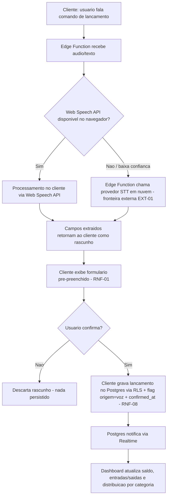
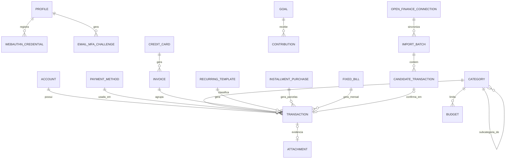

# SDD.md

**Dono**: Software Architect
**Data**: 2026-09-02 (Seção 5 e as subseções Autenticação/Autorização/Isolamento
Multi-Tenant da Seção 7 reabertas e reescritas em 2026-09-02, mesma data — ver nota de
reabertura abaixo)
**Gate de entrada**: `PRD-TECNICO.md` liberado pelo Business Analyst em 2026-09-02.
**Gate de saída**: revisão do CTO no **Gate 2** (`architecture-decision-review` +
`build-vs-buy-analysis` + `risk-and-compliance-check`) — **este documento é um
rascunho pronto para revisão, não a arquitetura final.** Só vira final após veredito
Aprovado ou Aprovado com ressalvas do CTO. **Reabertura em curso**: as partes marcadas
abaixo foram reprovadas pontualmente pelo CTO (`CTO-REVIEW.md`, "Gate 2 (Reaberto por
Bloqueio 003)") e reescritas nesta rodada; aguardam novo `architecture-decision-review`
+ `risk-and-compliance-check` completo antes de o Backend retomar `BE-M-00`.
**Fonte**: `PRD-TECNICO.md` (Business Analyst) + `PRD.md` (PM) + `CTO-REVIEW.md` Gate 1
(contexto) + restrição técnica adicional do stakeholder (reaproveitamento do Supabase
legado, comunicada fora do PRD/PRD-TECNICO) + achado técnico do `SPK-001`
(`BLOCKERS.md`, Bloqueio 003) + `CTO-REVIEW.md` "Gate 2 (Reaberto por Bloqueio 003)".
**Consumidor imediato**: `cto` (Gate 2, novo ciclo completo); em seguida `ux-ui` e
`tech-lead` (que já haviam iniciado trabalho sobre a versão anterior — precisam
reconciliar `TASK.md`/`GUARDRAILS.md` com esta atualização, conforme cascata registrada
em `BLOCKERS.md`, Bloqueio 003).

## Nota de Reabertura (Bloqueio 003) — 2026-09-02

`SPK-001` (Backend) encontrou que a premissa central do `ADR-001` — "o projeto Supabase
reaproveitado contém dado de outro produto não relacionado, a isolar" — não se
sustenta: o schema `public` do projeto `xrcxbzrglndetrrhavhc` já implementa, de forma
avançada, o mesmo domínio que este documento desenhou do zero, e o stakeholder
confirmou diretamente que se trata de **uma implementação anterior deste mesmo produto
MyMoney**, feita por ele mesmo, que ele quer **reaproveitar**. O CTO decidiu (`Gate 2
Reaberto por Bloqueio 003`) que `ADR-001` é superseded por **ADR-012** — a estratégia
muda de "criar schema `mymoney` isolado do zero" para "adotar `public` como schema de
fato de persistência deste produto, com plano de evolução aditivo para as entidades
ainda ausentes". Detalhe completo em `ADR-012`
(`.md/adr/012-adotar-public-existente-como-base-reaproveitando-implementacao-anterior.md`)
e `ADR-013` (esclarecimento do gate de MFA/WebAuthn frente ao `ADR-005`/`ADR-010`).

Esta atualização reabre, além da Seção 5 e das 3 subseções de Seção 7 formalmente
reprovadas pelo CTO, um conjunto adicional de menções pontuais a "schema `mymoney`" nas
Seções 1-4 e 6.1, onde a referência antiga estava em conflito factual direto com a
decisão nova (deixar essas menções como estavam criaria uma contradição interna óbvia
dentro do próprio documento). Nenhuma decisão estrutural das Seções 1-4/6 muda de
mérito por causa disso — só a referência ao schema/à natureza do reaproveitamento é
corrigida onde havia conflito real. Tabelas, diagramas e decisões não relacionadas ao
schema permanecem exatamente como estavam.

## Nota sobre os 3 pontos delegados + 1 restrição adicional

O `PRD-TECNICO.md` delegou explicitamente a este agente três decisões, sem tomá-las:
(1) NFR formal de confiabilidade (SLA/backup), (2) web/PWA vs. app nativo, (3) build
vs. buy de voz/OCR/Open Finance. As três estão resolvidas e justificadas abaixo, cada
uma com ADR próprio (`.md/adr/003`, `.md/adr/004`, `.md/adr/006`, `.md/adr/007`,
`.md/adr/008`).

Além disso, o stakeholder impôs, fora do `PRD.md`/`PRD-TECNICO.md`, uma restrição
técnica adicional: reaproveitar o banco de dados Supabase de um projeto já existente
(`https://supabase.com/dashboard/project/xrcxbzrglndetrrhavhc`) em vez de provisionar
um banco novo, preservando os dados já existentes. **O schema real desse projeto foi
inspecionado (`SPK-001`) e confirmado pelo stakeholder como uma implementação anterior
deste mesmo produto**, não de um produto alheio — a arquitetura adota `public` como
schema de fato de persistência (ADR-012), com auditoria por objeto reaproveitado, em
vez de tratar o schema legado como incerteza a isolar (premissa original do `ADR-001`,
superseded). Essa restrição molda decisões em cascata: escolha de persistência
(ADR-001, superseded por ADR-012), padrão arquitetural geral (ADR-002) e estratégia de
backup (ADR-004, cadência corrigida por ADR-009; item de tier/plano ainda em aberto,
ver ADR-012 "Item Fora de Escopo").

---

## 1. Visão Geral da Arquitetura

O MyMoney é desenhado como um **monólito modular sobre uma plataforma
Backend-as-a-Service (Supabase)**, servido como **aplicação web responsiva instalável
(PWA)**, sem servidor de aplicação dedicado. Essa combinação é resultado direto do
contexto do projeto: usuário único, sem orçamento/prazo formal, sem equipe além do
próprio stakeholder, com exigência explícita de reaproveitar um projeto Supabase já
existente como banco de dados — projeto esse confirmado como uma **implementação
anterior deste mesmo produto**, feita pelo próprio stakeholder (ver ADR-012, supersede
ADR-001) — e a orientação do CTO no Gate 1 de "evitar arquitetura distribuída
desnecessária para carga de usuário único".

Princípios que orientam todas as decisões de arquitetura deste documento:

1. **Nenhum requisito do MVP/Fase 2 depende de decisão de provedor terceiro** — voz,
   OCR e Open Finance (Fase 3) são estritamente aditivos; se qualquer um desses
   provedores falhar ou ficar indisponível, o fluxo de lançamento manual (RF-MVP-04)
   continua funcionando sem degradação.
2. **Confirmação humana obrigatória (RNF-01) é uma barreira arquitetural, não apenas
   de UX** — nenhum caminho de persistência de lançamento de origem automatizada
   (voz, foto, importação, Open Finance) escreve na tabela de lançamentos sem passar
   pelo mesmo formulário de revisão do MVP e sem um evento de confirmação explícito
   registrado (RNF-08).
3. **Custo operacional mínimo e manutenção por uma única pessoa** — cada escolha de
   stack (Seção 3) prioriza serviços gerenciados com free/baixo tier sobre
   infraestrutura própria a operar.
4. **Reaproveitamento é a estratégia de fato, não um risco a isolar** — o projeto
   Supabase reaproveitado hospeda a própria implementação anterior deste produto; o
   schema `public` é adotado como base real de persistência, com plano de evolução
   aditivo (`CREATE`, nunca `ALTER`/`DROP` destrutivo sobre objeto com dado real sem
   revisão explícita do CTO) para as entidades ainda ausentes — um único schema
   `public` para todo o produto, sem split de schema (ADR-012, supersede ADR-001).
   Cada objeto reaproveitado (tabela/função/trigger/policy) é auditado contra os
   requisitos atuais antes de aceito como definitivo (ver Seção 6.1 e ADR-012).
5. **Confiabilidade é tratada com meta mensurável, não com promessa vaga** — RPO ≤
   24h (via exportação lógica diária independente, cadência corrigida por revisão do
   CTO no Gate 2), RTO ≤ 24h, backup em camadas independentes do fornecedor principal,
   e fila de lançamento offline no cliente como última linha de defesa contra perda de
   dado digitado (ADR-004, cadência de backup corrigida por ADR-009).

Decisões estruturais registradas como ADR (índice completo na Seção 4):
reaproveitamento do Supabase como base real de persistência (ADR-001, superseded por
ADR-012), monólito modular sobre BaaS (ADR-002), web/PWA em vez de nativo (ADR-003),
meta de confiabilidade/backup em camadas (ADR-004, cadência corrigida por ADR-009),
autenticação via Supabase Auth + WebAuthn/PIN (ADR-005, esclarecida por ADR-010 e
ADR-013), build-vs-buy de voz (ADR-006), OCR (ADR-007) e Open Finance (ADR-008),
política de retenção/descarte (ADR-011), adoção de `public` como base real (ADR-012),
e esclarecimento do gate de MFA/WebAuthn reaproveitado (ADR-013).

---

## 2. Componentes e Fluxo de Dados

### 2.1 Componentes

| Componente | Responsabilidade | Requisitos que o justificam |
|---|---|---|
| **Cliente Web PWA** (React + TypeScript) | UI de todas as fases: contas, formas de pagamento, categorização, lançamentos, dashboard, orçamento, cartão/fatura, recorrência, parcelamento, contas fixas, metas, captura de voz/foto, importação, relatórios/exportação | RF-MVP-01 a 08, RF-F2-01 a 10, RF-F3-01 a 06 |
| **Service Worker + fila offline (IndexedDB)** | Cache de app instalável, recebimento de push, fila local de lançamentos digitados sem conexão, sincronizada ao reconectar | RNF-04 (confiabilidade), RF-MVP-04 |
| **Supabase Auth** | Identidade/sessão do usuário (e-mail/senha ou magic link) | RF-MVP-08 |
| **WebAuthn (API do navegador/SO)** | Desbloqueio biométrico do app (Face ID/Touch ID/Windows Hello) + PIN local de fallback | RF-MVP-08, EXT-06 |
| **Postgres (schema `public`, projeto Supabase reaproveitado como base real deste produto — ADR-012)** | Persistência do ledger financeiro e de todas as entidades de planejamento (ver Seção 5) | RF-MVP-01 a 07, RF-F2-01 a 10, RF-F3-03/04/05 |
| **RLS Policies** | Autorização por ownership (`auth.uid() = user_id`) em toda tabela de `public` associada a este produto | Seção 7 (Autorização) |
| **Supabase Edge Functions** | Execução server-side de regras de negócio não triviais: geração mensal de recorrência (RN-07), cálculo de fechamento/projeção de fatura (RN-01, RN-06), avaliação de aviso de conta fixa (RN-05), proxy de chamadas a provedores externos (STT, OCR, agregador Open Finance) mantendo segredos fora do cliente | RF-F2-01 a 09, RF-F3-01/02/04 |
| **pg_cron / Scheduled Functions** | Disparo agendado (mensal/diário) das Edge Functions de recorrência, fatura e avisos | RF-F2-02, RF-F2-05, RF-F2-07 |
| **Supabase Storage** | Armazenamento privado de fotos de recibo (pipeline OCR) e arquivos de exportação (PDF/CSV) | RF-F3-02, RF-F3-06 |
| **Supabase Realtime** | Propagação de mudanças de dados entre abas/dispositivos do mesmo usuário para manter o dashboard atualizado | RF-MVP-05 AC2 |
| **Web Push Service** | Entrega de notificações (orçamento perto do teto, conta fixa a vencer) | RF-F2-09, EXT-05 |
| **Web Speech API + fallback STT em nuvem** | Interpretação de fala para pré-preencher lançamento (Fase 3) | RF-F3-01, EXT-01 — ver ADR-006 |
| **Provedor de OCR em nuvem** | Extração de campos de recibo fotografado | RF-F3-02, EXT-02 — ver ADR-007 |
| **Parser OFX/CSV (interno, Edge Function)** | Interpretação de extrato importado | RF-F3-03, EXT-03 |
| **Agregador Open Finance (Pluggy)** | Conectividade Open Finance certificada, sem certificação regulatória própria | RF-F3-04, EXT-04 — ver ADR-008 |

Todo componente acima é rastreável a pelo menos um requisito funcional do
`PRD-TECNICO.md`; nenhum componente foi introduzido "por via das dúvidas".

### 2.2 Bounded contexts (organização lógica dentro do monólito modular)

Aplicando `modular-design-principles` sobre o schema `public` (nenhum é um banco
físico separado — são fronteiras lógicas de tabelas/RPCs/Edge Functions dentro do
mesmo schema, ADR-012):

- **Contas & Formas de Pagamento** — RF-MVP-01, RF-MVP-02
- **Categorização** — RF-MVP-03
- **Ledger (Lançamentos)** — RF-MVP-04, núcleo do sistema; todo outro contexto produz
  ou consome lançamentos
- **Orçamento** — RF-MVP-07, depende de Categorização + Ledger
- **Cartão & Fatura** — RF-F2-01, RF-F2-05, depende de Formas de Pagamento + Ledger
- **Recorrência & Parcelamento** — RF-F2-02 a 04, gera lançamentos no Ledger
- **Contas Fixas** — RF-F2-06/07, gera lançamentos previstos no Ledger
- **Metas** — RF-F2-08
- **Notificações** — RF-F2-09, cross-cutting (assina eventos de Orçamento e Contas
  Fixas)
- **Captura Automatizada** (voz, foto, importação, Open Finance) — RF-F3-01 a 04,
  produz *candidatos* que só entram no Ledger após confirmação humana (RNF-01)
- **Relatórios & Exportação** — RF-F3-05/06, modelo de leitura sobre o Ledger

### 2.3 Diagrama de Componentes

```mermaid
flowchart TB
    subgraph Client["Cliente - Web PWA (React/TS)"]
        UI["UI: Contas, Lancamentos, Dashboard, Orcamento, Cartao, Recorrencia, Metas, Captura"]
        SW["Service Worker: cache offline, push"]
        IDB[("IndexedDB: fila de lancamentos offline")]
    end

    subgraph Supabase["Supabase - base real de persistencia deste produto (ADR-012)"]
        Auth["Supabase Auth"]
        PG[("Postgres - schema public")]
        RLS["RLS Policies"]
        Edge["Edge Functions"]
        Cron["pg_cron / Scheduled Functions"]
        Storage[("Storage: recibos, exports")]
        Realtime["Realtime Channels"]
    end

    subgraph External["Integracoes Externas (Fase 3)"]
        STT["Web Speech API + fallback STT nuvem - EXT-01"]
        OCR["Provedor OCR nuvem - EXT-02"]
        OFX["Parser OFX/CSV - EXT-03, interno ao Edge"]
        OpenF["Agregador Open Finance Pluggy - EXT-04"]
        Push["Web Push Service - EXT-05"]
        WebAuthn["WebAuthn API do navegador/SO - EXT-06"]
    end

    UI -->|login/sessao| Auth
    UI -->|CRUD via PostgREST, protegido por RLS| PG
    PG --- RLS
    UI <-->|assinatura de mudancas| Realtime
    Realtime --- PG
    UI -->|upload foto recibo| Storage
    UI -->|grava lancamento offline| IDB
    IDB -->|sincroniza ao reconectar| PG
    SW -->|recebe notificacao| Push
    Cron -->|dispara| Edge
    Edge -->|gera lancamento recorrente/parcela/aviso| PG
    Edge -->|dispara notificacao| Push
    UI -->|captura de voz| Edge
    Edge --> STT
    UI -->|captura de foto| Edge
    Edge --> OCR
    UI -->|importa extrato| Edge
    Edge --> OFX
    Edge -->|sincroniza transacoes| OpenF
    UI -->|desbloqueio biometrico/PIN| WebAuthn
```

### 2.4 Fluxo de Dados — Captura Automatizada Cruzando Fronteira Externa (exemplo: voz)

Este fluxo detalha, em nível de arquitetura, o mesmo comportamento funcional já
mapeado pelo Business Analyst em FL-04 (`PRD-TECNICO.md`), destacando onde a
fronteira externa (EXT-01) é cruzada e onde a confirmação humana (RNF-01) é
tecnicamente imposta:

O mesmo padrão (extração por componente externo → rascunho não persistido →
confirmação humana obrigatória → gravação com flag de origem + timestamp) se aplica
a OCR (RF-F3-02), importação OFX/CSV (RF-F3-03) e Open Finance (RF-F3-04) — apenas o
componente que produz o rascunho muda (OCR, parser interno, ou agregador,
respectivamente).

### 2.5 Decisões de fluxo de dados de rotina (sem ADR próprio)

- **Atualização do dashboard (RF-MVP-05 AC2)**: o cliente que executou a escrita
  atualiza seu próprio estado imediatamente após a resposta da escrita bem-sucedida
  (não espera o Realtime); o canal Realtime serve para propagar a mudança para
  *outras* abas/dispositivos da mesma sessão do usuário — não é dependência crítica
  para a própria ação do usuário.
- **Horizonte da fatura projetada (RF-F2-05 AC1)**: fatura corrente + 2 faturas
  futuras (3 competências no total) exibidas por padrão — dimensionado para o volume
  de referência de RNF-09, ajustável sem mudança estrutural se o uso real (RN-11)
  divergir.
- **Notificações (RF-F2-09)**: um único mecanismo (Web Push, ADR-003) centraliza os
  dois gatilhos (orçamento próximo do teto, conta fixa a vencer), disparado por Edge
  Functions agendadas via `pg_cron`, sem lógica de disparo duplicada entre os dois
  domínios.

---

## 3. Stack Tecnológica e Justificativa

| Componente | Tecnologia | Requisito que motiva | Alternativa considerada | Trade-off | Gate 2? |
|---|---|---|---|---|---|
| Framework de UI | React + TypeScript | Todas as telas do MVP/F2/F3; ecossistema maduro de PWA | Vue 3 (ecossistema PWA um pouco menos padronizado) | Curva de aprendizado baixa para manutenção solo; maior disponibilidade de bibliotecas de gráfico (RF-MVP-06) | Não |
| Estilização | Tailwind CSS | Velocidade de implementação sem equipe de design dedicada | CSS Modules puro | Menos flexível para design systems muito customizados; mais rápido para produto solo | Não |
| PWA / Service Worker | Workbox (sobre Service Worker API nativa) | RNF-05 — instalabilidade, cache offline, push (ADR-003) | Implementação manual de Service Worker | Workbox reduz boilerplate e bugs de cache; mais uma dependência de build | Não |
| Fila offline no cliente | IndexedDB via Dexie.js | RNF-04 — não perder lançamento digitado offline (ADR-004) | LocalStorage simples | IndexedDB suporta volume/estrutura maior; Dexie reduz boilerplate da API nativa | Não |
| Persistência principal | Postgres gerenciado via Supabase (projeto reaproveitado, schema `public` adotado como base real — ADR-012, supersede ADR-001) | Restrição explícita do stakeholder + confirmação de que é implementação anterior própria (ADR-012) | Novo projeto Supabase greenfield / mover objetos para schema `mymoney` novo (Opção B do ADR-012) | Custo zero adicional e reaproveita trabalho já funcional vs. lock-in de lógica de negócio mais profundo (código reaproveitado já em uso, auditado objeto a objeto — ver ADR-012) | **Sim** — vendor lock-in + qualidade de código próprio não revisado |
| Padrão de backend | Supabase (Auth + Postgres + Storage + Edge Functions + Realtime) — monólito modular sem servidor de aplicação dedicado | RNF-09 (evitar arquitetura distribuída desnecessária), ADR-002 | Backend customizado (Node/NestJS) | Zero custo de servidor 24/7 vs. lock-in mais profundo na plataforma | **Sim** — decisão estrutural de arquitetura |
| Autenticação | Supabase Auth + WebAuthn (biometria de plataforma) + PIN local | RF-MVP-08 (ADR-005) | Serviço de auth customizado | Custo zero vs. UX levemente inconsistente entre navegadores | Sim (`risk-and-compliance-check`) |
| Autorização | Row Level Security (RLS) nativa do Postgres | RN-08, RN-07, Seção 7 | Camada de autorização em código de aplicação | RLS evita duplicar regra de acesso em múltiplas camadas; exige disciplina de teste de policy | Não |
| Lógica de negócio server-side | Supabase Edge Functions (Deno) + `pg_cron` | RN-01, RN-02, RN-06, RN-07 (fatura, recorrência, parcelamento) | Servidor Node dedicado | Escala automaticamente sem infraestrutura própria; debugging levemente mais limitado que servidor tradicional | Não |
| Armazenamento de arquivo | Supabase Storage | RF-F3-02 (fotos de recibo), RF-F3-06 (exports) | S3 (AWS) direto | Storage já incluso no Supabase, sem conta/serviço adicional a gerenciar | Não |
| Atualização em tempo real | Supabase Realtime | RF-MVP-05 AC2 | Polling periódico no cliente | Menor latência percebida sem custo de polling constante; mais uma dependência de canal WebSocket a monitorar | Não |
| Hospedagem do frontend | CDN estático (Vercel/Cloudflare Pages, free tier) | RNF-04 (disponibilidade "melhor esforço", ADR-004), custo zero | Servidor próprio | Alta disponibilidade nativa do CDN sem custo/operação própria | Não |
| Push notification | Web Push API (VAPID) | RF-F2-09, EXT-05 (ADR-003) | Push nativo (exigiria app nativo) | Sem custo de loja; limitação conhecida de push no iOS Safari (ADR-003) | Não |
| Captura de voz (STT) | Web Speech API (cliente) + fallback opcional em nuvem | RF-F3-01, EXT-01 (ADR-006) | Modelo de STT próprio (build) | Custo zero na primeira camada vs. suporte desigual entre navegadores | **Sim** — `build-vs-buy-analysis` |
| OCR de recibo | Provedor de nuvem (Google Cloud Vision/AWS Textract) via Edge Function, com Tesseract.js como fallback client-side | RF-F3-02, EXT-02 (ADR-007) | OCR próprio (build) | Acurácia consistente vs. dependência de serviço externo e política de free tier | **Sim** — `build-vs-buy-analysis` |
| Integração Open Finance | Agregador terceirizado (Pluggy) via Edge Function | RF-F3-04, EXT-04 (ADR-008) | Certificação direta junto ao BACEN | Sem custo/tempo de certificação vs. lock-in adicional e custo condicional ao volume | **Sim** — `build-vs-buy-analysis` + `risk-and-compliance-check` |
| Parser de extrato | Biblioteca open-source de OFX + parser CSV próprio (dentro de Edge Function) | RF-F3-03, EXT-03 | Parser 100% próprio para todos os formatos proprietários de banco | OFX é formato aberto; biblioteca madura reduz esforço; cobertura de 100% dos bancos é dívida técnica aceita (Seção 6) | Não |
| Exportação PDF/CSV | Biblioteca de geração de PDF no cliente ou via Edge Function (ex. `pdf-lib`) + CSV nativo | RF-F3-06 | Serviço externo de geração de relatório | Sem custo de serviço adicional; layout de PDF ainda não fechado (AMB-05 do `PRD-TECNICO.md`), a detalhar na fase tática | Não |

Toda escolha marcada "Gate 2? Sim" está sinalizada para revisão do CTO
(`architecture-decision-review` e/ou `build-vs-buy-analysis` e/ou
`risk-and-compliance-check`, conforme o caso) antes de ser considerada definitiva —
não foi decidida como aposta de alto risco unilateral.

---

## 4. Decisões Arquiteturais (ADRs)

Todos os ADRs vivem em `.md/adr/`, um arquivo imutável por decisão. Este índice
reflete exatamente os arquivos existentes nesta submissão ao Gate 2.

| ADR | Título | Status |
|---|---|---|
| [001](./adr/001-reaproveitar-supabase-legado-como-persistencia.md) | Reaproveitar o Supabase do projeto legado como camada de persistência | **Superseded by ADR-012** |
| [002](./adr/002-monolito-modular-sobre-baas-supabase.md) | Adotar monólito modular sobre BaaS (Supabase) em vez de backend customizado ou microsserviços | Accepted |
| [003](./adr/003-web-responsivo-pwa-em-vez-de-app-nativo.md) | Adotar web responsivo com PWA em vez de app nativo | Accepted |
| [004](./adr/004-meta-confiabilidade-rpo-rto-backup-em-camadas.md) | Definir meta de confiabilidade (RPO/RTO) e estratégia de backup em camadas | Superseded by ADR-009 |
| [005](./adr/005-autenticacao-supabase-auth-webauthn-pin-local.md) | Autenticação via Supabase Auth + biometria/PIN local via WebAuthn | Accepted — esclarecida por ADR-010 e ADR-013 |
| [006](./adr/006-captura-voz-provedor-stt-terceirizado.md) | Captura de lançamento por voz via provedor de Speech-to-Text terceirizado (buy) | Accepted |
| [007](./adr/007-ocr-recibo-provedor-terceirizado.md) | OCR de recibo via provedor de terceiro (buy) | Accepted |
| [008](./adr/008-open-finance-agregador-terceirizado-pluggy.md) | Integração Open Finance via agregador terceirizado, em vez de integração direta certificada BACEN (buy) | Accepted |
| [009](./adr/009-meta-confiabilidade-rpo-rto-backup-em-camadas-cadencia-diaria.md) | Corrigir cadência da exportação lógica de backup para diária, tornando RPO ≤ 24h verdadeiro independentemente do tier do Supabase legado (supersede ADR-004, correção pontual pós Gate 2) | Accepted |
| [010](./adr/010-escopo-revalidacao-servidor-desbloqueio-local.md) | Esclarecer o escopo da "revalidação de sessão do lado do servidor" no desbloqueio local (PIN/WebAuthn) do ADR-005 — resolve Bloqueio 001 (`ux-ui`) | Accepted |
| [011](./adr/011-politica-retencao-descarte-dado-exclusao-conta.md) | Definir política de retenção e descarte de dado (ledger, recibos, exports, backups) e processo de exclusão de conta — resolve Bloqueio 002 (`tech-lead`) | Accepted |
| [012](./adr/012-adotar-public-existente-como-base-reaproveitando-implementacao-anterior.md) | Adotar o schema `public` existente como base real de persistência, reaproveitando implementação anterior do stakeholder (supersede ADR-001) — resolve Bloqueio 003 (`backend`/`cto`) | **Accepted** |
| [013](./adr/013-esclarecimento-mfa-gate-jwt-claim-e-tabelas-auth-reaproveitadas.md) | Esclarecer a adoção do gate de MFA via JWT claim e das tabelas de autenticação já implementadas em `public`, frente ao ADR-005/ADR-010 | Accepted |

Nenhum ADR foi editado após aceito, com uma única exceção convencionada: a linha
`Status` do ADR superseded é atualizada para apontar ao ADR novo (mesmo padrão já
aplicado ao ADR-004→ADR-009, agora também ao ADR-001→ADR-012) — nenhum outro campo do
ADR original é tocado. Toda mudança de decisão (inclusive reprovação pontual do CTO no
Gate 2) gera um novo ADR, marcando o anterior como `Status: Superseded by ADR-NNN`.
Quando a mudança é apenas esclarecimento de ambiguidade de texto, sem alterar o
Decision Outcome já aceito (caso do ADR-010 e do ADR-013 sobre o ADR-005), o ADR
original permanece `Accepted` e ganha a nota "esclarecida por ADR-NNN" só no índice
acima — o ADR original em si não é editado.

---

## 5. Modelo de Dados de Alto Nível

**Reescrita completa desta seção — resolve Bloqueio 003 (`BLOCKERS.md`), reprovação
pontual do CTO em `CTO-REVIEW.md` "Gate 2 (Reaberto por Bloqueio 003)".** `SPK-001`
(Backend) inspecionou o schema real do projeto Supabase reaproveitado e confirmou, com
validação direta do stakeholder, que ele já implementa a maior parte do modelo lógico
abaixo — não como coincidência, mas como uma implementação anterior deste mesmo
produto. Todas as entidades agora vivem no schema `public` (ADR-012, supersede
ADR-001) — **nenhuma entidade nova, de qualquer fase, vai para um schema separado**.
**Este continua sendo um modelo lógico, não uma modelagem física detalhada** — tipos de
coluna, índices e constraints físicas exatas são responsabilidade do Backend na
implementação, dentro do princípio de migration aditiva (ADR-012).

### 5.1 Entidades já existentes em `public` (adotadas, auditadas em ADR-012)

| Entidade lógica | Tabela real | Campos principais confirmados | Observação da auditoria |
|---|---|---|---|
| **Account** (Conta) | `accounts` | nome, tipo, saldo, ativa/inativa | Adotada como está; Backend confirma equivalência campo a campo com RF-MVP-01 |
| **PaymentMethod** (Forma de Pagamento) | `payment_methods` | nome, padrão do sistema ou customizada | Adotada como está |
| **Category** (Categoria/Subcategoria) | `categories` | nome, `parent_category_id` (self-reference, exatamente como este modelo já previa) | Adotada como está; **já seedada com as mesmas 12 categorias topo-nível** que `BE-M-02` precisaria criar (Alimentação, Assinaturas, Compras, Educação, Investimentos, Lazer, Moradia, Outras Despesas, Outras Receitas, Salário, Saúde, Transporte) — dado real, não a recriar |
| **Transaction** (Lançamento) | `transactions` | data, valor, tipo, descrição, status, `source` (default `'manual'`; enum já cobre voz/foto/importação/open finance), `confirmed_at`, mais `recurring_rule_id`, `installment_plan_id`, `card_invoice_id`, `import_staging_id`, `external_ref`, `attachment_id` (colunas nullable que já antecipam entidades da Seção 5.2) | Adotada como está; colunas antecipatórias reaproveitadas, não redesenhadas — ver "Migrations Evolutivas" abaixo |
| **Profile** (Perfil do usuário) | `profiles` | `id` (= `auth.users.id`), dado de PIN (via RPCs `set_pin`/`verify_pin`) | **Entidade nova nesta versão do `SDD.md`** — não estava modelada antes; existe 1 registro real (o próprio stakeholder). Populada automaticamente pelo trigger `handle_new_user()` em `auth.users` (ver ADR-012, avaliação de efeito colateral) |
| **WebAuthnCredential** (Credencial WebAuthn) | `webauthn_credentials` | `credential_id`, `public_key`, `sign_count`, `device_label` | **Entidade nova nesta versão** — adotada como a tabela real de `BE-M-09` (ver ADR-013), não recriada |
| **EmailMfaChallenge** (Desafio de MFA por e-mail) | `email_mfa_challenges` | dado de desafio/verificação associado ao gate de MFA via JWT claim | **Órfã (ADR-014)** — o gate de MFA por e-mail foi removido definitivamente do fluxo de autenticação; tabela mantida sem uso ativo, sem risco associado (ver Seção 7) |

### 5.2 Entidades ainda ausentes (plano de evolução aditivo dentro de `public`)

Nenhuma delas existe hoje — são criadas por migration aditiva, no próprio `public`,
quando a fase correspondente do `TASK.md` for retomada:

| Entidade | Campos principais (lógicos) | Relacionamentos | Requisito | Coluna antecipatória já existente em `transactions` |
|---|---|---|---|---|
| **Budget** (Orçamento) | competência (mês/ano), valor-teto, limiar de alerta | N:1 Category | RF-MVP-07 | — |
| **CreditCard** (Cartão) | limite, dia de fechamento, dia de vencimento | 1:N Invoice | RF-F2-01 | — |
| **Invoice** (Fatura) | competência, status (aberta/fechada), total calculado | N:1 CreditCard, 1:N Transaction | RF-F2-05 | `card_invoice_id` (FK a adicionar quando a tabela existir) |
| **RecurringTemplate** (Recorrência) | descrição, valor atual, categoria, forma de pagamento, dia do mês, data início/fim, histórico de reajuste | 1:N Transaction (gerados) | RF-F2-02, RF-F2-03 | `recurring_rule_id` (FK a adicionar quando a tabela existir) |
| **InstallmentPurchase** (Compra Parcelada) | valor total, número de parcelas, categoria, cartão | 1:N Transaction (parcelas) | RF-F2-04 | `installment_plan_id` (FK a adicionar quando a tabela existir) |
| **FixedBill** (Conta Fixa) | descrição, valor, categoria, dia de vencimento | 1:N Transaction (gerados por competência) | RF-F2-06/07 | — |
| **Goal** (Meta) | nome, valor-alvo, prazo (nullable) | 1:N Contribution | RF-F2-08 | — |
| **Contribution** (Aporte de Meta) | valor, data | N:1 Goal | RF-F2-08 | — |
| **Notification** (Notificação) | tipo, mensagem, entidade relacionada, lida_em, criada_em | — | RF-F2-09 | — |
| **ImportBatch** (Lote de Importação) | fonte (ofx/csv/open finance), status | 1:N CandidateTransaction | RF-F3-03/04 | `import_staging_id` (referência de staging; conciliar com `CandidateTransaction` na implementação) |
| **CandidateTransaction** (Candidato) | dado bruto extraído, possível duplicata de (nullable), status (pendente/confirmado/descartado) | N:1 ImportBatch, 0:1 Transaction (após confirmação) | RF-F3-03/04, RNF-01 | `import_staging_id` (mesma coluna acima — o candidato confirmado é referenciado pela `transaction` gerada) |
| **OpenFinanceConnection** (Conexão Open Finance) | instituição, id de conexão do agregador, status, última sincronização | 1:N ImportBatch | RF-F3-04, EXT-04 | `external_ref` (referência externa da instituição/agregador) |
| **Attachment** (Anexo/Evidência) — **achado adicional desta auditoria, fora da lista original do CTO** | tipo (foto de recibo), URL/path no Storage, `transaction_id` | N:1 Transaction | RF-F3-02 (evidência de OCR), ADR-011 (retenção de 90/30 dias) | `attachment_id` (FK a adicionar quando a tabela existir) |

### 5.3 Diagrama Entidade-Relacionamento (estado alvo, existentes + planejadas)

*(Entidades em maiúsculo sem itálico já existem em `public`: `ACCOUNT`, `PAYMENT_METHOD`,
`CATEGORY`, `TRANSACTION`, `PROFILE`, `WEBAUTHN_CREDENTIAL`, `EMAIL_MFA_CHALLENGE`. As
demais — `BUDGET`, `CREDIT_CARD`, `INVOICE`, `RECURRING_TEMPLATE`,
`INSTALLMENT_PURCHASE`, `FIXED_BILL`, `GOAL`, `CONTRIBUTION`, `IMPORT_BATCH`,
`CANDIDATE_TRANSACTION`, `OPEN_FINANCE_CONNECTION`, `ATTACHMENT` — ainda não existem,
ver Seção 5.2.)*

### 5.4 Migrations Evolutivas — decisão sobre as colunas antecipatórias

`transactions` já tem `recurring_rule_id`, `installment_plan_id`, `card_invoice_id`,
`import_staging_id`, `external_ref` e `attachment_id`, todas nullable, sem
`FOREIGN KEY` ativa (as tabelas referenciadas ainda não existem). **Decisão: aproveitar
essas colunas como estão, não redesenhar.** Cada uma antecipa corretamente a entidade
de Fase 2/3 correspondente (mapeamento na tabela 5.2). A migration de cada entidade
futura inclui, como parte do seu próprio escopo aditivo: (i) `CREATE TABLE` da entidade
nova; (ii) `ALTER TABLE transactions ADD CONSTRAINT ... FOREIGN KEY` ligando a coluna já
existente à nova tabela. Isso é uma migration aditiva no sentido do `ADR-012` (adiciona
uma constraint nova, não altera/remove dado existente) — não uma exceção à regra de
"nenhum `ALTER` destrutivo".

### 5.5 O que segue não confirmado

Nenhuma pendência de modelo lógico permanece em aberto por falta de inspeção — o
schema real foi inspecionado (`SPK-001`) e confirmado pelo stakeholder. A única
pendência remanescente é operacional, não de modelo de dados: o plano/tier contratado
do Supabase (item 6 do `SPK-001`) segue não confirmado, relevante para `ADR-009`
(backup), não para este modelo (ver `ADR-012`, "Item Fora de Escopo").

---

## 6. Riscos Técnicos e Dívida Técnica Aceita

### 6.1 Riscos e gargalos

| Risco/Gargalo | Componente | Severidade | Mitigação ou plano |
|---|---|---|---|
| Ponto único de falha: Supabase indisponível | Supabase (Auth+DB+Storage+Edge) | Média | Fila offline no cliente (IndexedDB) mantém o lançamento manual funcionando localmente; export lógico independente (ADR-004/ADR-009) reduz dependência total do mesmo fornecedor para recuperação; sem HA multi-região por ser desproporcional a usuário único. **Nota**: deixa de ser risco de disponibilidade "compartilhada com um segundo produto" — o projeto Supabase é dedicado a este produto (ADR-012); o risco de SPOF em si permanece, só a causa de contenção por terceiro deixa de existir |
| **Reclassificado** — Qualidade/confiabilidade de código reaproveitado não revisado (antigo "Schema real do projeto legado desconhecido") | Funções/triggers/policies de `public` já existentes (`apply_transaction_effect`, `handle_new_user`, `fn_clear_due_transactions`, `custom_access_token_hook`, RPCs de dashboard, `set_pin`/`verify_pin`) | Média-Alta | Deixou de ser risco de colisão com produto alheio (confirmado que não existe — ADR-012) e passa a ser risco de **qualidade de código próprio não revisado**: é uma implementação anterior do próprio stakeholder, sem cobertura de teste automatizado nem revisão de segurança conhecida. Mitigação: checklist de auditoria por objeto reaproveitado já aplicado em ADR-012 (tabela de auditoria); nenhum objeto entra em uso pleno por nova funcionalidade sem essa auditoria; DevSecOps revisa antes de qualquer objeto ir para produção — não presumir segurança adquirida só por já funcionar hoje |
| Perda de dados em migration sobre dado real já existente | Postgres (`public`) | Alta (permanente, não só até uma validação pontual) | Backup/snapshot antes de cada migration; nenhum `ALTER`/`DROP` destrutivo em objeto de `public` com dado real sem revisão explícita do CTO (ADR-012); migrations aditivas por padrão; sem staging separado confirmado — elevada a importância do backup antes de cada mudança |
| Vendor lock-in acumulado (Supabase + STT/OCR/Open Finance), lock-in de **lógica de negócio** mais profundo por reaproveitamento de código já em uso | Toda a stack, aprofundado pelas funções/triggers reaproveitadas | Média | Nenhuma automação de Fase 3 é pré-requisito do fluxo manual (RF-MVP-04 sempre funciona sem provedor externo); export lógico de backup independente do fornecedor principal; revisão de lock-in atualizada em ADR-012 ("Vendor Lock-in — Revisão") — piora de lógica aceita conscientemente, não omitida |
| Cadastro não controlado em `auth.users` gerando `profiles` órfãos (efeito colateral do trigger `handle_new_user()` reaproveitado) | `public.profiles`, Supabase Auth | Baixa-Média | Achado da auditoria de ADR-012; recomendação de restringir sign-up (allow-list de e-mail ou desabilitar cadastro público) a avaliar por Backend/DevSecOps na fase tática — não é uma correção de RLS (RLS por `user_id` já impede acesso cruzado), é higiene operacional |
| Custo de free tier excedido (STT nuvem fallback, OCR, agregador Open Finance) | Edge Functions/integrações de Fase 3 | Média | Priorizar camada gratuita (Web Speech API) antes de acionar fallback pago; monitorar uso; sinalizar ao BA/PM se custo real inviabilizar a Fase 3 (ver ADR-008) |
| Conflito de sincronização em edição offline em múltiplos dispositivos | Cliente (fila offline IndexedDB) | Baixa | Aceito como dívida técnica (ver 6.2), dado usuário único; resolução simples last-write-wins |
| Lógica de negócio de fatura/recorrência/parcelamento concentrada em Edge Functions/`pg_cron` | Edge Functions, `pg_cron` | Média | Cobertura de teste automatizado exigida na fase de Tech Lead/QA (RN-01, RN-02, RN-06, RN-07 são regras críticas); nenhuma regra deve viver só no cliente — inclui as funções/triggers já reaproveitadas (`apply_transaction_effect`, `fn_clear_due_transactions`), que herdam a mesma exigência |
| Falha ou atraso de sincronização Realtime | Supabase Realtime | Baixa | Cliente sempre atualiza seu próprio estado imediatamente após escrita bem-sucedida (não depende do Realtime para a própria ação do usuário); Realtime só cobre atualização entre abas/dispositivos |
| Mecanismo real de `verify_pin` pode conflitar com a promessa de desbloqueio 100% offline (ADR-010) | RPCs `set_pin`/`verify_pin` (auditoria pendente, ver ADR-013) | Média (até verificação) | Backend inspeciona o corpo das funções antes de `BE-M-09`; se `verify_pin` for o gate primário de desbloqueio e exigir rede, novo `BLOCKERS.md` escalado ao Software Architect antes de prosseguir (ADR-013) |

### 6.2 Dívida técnica aceita conscientemente

| Dívida Técnica Aceita | Motivo | Condição de revisão |
|---|---|---|
| Sem arquitetura de alta disponibilidade multi-região | Usuário único, sem orçamento formal; meta de disponibilidade é "melhor esforço" (ADR-004) | Revisitar se o produto deixar de ser uso pessoal (ex.: multiusuário) ou se surgir orçamento formal |
| Sem camada de cache dedicada (Redis) | Volume de referência baixo (60–120 lançamentos/mês, RNF-09); Postgres gerenciado atende sem cache adicional | Revisitar se o p95 de latência degradar ou o volume real medido (RN-11) ultrapassar consistentemente algumas centenas de lançamentos/mês |
| Conflito de sincronização offline resolvido por last-write-wins simples | Usuário único reduz drasticamente a chance de edição concorrente real do mesmo lançamento | Revisitar se o padrão de uso mostrar edição frequente do mesmo dado em múltiplos dispositivos simultâneos |
| Parser de OFX/CSV usa biblioteca de terceiro sem tratar todas as variações proprietárias de banco | Formato OFX é aberto, mas implementações variam; cobrir 100% dos bancos é desproporcional ao escopo | Revisitar caso a caso quando um banco específico do stakeholder falhar na importação (RF-F3-03 AC3 já prevê fallback manual) |
| Funções/triggers reaproveitados de `public` sem cobertura de teste automatizado até serem auditados individualmente (ADR-012) | Auditoria por objeto é o mecanismo de mitigação escolhido em vez de reescrever tudo do zero; proporcional a projeto pessoal sem orçamento formal | Cada objeto sai da condição de "dívida" assim que auditado conforme a tabela do ADR-012 e, se necessário, coberto por teste automatizado — revisitar item a item, não em bloco |

---

## 7. Requisitos de Segurança e Compliance (nível de arquitetura)

Esta seção define o **requisito de arquitetura**, não a implementação tática final —
o DevSecOps refina bloqueio de tentativas, SAST/DAST, hardening de código e scanner
de segredos mais adiante, a partir do que está definido aqui.

### Autenticação

**Reconciliada com a implementação real de `public` — resolve Bloqueio 003, condição
de aceite nº 4; ver ADR-012 e ADR-013 para o detalhe completo da auditoria.**

- **Usuário final**: Supabase Auth (e-mail/senha ou magic link) cria a sessão (JWT).
  Camada adicional **obrigatória** de desbloqueio do app via WebAuthn (biometria de
  plataforma) ou PIN numérico local antes de exibir qualquer dado financeiro
  (RF-MVP-08, ADR-005). Bloqueio temporário após **5 tentativas malsucedidas**, por
  **5 minutos** — baseline de arquitetura, refinável pelo DevSecOps na fase tática.
  **Esse gesto de desbloqueio (asserção WebAuthn ou checagem local do hash de PIN) é
  inteiramente local ao dispositivo e funciona sem conexão** — a "revalidação de
  sessão do lado do servidor" mencionada no ADR-005 se refere exclusivamente à
  validação do JWT que o Supabase já aplica a toda chamada subsequente ao
  PostgREST/Edge Functions (ver "Superfície de Exposição" abaixo), não ao gesto de
  desbloqueio em si; detalhado em ADR-010, que resolve o Bloqueio 001 (`ux-ui`).
- **WebAuthn já implementado**: a tabela `public.webauthn_credentials`
  (`credential_id`, `public_key`, `sign_count`, `device_label`) é adotada como a
  tabela real de `BE-M-09`, não recriada (ADR-013).
- **Sem 2º fator por e-mail (ADR-014, supersede a parte do ADR-013 que adotava o gate
  de MFA)**: o Auth Hook (`custom_access_token_hook`) e a tabela
  `public.email_mfa_challenges` existem no schema (herdados da implementação
  reaproveitada), mas o hook emite `app_email_mfa_verified=true` sempre, de forma
  definitiva — decisão do stakeholder, não bypass temporário. A Edge Function
  `auth-email-mfa` não é mais invocada pelo app. Fluxo de autenticação final:
  **Login (e-mail/senha) → Senha → PIN/biometria** (sem passo intermediário de
  verificação por e-mail).
- **PIN local — pendência de auditoria não resolvida nesta rodada**: existem RPCs
  reais `set_pin`/`verify_pin` cujo corpo interno não foi inspecionado por `SPK-001`.
  Se `verify_pin` for o mecanismo *primário* de desbloqueio e exigir chamada de rede,
  isso conflita diretamente com o Decision Outcome do ADR-010 (desbloqueio 100%
  local/offline) e com a promessa de fila offline (RNF-04). Este documento **não
  assume nenhuma das duas hipóteses** — Backend deve inspecionar as funções antes de
  `BE-M-09`; se houver conflito real, abre novo `BLOCKERS.md` ao Software Architect
  antes de prosseguir (ADR-013).
- **`profiles` populada automaticamente**: o trigger `handle_new_user()` (já existente
  em `auth.users`, `SECURITY DEFINER`) cria a linha de `Profile` para todo novo
  usuário. Adotado como está; recomendação de restringir cadastro público (ver Seção
  6.1) fica para a fase tática, não é uma mudança de arquitetura de autenticação.
- **Serviço a serviço**: Edge Functions chamam provedores externos (STT em nuvem
  fallback, OCR, agregador Open Finance) usando chaves/segredos mantidos em
  variáveis de ambiente do lado do servidor (Supabase Vault/secrets) — nunca
  expostas ao cliente.
- **Integração externa**: Open Finance segue o fluxo de consentimento OAuth2 do
  agregador (Pluggy); o token de acesso à conexão bancária do usuário é armazenado
  server-side, nunca no cliente.

### Autorização

**Reconciliada com o padrão real de `public` — resolve Bloqueio 003, condição de
aceite nº 4.**

- **Modelo**: ownership simples (não RBAC completo — usuário único não precisa de
  papéis diferenciados). Toda tabela de `public` associada a este produto tem RLS
  habilitada, com policy real confirmada `auth.uid() = user_id` para `SELECT`/
  `INSERT`/`UPDATE`/`DELETE` — **este é o padrão real já implementado e adotado como
  convenção do projeto daqui em diante**; substitui a convenção `owner_id` que este
  documento assumira sem inspeção na versão anterior (nenhuma tabela precisa ser
  renomeada — a intenção do `SDD.md` que muda, não o banco).
- **Claim de MFA sempre-verdadeiro, sem gate real (ADR-014)**: `accounts`,
  `categories`, `payment_methods`, `transactions` e as demais tabelas que copiaram o
  mesmo padrão em Fase 2 ainda checam `(auth.jwt() ->> 'app_email_mfa_verified') =
  'true'` em suas policies, mas o hook que emite esse claim (ver "Autenticação" acima)
  sempre o define como `'true'` — a cláusula é tecnicamente redundante, mantida por
  não representar risco (nunca bloqueia acesso legítimo) nem justificar o esforço de
  reescrever as policies das 12 tabelas envolvidas. Remoção da cláusula é limpeza
  opcional futura, não uma pendência de segurança.
- Edge Functions que executam tarefas de sistema (geração de recorrência,
  fechamento de fatura, notificações) operam com role de serviço restrita a essas
  operações específicas, nunca exposta ao cliente, sempre escopadas ao `user_id`
  do usuário dono do dado.
- Regras de negócio que viram autorização: **RN-08** (conta com lançamento
  vinculado não pode ser excluída, só inativada — enforced via flag `active` +
  bloqueio de `DELETE` físico quando há vínculo) e **RN-07** (cancelamento de
  recorrência/parcelamento não apaga lançamento já gerado — enforced por ausência
  de cascade delete entre `RecurringTemplate`/`InstallmentPurchase` e `Transaction`,
  entidades ainda a criar — ver Seção 5.2). A regra análoga a RN-11 (transição
  prevista→efetivado por vencimento) já está implementada em produção via
  `fn_clear_due_transactions`/`pg_cron` — Backend audita a semântica exata contra
  `PRD-TECNICO.md` antes de considerar `BE-M-06` equivalente (ver ADR-012).

### Criptografia

- **Em trânsito**: TLS 1.2+ obrigatório em toda comunicação cliente-Supabase,
  cliente-Edge Function e Edge Function-provedor externo (RNF-03).
- **Em repouso**: criptografia nativa do Postgres gerenciado (Supabase, AES-256 em
  nível de infraestrutura) para todas as tabelas (RNF-02). Campos especialmente
  sensíveis — em particular o token de conexão Open Finance — recebem criptografia
  adicional em nível de aplicação (ex.: Supabase Vault/`pgsodium`) antes de
  persistir, como defesa em profundidade além da criptografia de infraestrutura.
- Fotos de recibo no Storage: bucket **privado**, nunca público, acesso apenas via
  signed URL de curta duração.

### Isolamento Multi-Tenant

**Reescrita completa — resolve Bloqueio 003, condição de aceite nº 4.** A subseção
anterior partia da premissa "nunca em `public` compartilhado com o legado" — essa
premissa não existe mais: não há produto alheio a isolar (ADR-012), e `public` é
adotado como o único schema de persistência deste produto.

Não aplicável no sentido clássico de SaaS multiusuário — o produto atende um único
usuário (RNF-09). **Isolamento lógico continua sendo requisito real, mas o mecanismo
muda**: como o schema deixa de ser o instrumento de isolamento (não há mais um segundo
produto do qual isolar por namespace), a barreira de isolamento passa a ser
inteiramente a **RLS por `auth.uid() = user_id`** (ver "Autorização" acima), reforçada
pelo gate adicional de MFA via JWT claim nas 4 tabelas de dado mais sensível. Isso não
é uma barreira mais fraca do que o isolamento por schema — é o mesmo padrão que
qualquer aplicação Supabase multiusuário usa para isolar dado por linha dentro de um
schema compartilhado, e é o padrão que este projeto já usaria de qualquer forma
*dentro* do próprio `mymoney` caso esse schema tivesse sido criado (a política
`auth.uid() = owner_id` original também dependia de RLS, não de separação física por
schema, para isolar registros de usuários diferentes).

Dois pontos adicionais que a auditoria de ADR-012 trouxe para esta subseção:

- Como o produto é de uso pessoal de um único usuário, e a autorização por RLS só
  isola dado *entre* usuários diferentes, o risco real de "isolamento" deste produto
  não é multiusuário — é o cadastro não controlado de um segundo `auth.users` (ver
  Seção 6.1, risco "Cadastro não controlado"). Mitigação recomendada na fase tática:
  restringir sign-up.
- Role de banco: nenhum role customizado de aplicação existe no projeto — só os roles
  padrão de um projeto Supabase (`anon`, `authenticated`, `service_role`, etc.),
  confirmado por `SPK-001`. Não há "role do legado" a manter separado, porque não há
  legado — este ponto do `ADR-001` original está definitivamente resolvido, não mais
  pendente de confirmação.

### Superfície de Exposição

- **API PostgREST** auto-gerada pelo Supabase: exposta via HTTPS, protegida por RLS
  + JWT de sessão — nenhuma tabela de `public` associada a este produto sem RLS
  habilitada (correção de terminologia de schema, ADR-012 — decisão desta subseção
  não reaberta).
- **Edge Functions**: endpoints HTTPS, validam JWT de sessão antes de qualquer
  operação; o endpoint de webhook do agregador Open Finance valida assinatura/
  segredo do provedor para rejeitar chamadas forjadas.
- **Frontend**: hospedado como estático via CDN (HTTPS obrigatório); service worker
  restrito ao próprio domínio.
- **Storage**: bucket privado por padrão, sem listagem pública.

### Retenção e Descarte de Dado

Requisito de arquitetura formalizado em **ADR-011** (resolve Bloqueio 002, escalado
pelo Tech Lead; achado originalmente registrado pelo CTO no Gate 2,
`risk-and-compliance-check`, severidade Média). Resumo — ver ADR-011 para o
detalhamento completo por categoria, alternativas consideradas e a nota sobre a
tensão entre exclusão a pedido do usuário e backup já emitido:

| Categoria de dado | Retenção | Descarte |
|---|---|---|
| Ledger (lançamentos e demais entidades de planejamento) | Indefinida, enquanto a conta estiver ativa | Só por exclusão de conta |
| Candidato de importação (`CandidateTransaction`) descartado ou abandonado | 30 dias | Job diário agendado (`pg_cron` + Edge Function) |
| Foto de recibo vinculada a lançamento confirmado | 90 dias após `confirmed_at` | Job diário agendado |
| Foto de recibo vinculada a candidato descartado/abandonado | 30 dias (mesmo prazo do candidato) | Job diário agendado |
| Export CSV/PDF gerado sob demanda | Até 24h após geração | Job diário agendado |
| Backup/exportação lógica de disaster recovery (ADR-009) | Rotação dos últimos 30 snapshots diários | Job de rotação (mesma Edge Function do ADR-009) |
| Exclusão de conta a pedido do usuário | Imediata para dado ativo (tabelas de `public` associadas ao usuário¹ + Storage + usuário no Supabase Auth); até 30 dias de cauda residual em backup já emitido | Edge Function privilegiada dedicada, nunca exposta como operação direta do cliente |

Todos os jobs de expurgo reaproveitam exclusivamente o padrão já desenhado nesta
arquitetura (`pg_cron` + Edge Function), sem infraestrutura nova — coerente com o
princípio de custo operacional mínimo (Seção 1, princípio 3). Prazos concretos (90/30
dias, 30 snapshots) são a primeira definição formal da política, sujeitos à condição
de revisão registrada em ADR-011.

¹ Correção de terminologia (schema `mymoney` → `public`), consequência direta de
ADR-012 — não reabre a decisão do ADR-011 (política de retenção, prazos e mecanismo
permanecem exatamente como decididos), só atualiza o nome do schema onde o dado vive.

---

## Checklist de Pronto (auto-verificação do Software Architect)

- [x] Toda decisão arquitetural relevante tem ADR correspondente em `.md/adr/` — 13
      ADRs (001 a 013; 001 superseded por 012, 004 superseded por 009), incluindo os 3
      pontos delegados (RNF-04, RNF-05, RNF-06), a restrição de reaproveitamento do
      Supabase (ADR-012, substitui ADR-001), o esclarecimento de MFA/WebAuthn
      (ADR-013), a política de retenção (ADR-011) e a correção de cadência de backup
      (ADR-009)
- [x] Toda escolha de stack tem justificativa e trade-off/alternativa considerada
      registrados — Seção 3 (linha "Persistência principal" atualizada conforme
      ADR-012)
- [x] Todo risco técnico/gargalo tem severidade; toda dívida técnica aceita
      conscientemente tem o motivo e a condição de revisão registrados — Seção 6,
      reclassificada conforme condição de aceite nº 2 do CTO (Bloqueio 003)
- [x] Requisitos de segurança cobrem autenticação, autorização, criptografia e
      isolamento — Seção 7, nenhum item genérico sem detalhe concreto; subseções
      Autenticação/Autorização/Isolamento Multi-Tenant reescritas conforme condição de
      aceite nº 4 do CTO (Bloqueio 003)
- [x] Nenhuma das 7 seções está vazia ou com placeholder

**Nenhum requisito do `PRD-TECNICO.md` foi considerado tecnicamente inviável ou
desproporcional nesta rodada** — não há sinalização de bloqueio ao Business Analyst.
O único ponto de atenção condicional registrado é o custo do agregador Open Finance
além do free/dev tier (ADR-008), que só vira sinalização real se o volume/custo
medido durante a Fase 3 confirmar o risco. Duas pendências processuais novas, não
tratadas como bloqueio de Gate 2 (ambas com processo de escalonamento já definido, ver
ADR-012/ADR-013): confirmação de ativação do Auth Hook `custom_access_token_hook`, e
auditoria do corpo de `set_pin`/`verify_pin` pelo Backend antes de `BE-M-09`.

**SDD.md — atualizado após reabertura pontual do Gate 2 (Bloqueio 003), pronto para
novo `architecture-decision-review` + `risk-and-compliance-check` completo do CTO.**
Não é considerado final até aprovação (Aprovado ou Aprovado com ressalvas) desta nova
rodada — o restante do documento (Seções 1-4, 6 exceto os pontos reclassificados
acima) já havia sido aprovado no Gate 2 original e não é reaberto para novo veredito,
salvo se o CTO decidir revisitá-lo por consequência da mudança.
