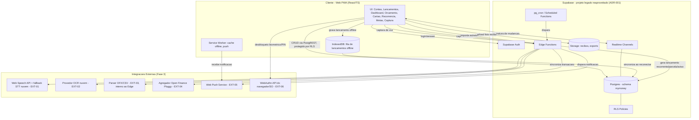
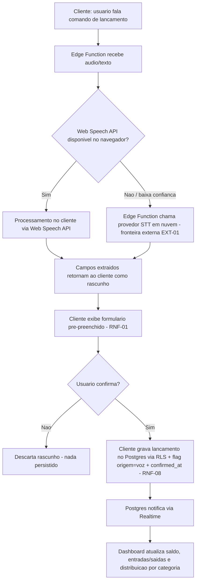
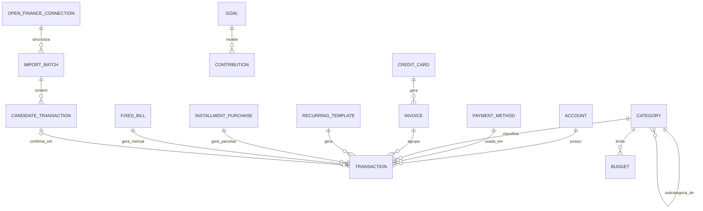

# SDD.md

**Dono**: Software Architect
**Data**: 2026-09-02
**Gate de entrada**: `PRD-TECNICO.md` liberado pelo Business Analyst em 2026-09-02.
**Gate de saída**: revisão do CTO no **Gate 2** (`architecture-decision-review` +
`build-vs-buy-analysis` + `risk-and-compliance-check`) — **este documento é um
rascunho pronto para revisão, não a arquitetura final.** Só vira final após veredito
Aprovado ou Aprovado com ressalvas do CTO.
**Fonte**: `PRD-TECNICO.md` (Business Analyst) + `PRD.md` (PM) + `CTO-REVIEW.md` Gate 1
(contexto) + restrição técnica adicional do stakeholder (reaproveitamento do Supabase
legado, comunicada fora do PRD/PRD-TECNICO).
**Consumidor imediato**: `cto` (Gate 2); em seguida `ux-ui` e `tech-lead`.

## Nota sobre os 3 pontos delegados + 1 restrição adicional

O `PRD-TECNICO.md` delegou explicitamente a este agente três decisões, sem tomá-las:
(1) NFR formal de confiabilidade (SLA/backup), (2) web/PWA vs. app nativo, (3) build
vs. buy de voz/OCR/Open Finance. As três estão resolvidas e justificadas abaixo, cada
uma com ADR próprio (`.md/adr/003`, `.md/adr/004`, `.md/adr/006`, `.md/adr/007`,
`.md/adr/008`).

Além disso, o stakeholder impôs, fora do `PRD.md`/`PRD-TECNICO.md`, uma restrição
técnica adicional: reaproveitar o banco de dados Supabase de um projeto legado já
existente (`https://supabase.com/dashboard/project/xrcxbzrglndetrrhavhc`) em vez de
provisionar um banco novo, preservando os dados já existentes. **O schema real desse
projeto não foi inspecionado nesta rodada** — esta arquitetura trata isso como
premissa explícita a validar antes da implementação (ver ADR-001), não como fato
assumido. Essa restrição molda decisões em cascata: escolha de persistência (ADR-001),
padrão arquitetural geral (ADR-002) e estratégia de backup (ADR-004).

---

## 1. Visão Geral da Arquitetura

O MyMoney é desenhado como um **monólito modular sobre uma plataforma
Backend-as-a-Service (Supabase)**, servido como **aplicação web responsiva instalável
(PWA)**, sem servidor de aplicação dedicado. Essa combinação é resultado direto do
contexto do projeto: usuário único, sem orçamento/prazo formal, sem equipe além do
próprio stakeholder, com exigência explícita de reaproveitar um projeto Supabase
legado como banco de dados (ver ADR-001) e a orientação do CTO no Gate 1 de "evitar
arquitetura distribuída desnecessária para carga de usuário único".

Princípios que orientam todas as decisões de arquitetura deste documento:

1. **Nenhum requisito do MVP/Fase 2 depende de decisão de provedor terceiro** — voz,
   OCR e Open Finance (Fase 3) são estritamente aditivos; se qualquer um desses
   provedores falhar ou ficar indisponível, o fluxo de lançamento manual (RF-MVP-04)
   continua funcionando sem degradação.
2. **Confirmação humana obrigatória (RNF-01) é uma barreira arquitetural, não apenas
   de UX** — nenhum caminho de persistência de lançamento de origem automatizada
   (voz, foto, importação, Open Finance) escreve na tabela de lançamentos sem passar
   pelo mesmo formulário de revisão do MVP e sem um evento de confirmação explícito
   registrado (RNF-08).
3. **Custo operacional mínimo e manutenção por uma única pessoa** — cada escolha de
   stack (Seção 3) prioriza serviços gerenciados com free/baixo tier sobre
   infraestrutura própria a operar.
4. **Reaproveitamento do Supabase legado é aceito, mas isolado** — todas as tabelas
   deste produto vivem em um schema Postgres dedicado (`mymoney`), nunca alteram ou
   assumem a estrutura de tabelas legadas já existentes (ADR-001).
5. **Confiabilidade é tratada com meta mensurável, não com promessa vaga** — RPO ≤
   24h (via exportação lógica diária independente, cadência corrigida por revisão do
   CTO no Gate 2), RTO ≤ 24h, backup em camadas independentes do fornecedor principal,
   e fila de lançamento offline no cliente como última linha de defesa contra perda de
   dado digitado (ADR-004, cadência de backup corrigida por ADR-009).

Decisões estruturais registradas como ADR (índice completo na Seção 4):
reaproveitamento do Supabase legado (ADR-001), monólito modular sobre BaaS (ADR-002),
web/PWA em vez de nativo (ADR-003), meta de confiabilidade/backup em camadas
(ADR-004, cadência corrigida por ADR-009), autenticação via Supabase Auth +
WebAuthn/PIN (ADR-005), e build-vs-buy de voz (ADR-006), OCR (ADR-007) e Open
Finance (ADR-008).

---

## 2. Componentes e Fluxo de Dados

### 2.1 Componentes

| Componente | Responsabilidade | Requisitos que o justificam |
|---|---|---|
| **Cliente Web PWA** (React + TypeScript) | UI de todas as fases: contas, formas de pagamento, categorização, lançamentos, dashboard, orçamento, cartão/fatura, recorrência, parcelamento, contas fixas, metas, captura de voz/foto, importação, relatórios/exportação | RF-MVP-01 a 08, RF-F2-01 a 10, RF-F3-01 a 06 |
| **Service Worker + fila offline (IndexedDB)** | Cache de app instalável, recebimento de push, fila local de lançamentos digitados sem conexão, sincronizada ao reconectar | RNF-04 (confiabilidade), RF-MVP-04 |
| **Supabase Auth** | Identidade/sessão do usuário (e-mail/senha ou magic link) | RF-MVP-08 |
| **WebAuthn (API do navegador/SO)** | Desbloqueio biométrico do app (Face ID/Touch ID/Windows Hello) + PIN local de fallback | RF-MVP-08, EXT-06 |
| **Postgres (schema `mymoney`, no projeto Supabase legado reaproveitado)** | Persistência do ledger financeiro e de todas as entidades de planejamento (ver Seção 5) | RF-MVP-01 a 07, RF-F2-01 a 10, RF-F3-03/04/05 |
| **RLS Policies** | Autorização por ownership em toda tabela do schema `mymoney` | Seção 7 (Autorização) |
| **Supabase Edge Functions** | Execução server-side de regras de negócio não triviais: geração mensal de recorrência (RN-07), cálculo de fechamento/projeção de fatura (RN-01, RN-06), avaliação de aviso de conta fixa (RN-05), proxy de chamadas a provedores externos (STT, OCR, agregador Open Finance) mantendo segredos fora do cliente | RF-F2-01 a 09, RF-F3-01/02/04 |
| **pg_cron / Scheduled Functions** | Disparo agendado (mensal/diário) das Edge Functions de recorrência, fatura e avisos | RF-F2-02, RF-F2-05, RF-F2-07 |
| **Supabase Storage** | Armazenamento privado de fotos de recibo (pipeline OCR) e arquivos de exportação (PDF/CSV) | RF-F3-02, RF-F3-06 |
| **Supabase Realtime** | Propagação de mudanças de dados entre abas/dispositivos do mesmo usuário para manter o dashboard atualizado | RF-MVP-05 AC2 |
| **Web Push Service** | Entrega de notificações (orçamento perto do teto, conta fixa a vencer) | RF-F2-09, EXT-05 |
| **Web Speech API + fallback STT em nuvem** | Interpretação de fala para pré-preencher lançamento (Fase 3) | RF-F3-01, EXT-01 — ver ADR-006 |
| **Provedor de OCR em nuvem** | Extração de campos de recibo fotografado | RF-F3-02, EXT-02 — ver ADR-007 |
| **Parser OFX/CSV (interno, Edge Function)** | Interpretação de extrato importado | RF-F3-03, EXT-03 |
| **Agregador Open Finance (Pluggy)** | Conectividade Open Finance certificada, sem certificação regulatória própria | RF-F3-04, EXT-04 — ver ADR-008 |

Todo componente acima é rastreável a pelo menos um requisito funcional do
`PRD-TECNICO.md`; nenhum componente foi introduzido "por via das dúvidas".

### 2.2 Bounded contexts (organização lógica dentro do monólito modular)

Aplicando `modular-design-principles` sobre o schema `mymoney` (nenhum é um banco
físico separado — são fronteiras lógicas de tabelas/RPCs/Edge Functions):

- **Contas & Formas de Pagamento** — RF-MVP-01, RF-MVP-02
- **Categorização** — RF-MVP-03
- **Ledger (Lançamentos)** — RF-MVP-04, núcleo do sistema; todo outro contexto produz
  ou consome lançamentos
- **Orçamento** — RF-MVP-07, depende de Categorização + Ledger
- **Cartão & Fatura** — RF-F2-01, RF-F2-05, depende de Formas de Pagamento + Ledger
- **Recorrência & Parcelamento** — RF-F2-02 a 04, gera lançamentos no Ledger
- **Contas Fixas** — RF-F2-06/07, gera lançamentos previstos no Ledger
- **Metas** — RF-F2-08
- **Notificações** — RF-F2-09, cross-cutting (assina eventos de Orçamento e Contas
  Fixas)
- **Captura Automatizada** (voz, foto, importação, Open Finance) — RF-F3-01 a 04,
  produz *candidatos* que só entram no Ledger após confirmação humana (RNF-01)
- **Relatórios & Exportação** — RF-F3-05/06, modelo de leitura sobre o Ledger

### 2.3 Diagrama de Componentes

### 2.4 Fluxo de Dados — Captura Automatizada Cruzando Fronteira Externa (exemplo: voz)

Este fluxo detalha, em nível de arquitetura, o mesmo comportamento funcional já
mapeado pelo Business Analyst em FL-04 (`PRD-TECNICO.md`), destacando onde a
fronteira externa (EXT-01) é cruzada e onde a confirmação humana (RNF-01) é
tecnicamente imposta:

O mesmo padrão (extração por componente externo → rascunho não persistido →
confirmação humana obrigatória → gravação com flag de origem + timestamp) se aplica
a OCR (RF-F3-02), importação OFX/CSV (RF-F3-03) e Open Finance (RF-F3-04) — apenas o
componente que produz o rascunho muda (OCR, parser interno, ou agregador,
respectivamente).

### 2.5 Decisões de fluxo de dados de rotina (sem ADR próprio)

- **Atualização do dashboard (RF-MVP-05 AC2)**: o cliente que executou a escrita
  atualiza seu próprio estado imediatamente após a resposta da escrita bem-sucedida
  (não espera o Realtime); o canal Realtime serve para propagar a mudança para
  *outras* abas/dispositivos da mesma sessão do usuário — não é dependência crítica
  para a própria ação do usuário.
- **Horizonte da fatura projetada (RF-F2-05 AC1)**: fatura corrente + 2 faturas
  futuras (3 competências no total) exibidas por padrão — dimensionado para o volume
  de referência de RNF-09, ajustável sem mudança estrutural se o uso real (RN-11)
  divergir.
- **Notificações (RF-F2-09)**: um único mecanismo (Web Push, ADR-003) centraliza os
  dois gatilhos (orçamento próximo do teto, conta fixa a vencer), disparado por Edge
  Functions agendadas via `pg_cron`, sem lógica de disparo duplicada entre os dois
  domínios.

---

## 3. Stack Tecnológica e Justificativa

| Componente | Tecnologia | Requisito que motiva | Alternativa considerada | Trade-off | Gate 2? |
|---|---|---|---|---|---|
| Framework de UI | React + TypeScript | Todas as telas do MVP/F2/F3; ecossistema maduro de PWA | Vue 3 (ecossistema PWA um pouco menos padronizado) | Curva de aprendizado baixa para manutenção solo; maior disponibilidade de bibliotecas de gráfico (RF-MVP-06) | Não |
| Estilização | Tailwind CSS | Velocidade de implementação sem equipe de design dedicada | CSS Modules puro | Menos flexível para design systems muito customizados; mais rápido para produto solo | Não |
| PWA / Service Worker | Workbox (sobre Service Worker API nativa) | RNF-05 — instalabilidade, cache offline, push (ADR-003) | Implementação manual de Service Worker | Workbox reduz boilerplate e bugs de cache; mais uma dependência de build | Não |
| Fila offline no cliente | IndexedDB via Dexie.js | RNF-04 — não perder lançamento digitado offline (ADR-004) | LocalStorage simples | IndexedDB suporta volume/estrutura maior; Dexie reduz boilerplate da API nativa | Não |
| Persistência principal | Postgres gerenciado via Supabase (projeto legado reaproveitado, schema `mymoney`) | Restrição explícita do stakeholder (ADR-001) | Novo projeto Supabase greenfield | Custo zero adicional vs. risco de schema legado desconhecido (mitigado por inspeção prévia obrigatória) | **Sim** — vendor lock-in + reuso de infra compartilhada |
| Padrão de backend | Supabase (Auth + Postgres + Storage + Edge Functions + Realtime) — monólito modular sem servidor de aplicação dedicado | RNF-09 (evitar arquitetura distribuída desnecessária), ADR-002 | Backend customizado (Node/NestJS) | Zero custo de servidor 24/7 vs. lock-in mais profundo na plataforma | **Sim** — decisão estrutural de arquitetura |
| Autenticação | Supabase Auth + WebAuthn (biometria de plataforma) + PIN local | RF-MVP-08 (ADR-005) | Serviço de auth customizado | Custo zero vs. UX levemente inconsistente entre navegadores | Sim (`risk-and-compliance-check`) |
| Autorização | Row Level Security (RLS) nativa do Postgres | RN-08, RN-07, Seção 7 | Camada de autorização em código de aplicação | RLS evita duplicar regra de acesso em múltiplas camadas; exige disciplina de teste de policy | Não |
| Lógica de negócio server-side | Supabase Edge Functions (Deno) + `pg_cron` | RN-01, RN-02, RN-06, RN-07 (fatura, recorrência, parcelamento) | Servidor Node dedicado | Escala automaticamente sem infraestrutura própria; debugging levemente mais limitado que servidor tradicional | Não |
| Armazenamento de arquivo | Supabase Storage | RF-F3-02 (fotos de recibo), RF-F3-06 (exports) | S3 (AWS) direto | Storage já incluso no Supabase, sem conta/serviço adicional a gerenciar | Não |
| Atualização em tempo real | Supabase Realtime | RF-MVP-05 AC2 | Polling periódico no cliente | Menor latência percebida sem custo de polling constante; mais uma dependência de canal WebSocket a monitorar | Não |
| Hospedagem do frontend | CDN estático (Vercel/Cloudflare Pages, free tier) | RNF-04 (disponibilidade "melhor esforço", ADR-004), custo zero | Servidor próprio | Alta disponibilidade nativa do CDN sem custo/operação própria | Não |
| Push notification | Web Push API (VAPID) | RF-F2-09, EXT-05 (ADR-003) | Push nativo (exigiria app nativo) | Sem custo de loja; limitação conhecida de push no iOS Safari (ADR-003) | Não |
| Captura de voz (STT) | Web Speech API (cliente) + fallback opcional em nuvem | RF-F3-01, EXT-01 (ADR-006) | Modelo de STT próprio (build) | Custo zero na primeira camada vs. suporte desigual entre navegadores | **Sim** — `build-vs-buy-analysis` |
| OCR de recibo | Provedor de nuvem (Google Cloud Vision/AWS Textract) via Edge Function, com Tesseract.js como fallback client-side | RF-F3-02, EXT-02 (ADR-007) | OCR próprio (build) | Acurácia consistente vs. dependência de serviço externo e política de free tier | **Sim** — `build-vs-buy-analysis` |
| Integração Open Finance | Agregador terceirizado (Pluggy) via Edge Function | RF-F3-04, EXT-04 (ADR-008) | Certificação direta junto ao BACEN | Sem custo/tempo de certificação vs. lock-in adicional e custo condicional ao volume | **Sim** — `build-vs-buy-analysis` + `risk-and-compliance-check` |
| Parser de extrato | Biblioteca open-source de OFX + parser CSV próprio (dentro de Edge Function) | RF-F3-03, EXT-03 | Parser 100% próprio para todos os formatos proprietários de banco | OFX é formato aberto; biblioteca madura reduz esforço; cobertura de 100% dos bancos é dívida técnica aceita (Seção 6) | Não |
| Exportação PDF/CSV | Biblioteca de geração de PDF no cliente ou via Edge Function (ex. `pdf-lib`) + CSV nativo | RF-F3-06 | Serviço externo de geração de relatório | Sem custo de serviço adicional; layout de PDF ainda não fechado (AMB-05 do `PRD-TECNICO.md`), a detalhar na fase tática | Não |

Toda escolha marcada "Gate 2? Sim" está sinalizada para revisão do CTO
(`architecture-decision-review` e/ou `build-vs-buy-analysis` e/ou
`risk-and-compliance-check`, conforme o caso) antes de ser considerada definitiva —
não foi decidida como aposta de alto risco unilateral.

---

## 4. Decisões Arquiteturais (ADRs)

Todos os ADRs vivem em `.md/adr/`, um arquivo imutável por decisão. Este índice
reflete exatamente os arquivos existentes nesta submissão ao Gate 2.

| ADR | Título | Status |
|---|---|---|
| [001](./adr/001-reaproveitar-supabase-legado-como-persistencia.md) | Reaproveitar o Supabase do projeto legado como camada de persistência | Accepted |
| [002](./adr/002-monolito-modular-sobre-baas-supabase.md) | Adotar monólito modular sobre BaaS (Supabase) em vez de backend customizado ou microsserviços | Accepted |
| [003](./adr/003-web-responsivo-pwa-em-vez-de-app-nativo.md) | Adotar web responsivo com PWA em vez de app nativo | Accepted |
| [004](./adr/004-meta-confiabilidade-rpo-rto-backup-em-camadas.md) | Definir meta de confiabilidade (RPO/RTO) e estratégia de backup em camadas | Superseded by ADR-009 |
| [005](./adr/005-autenticacao-supabase-auth-webauthn-pin-local.md) | Autenticação via Supabase Auth + biometria/PIN local via WebAuthn | Accepted — esclarecida por ADR-010 |
| [006](./adr/006-captura-voz-provedor-stt-terceirizado.md) | Captura de lançamento por voz via provedor de Speech-to-Text terceirizado (buy) | Accepted |
| [007](./adr/007-ocr-recibo-provedor-terceirizado.md) | OCR de recibo via provedor de terceiro (buy) | Accepted |
| [008](./adr/008-open-finance-agregador-terceirizado-pluggy.md) | Integração Open Finance via agregador terceirizado, em vez de integração direta certificada BACEN (buy) | Accepted |
| [009](./adr/009-meta-confiabilidade-rpo-rto-backup-em-camadas-cadencia-diaria.md) | Corrigir cadência da exportação lógica de backup para diária, tornando RPO ≤ 24h verdadeiro independentemente do tier do Supabase legado (supersede ADR-004, correção pontual pós Gate 2) | Accepted |
| [010](./adr/010-escopo-revalidacao-servidor-desbloqueio-local.md) | Esclarecer o escopo da "revalidação de sessão do lado do servidor" no desbloqueio local (PIN/WebAuthn) do ADR-005 — resolve Bloqueio 001 (`ux-ui`) | Accepted |
| [011](./adr/011-politica-retencao-descarte-dado-exclusao-conta.md) | Definir política de retenção e descarte de dado (ledger, recibos, exports, backups) e processo de exclusão de conta — resolve Bloqueio 002 (`tech-lead`) | Accepted |

Nenhum ADR foi editado após aceito. Toda mudança de decisão (inclusive reprovação
pontual do CTO no Gate 2) gera um novo ADR, marcando o anterior como `Status:
Superseded by ADR-NNN`. Quando a mudança é apenas esclarecimento de ambiguidade de
texto, sem alterar o Decision Outcome já aceito (caso do ADR-010 sobre o ADR-005), o
ADR original permanece `Accepted` e ganha a nota "esclarecida por ADR-NNN" — o ADR
original não é editado, só passa a ser lido em conjunto com o esclarecimento.

---

## 5. Modelo de Dados de Alto Nível

Entidades principais do schema `mymoney` (novo, dentro do projeto Supabase legado
reaproveitado — ver ADR-001). **Este é um modelo lógico, não uma modelagem física
detalhada** — cabe ao Backend Developer detalhar tipos de coluna, índices e
constraints físicas depois da inspeção obrigatória do schema legado (premissa
registrada em ADR-001).

| Entidade | Campos principais (lógicos) | Relacionamentos | Requisito |
|---|---|---|---|
| **Account** (Conta) | nome, tipo (corrente/poupança/carteira/investimento), saldo inicial, ativa/inativa | 1:N Transaction | RF-MVP-01 |
| **PaymentMethod** (Forma de Pagamento) | nome, é padrão do sistema ou customizada | 1:N Transaction | RF-MVP-02 |
| **Category** (Categoria/Subcategoria) | nome, categoria pai (self-reference, nullable) | 1:N Category (subcategoria), 1:N Transaction, 1:N Budget | RF-MVP-03 |
| **Transaction** (Lançamento) | data, valor, tipo (entrada/saída), descrição, status (previsto/efetivado), origem (manual/voz/foto/importação/open finance), confirmed_at | N:1 Account, N:1 PaymentMethod, N:1 Category, N:1 Invoice (nullable), N:1 RecurringTemplate (nullable), N:1 InstallmentPurchase (nullable), N:1 FixedBill (nullable) | RF-MVP-04, RNF-01, RNF-08 |
| **Budget** (Orçamento) | competência (mês/ano), valor-teto, limiar de alerta | N:1 Category | RF-MVP-07 |
| **CreditCard** (Cartão) | limite, dia de fechamento, dia de vencimento | 1:N Invoice | RF-F2-01 |
| **Invoice** (Fatura) | competência, status (aberta/fechada), total calculado | N:1 CreditCard, 1:N Transaction | RF-F2-05 |
| **RecurringTemplate** (Recorrência) | descrição, valor atual, categoria, forma de pagamento, dia do mês, data início/fim, histórico de reajuste | 1:N Transaction (gerados) | RF-F2-02, RF-F2-03 |
| **InstallmentPurchase** (Compra Parcelada) | valor total, número de parcelas, categoria, cartão | 1:N Transaction (parcelas) | RF-F2-04 |
| **FixedBill** (Conta Fixa) | descrição, valor, categoria, dia de vencimento | 1:N Transaction (gerados por competência) | RF-F2-06/07 |
| **Goal** (Meta) | nome, valor-alvo, prazo (nullable) | 1:N Contribution | RF-F2-08 |
| **Contribution** (Aporte de Meta) | valor, data | N:1 Goal | RF-F2-08 |
| **Notification** (Notificação) | tipo, mensagem, entidade relacionada, lida_em, criada_em | — | RF-F2-09 |
| **ImportBatch** (Lote de Importação) | fonte (ofx/csv/open finance), status | 1:N CandidateTransaction | RF-F3-03/04 |
| **CandidateTransaction** (Candidato) | dado bruto extraído, possível duplicata de (nullable), status (pendente/confirmado/descartado) | N:1 ImportBatch, 0:1 Transaction (após confirmação) | RF-F3-03/04, RNF-01 |
| **OpenFinanceConnection** (Conexão Open Finance) | instituição, id de conexão do agregador, status, última sincronização | 1:N ImportBatch | RF-F3-04, EXT-04 |

**Premissa a validar** (herdada de ADR-001): o schema real do projeto Supabase legado
não foi inspecionado nesta rodada. As entidades acima são **tabelas novas** a criar
no schema dedicado `mymoney`; nenhuma tabela/coluna legada é assumida, referenciada ou
alterada por este modelo. A inspeção do schema real é pré-requisito da primeira tarefa
de implementação (Tech Lead/Backend).

---

## 6. Riscos Técnicos e Dívida Técnica Aceita

### 6.1 Riscos e gargalos

| Risco/Gargalo | Componente | Severidade | Mitigação ou plano |
|---|---|---|---|
| Ponto único de falha: Supabase indisponível (compartilhado com o projeto legado) | Supabase (Auth+DB+Storage+Edge) | Média | Fila offline no cliente (IndexedDB) mantém o lançamento manual funcionando localmente; export lógico independente (ADR-004) reduz dependência total do mesmo fornecedor para recuperação; sem HA multi-região por ser desproporcional a usuário único |
| Schema real do projeto legado desconhecido nesta rodada | Postgres (schema legado + novo `mymoney`) | Alta (até validação) | Spike obrigatório de inspeção de schema pelo Tech Lead/Backend antes de qualquer migration; migrations aditivas por padrão (ADR-001) |
| Perda de dados durante a migração de reaproveitamento | Postgres | Alta (até validação) | Backup/snapshot antes de cada migration; ambiente de staging/branch de teste antes de aplicar em produção; nunca `ALTER`/`DROP` em tabela fora do escopo deste produto sem revisão explícita |
| Vendor lock-in acumulado (Supabase + STT/OCR/Open Finance) | Toda a stack de Fase 3 | Média | Nenhuma automação de Fase 3 é pré-requisito do fluxo manual (RF-MVP-04 sempre funciona sem provedor externo); export lógico de backup independente do fornecedor principal |
| Custo de free tier excedido (STT nuvem fallback, OCR, agregador Open Finance) | Edge Functions/integrações de Fase 3 | Média | Priorizar camada gratuita (Web Speech API) antes de acionar fallback pago; monitorar uso; sinalizar ao BA/PM se custo real inviabilizar a Fase 3 (ver ADR-008) |
| Conflito de sincronização em edição offline em múltiplos dispositivos | Cliente (fila offline IndexedDB) | Baixa | Aceito como dívida técnica (ver 6.2), dado usuário único; resolução simples last-write-wins |
| Lógica de negócio de fatura/recorrência/parcelamento concentrada em Edge Functions/`pg_cron` | Edge Functions, `pg_cron` | Média | Cobertura de teste automatizado exigida na fase de Tech Lead/QA (RN-01, RN-02, RN-06, RN-07 são regras críticas); nenhuma regra deve viver só no cliente |
| Falha ou atraso de sincronização Realtime | Supabase Realtime | Baixa | Cliente sempre atualiza seu próprio estado imediatamente após escrita bem-sucedida (não depende do Realtime para a própria ação do usuário); Realtime só cobre atualização entre abas/dispositivos |

### 6.2 Dívida técnica aceita conscientemente

| Dívida Técnica Aceita | Motivo | Condição de revisão |
|---|---|---|
| Sem arquitetura de alta disponibilidade multi-região | Usuário único, sem orçamento formal; meta de disponibilidade é "melhor esforço" (ADR-004) | Revisitar se o produto deixar de ser uso pessoal (ex.: multiusuário) ou se surgir orçamento formal |
| Sem camada de cache dedicada (Redis) | Volume de referência baixo (60–120 lançamentos/mês, RNF-09); Postgres gerenciado atende sem cache adicional | Revisitar se o p95 de latência degradar ou o volume real medido (RN-11) ultrapassar consistentemente algumas centenas de lançamentos/mês |
| Conflito de sincronização offline resolvido por last-write-wins simples | Usuário único reduz drasticamente a chance de edição concorrente real do mesmo lançamento | Revisitar se o padrão de uso mostrar edição frequente do mesmo dado em múltiplos dispositivos simultâneos |
| Parser de OFX/CSV usa biblioteca de terceiro sem tratar todas as variações proprietárias de banco | Formato OFX é aberto, mas implementações variam; cobrir 100% dos bancos é desproporcional ao escopo | Revisitar caso a caso quando um banco específico do stakeholder falhar na importação (RF-F3-03 AC3 já prevê fallback manual) |
| Nenhuma ferramenta automatizada de detecção de drift entre o schema deste produto e o schema legado | Reduz esforço inicial; revisão manual de migration é suficiente para a cadência esperada de um projeto pessoal | Revisitar se a frequência de migrations aumentar a ponto da revisão manual se tornar gargalo real |

---

## 7. Requisitos de Segurança e Compliance (nível de arquitetura)

Esta seção define o **requisito de arquitetura**, não a implementação tática final —
o DevSecOps refina bloqueio de tentativas, SAST/DAST, hardening de código e scanner
de segredos mais adiante, a partir do que está definido aqui.

### Autenticação

- **Usuário final**: Supabase Auth (e-mail/senha ou magic link) cria a sessão (JWT).
  Camada adicional **obrigatória** de desbloqueio do app via WebAuthn (biometria de
  plataforma) ou PIN numérico local antes de exibir qualquer dado financeiro
  (RF-MVP-08, ADR-005). Bloqueio temporário após **5 tentativas malsucedidas**, por
  **5 minutos** — baseline de arquitetura, refinável pelo DevSecOps na fase tática.
  **Esse gesto de desbloqueio (asserção WebAuthn ou checagem local do hash de PIN) é
  inteiramente local ao dispositivo e funciona sem conexão** — a "revalidação de
  sessão do lado do servidor" mencionada no ADR-005 se refere exclusivamente à
  validação do JWT que o Supabase já aplica a toda chamada subsequente ao
  PostgREST/Edge Functions (ver "Superfície de Exposição" abaixo), não ao gesto de
  desbloqueio em si; detalhado em ADR-010, que resolve o Bloqueio 001 (`ux-ui`).
- **Serviço a serviço**: Edge Functions chamam provedores externos (STT em nuvem
  fallback, OCR, agregador Open Finance) usando chaves/segredos mantidos em
  variáveis de ambiente do lado do servidor (Supabase Vault/secrets) — nunca
  expostas ao cliente.
- **Integração externa**: Open Finance segue o fluxo de consentimento OAuth2 do
  agregador (Pluggy); o token de acesso à conexão bancária do usuário é armazenado
  server-side, nunca no cliente.

### Autorização

- **Modelo**: ownership simples (não RBAC completo — usuário único não precisa de
  papéis diferenciados). Toda tabela do schema `mymoney` tem RLS habilitada, com
  policy padrão equivalente a `auth.uid() = owner_id` para `SELECT`/`INSERT`/
  `UPDATE`/`DELETE`.
- Edge Functions que executam tarefas de sistema (geração de recorrência,
  fechamento de fatura, notificações) operam com role de serviço restrita a essas
  operações específicas, nunca exposta ao cliente, sempre escopadas ao `owner_id`
  do usuário dono do dado.
- Regras de negócio que viram autorização: **RN-08** (conta com lançamento
  vinculado não pode ser excluída, só inativada — enforced via flag `active` +
  bloqueio de `DELETE` físico quando há vínculo) e **RN-07** (cancelamento de
  recorrência/parcelamento não apaga lançamento já gerado — enforced por ausência
  de cascade delete entre `RecurringTemplate`/`InstallmentPurchase` e `Transaction`).

### Criptografia

- **Em trânsito**: TLS 1.2+ obrigatório em toda comunicação cliente-Supabase,
  cliente-Edge Function e Edge Function-provedor externo (RNF-03).
- **Em repouso**: criptografia nativa do Postgres gerenciado (Supabase, AES-256 em
  nível de infraestrutura) para todas as tabelas (RNF-02). Campos especialmente
  sensíveis — em particular o token de conexão Open Finance — recebem criptografia
  adicional em nível de aplicação (ex.: Supabase Vault/`pgsodium`) antes de
  persistir, como defesa em profundidade além da criptografia de infraestrutura.
- Fotos de recibo no Storage: bucket **privado**, nunca público, acesso apenas via
  signed URL de curta duração.

### Isolamento Multi-Tenant

Não aplicável no sentido clássico de SaaS multiusuário — o produto atende um único
usuário (RNF-09). **Ainda assim, como o banco é um projeto Supabase compartilhado
com um produto legado (ADR-001), isolamento lógico é tratado como requisito real**:
todas as tabelas deste produto vivem em schema Postgres dedicado (`mymoney`), nunca
em `public` compartilhado com o legado; nenhuma policy de RLS deste produto
referencia ou expõe tabela do schema legado; role de banco com privilégio mínimo
necessário, separada da(s) role(s) do projeto legado, se e quando existirem (a
confirmar na inspeção de schema obrigatória, ADR-001).

### Superfície de Exposição

- **API PostgREST** auto-gerada pelo Supabase: exposta via HTTPS, protegida por RLS
  + JWT de sessão — nenhuma tabela do schema `mymoney` sem RLS habilitada.
- **Edge Functions**: endpoints HTTPS, validam JWT de sessão antes de qualquer
  operação; o endpoint de webhook do agregador Open Finance valida assinatura/
  segredo do provedor para rejeitar chamadas forjadas.
- **Frontend**: hospedado como estático via CDN (HTTPS obrigatório); service worker
  restrito ao próprio domínio.
- **Storage**: bucket privado por padrão, sem listagem pública.

### Retenção e Descarte de Dado

Requisito de arquitetura formalizado em **ADR-011** (resolve Bloqueio 002, escalado
pelo Tech Lead; achado originalmente registrado pelo CTO no Gate 2,
`risk-and-compliance-check`, severidade Média). Resumo — ver ADR-011 para o
detalhamento completo por categoria, alternativas consideradas e a nota sobre a
tensão entre exclusão a pedido do usuário e backup já emitido:

| Categoria de dado | Retenção | Descarte |
|---|---|---|
| Ledger (lançamentos e demais entidades de planejamento) | Indefinida, enquanto a conta estiver ativa | Só por exclusão de conta |
| Candidato de importação (`CandidateTransaction`) descartado ou abandonado | 30 dias | Job diário agendado (`pg_cron` + Edge Function) |
| Foto de recibo vinculada a lançamento confirmado | 90 dias após `confirmed_at` | Job diário agendado |
| Foto de recibo vinculada a candidato descartado/abandonado | 30 dias (mesmo prazo do candidato) | Job diário agendado |
| Export CSV/PDF gerado sob demanda | Até 24h após geração | Job diário agendado |
| Backup/exportação lógica de disaster recovery (ADR-009) | Rotação dos últimos 30 snapshots diários | Job de rotação (mesma Edge Function do ADR-009) |
| Exclusão de conta a pedido do usuário | Imediata para dado ativo (schema `mymoney` + Storage + usuário no Supabase Auth); até 30 dias de cauda residual em backup já emitido | Edge Function privilegiada dedicada, nunca exposta como operação direta do cliente |

Todos os jobs de expurgo reaproveitam exclusivamente o padrão já desenhado nesta
arquitetura (`pg_cron` + Edge Function), sem infraestrutura nova — coerente com o
princípio de custo operacional mínimo (Seção 1, princípio 3). Prazos concretos (90/30
dias, 30 snapshots) são a primeira definição formal da política, sujeitos à condição
de revisão registrada em ADR-011.

---

## Checklist de Pronto (auto-verificação do Software Architect)

- [x] Toda decisão arquitetural relevante tem ADR correspondente em `.md/adr/` — 8
      ADRs, incluindo os 3 pontos delegados (RNF-04, RNF-05, RNF-06) e a restrição
      adicional de reaproveitamento do Supabase legado
- [x] Toda escolha de stack tem justificativa e trade-off/alternativa considerada
      registrados — Seção 3
- [x] Todo risco técnico/gargalo tem severidade; toda dívida técnica aceita
      conscientemente tem o motivo e a condição de revisão registrados — Seção 6
- [x] Requisitos de segurança cobrem autenticação, autorização, criptografia e
      isolamento — Seção 7, nenhum item genérico sem detalhe concreto
- [x] Nenhuma das 7 seções está vazia ou com placeholder

**Nenhum requisito do `PRD-TECNICO.md` foi considerado tecnicamente inviável ou
desproporcional nesta rodada** — não há sinalização de bloqueio ao Business Analyst.
O único ponto de atenção condicional registrado é o custo do agregador Open Finance
além do free/dev tier (ADR-008), que só vira sinalização real se o volume/custo
medido durante a Fase 3 confirmar o risco.

**SDD.md — rascunho pronto para o Gate 2 do CTO.** Não é considerado final até
aprovação (Aprovado ou Aprovado com ressalvas).
